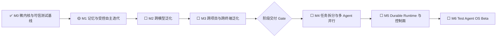

# AI Test Harness → Test Agent OS 演进路线

> 路线版本：v3.0  
> 当前阶段：`M0 FOUNDATION_BASELINE`  
> 阶段交付状态：`NOT_READY`  
> 下一里程碑：`M1 MEMORY_AND_CONTROLLED_EVOLUTION`

---

## 1. 重新定义当前成果

当前项目已经完成测试领域 Agent OS 的微内核基线：

- 原子 Capability 与版本协议；
- 不可变 Artifact 与哈希校验；
- Policy、Budget、Permission；
- 动态 DAG、暂停恢复和局部重编译；
- 风险分流、变更感知 Campaign；
- 业务理解、TestSpec、测试生成、诊断和智能回归；
- Replay、Mutation 和 `GREEN → RED → GREEN` 可信证明。

这证明了“Agent 如何被 Harness 约束并产生可验证结果”，但还没有证明：

1. Agent 能在长期运行中沉淀有效记忆并安全自我改进；
2. 不同推理能力的模型进入同一 Harness 后都能稳定完成或安全降级；
3. 系统能泛化到复杂业务、不同项目架构和真实设备。

因此，当前成果定义为：

```text
已完成：测试领域 Agent OS 微内核与可信执行基线
未完成：可对外宣称的跨模型、跨项目、跨终端阶段产品
```

`docs/final-delivery-report.md` 仅代表 v0.1 微内核基线的工程收口，不代表 Test Agent OS 产品达到阶段性交付条件。

---

## 2. 路线原则

### 2.1 记忆先于多 Agent

没有稳定记忆时，多 Agent 只会放大上下文丢失、重复工作和错误传播。先建立可审计的长期记忆与经验晋升机制，再扩展任务拆分和并行协作。

### 2.2 受控迭代，不允许无边界自修改

Agent 可以提出：

- 新记忆；
- 新经验；
- Prompt、Procedure、Skill 或 Capability 候选；
- 测试和修复候选。

Agent 不可直接修改：

- Oracle；
- Policy Floor；
- Permission；
- 发布 Gate；
- 已确认业务不变量；
- 生产版本 Capability。

任何自主迭代必须经过：

```text
候选
→ 独立评估
→ Hidden Benchmark
→ Replay / Mutation
→ 与当前基线对比
→ Canary
→ Promote 或 Rollback
```

### 2.3 弱模型的目标是安全退化，不是能力伪装

低能力模型不要求达到强模型同等产出，但必须：

- 能正确完成；或
- 显式请求更多上下文；或
- 显式升级到更强模型；或
- 明确进入 `BLOCKED / HUMAN_REQUIRED`。

绝不能静默输出错误结论或通过修改 Oracle 制造绿色结果。

### 2.4 模拟器先行，真实设备逐步接入

移动端、小程序和嵌入式遵循：

```text
协议与 Adapter
→ 模拟器 / Emulator
→ 本地单设备
→ 远程设备池
→ 多设备 / 多 DUT
```

真实设备属于受限资源，必须进入 Device Inventory、Lease、Health、Reset、Quarantine 和 Artifact 管理，不允许由 Agent 随意占用。

### 2.5 先验证单 Agent 稳定性，再做并行提效

多 Agent、任务拆分和并行执行是效率层，不是正确性基础。只有记忆、跨模型和跨项目 Gate 全部通过后，才进入多 Agent 编排。

---

## 3. 总体里程碑



首个阶段产品交付条件不是 M0，而是：

```text
M1 Memory Gate
+ M2 Model Generalization Gate
+ M3 Project / Architecture Generalization Gate
+ 全局 Safety Gate
```

M4 之后属于效率和平台化扩展，不阻塞第一版“可验证 Test Agent Runtime”阶段交付。

---

# 4. M1：记忆沉淀与受控自主迭代

## 4.1 目标

让 Agent 在跨会话、跨 Campaign 和重复项目任务中积累可复用经验，同时保证记忆可追溯、可失效、可撤回，不污染事实、Oracle 和安全策略。

## 4.2 记忆分层

| 类型 | 作用 | 生命周期 | 示例 |
|---|---|---|---|
| `WorkingMemory` | 当前 Campaign 工作状态 | 短期 | 当前假设、待确认项、执行计划 |
| `SemanticMemory` | 可复用事实和知识 | 长期、版本化 | 业务规则、架构、接口契约、生产不变量 |
| `EpisodicMemory` | 历史任务与结果 | 长期、可摘要 | 某次失败的环境、动作、结果和教训 |
| `ProceduralMemory` | 已验证的工作方法 | 长期、需晋升 | 调试流程、上下文加载策略、诊断步骤 |
| `SkillMemory` | 可执行且已验证的能力资产 | 长期、强 Gate | Adapter、生成模板、修复 Recipe、Capability |

不保存不可审计的内部思维过程，只保存可外显的事实、决策理由、操作、结果和证据。

## 4.3 子模块

### M1A Memory Contracts & Namespace

交付：

- `MemoryRecord`、`MemoryType`、`MemoryScope`；
- `SourceRef`、`EvidenceRef`、`ContentHash`；
- `Confidence`、`Validity`、`TTL`、`UtilityScore`；
- `ReadOnly`、`ACL`、`Owner`、`SharedWith`；
- 项目、Campaign、Agent、团队和全局 Namespace；
- 冲突、替代、撤回和历史版本协议。

### M1B Memory Store & Progressive Retrieval

交付：

- 先实现可确定性测试的 SQLite / File Store；
- 后续提供 PostgreSQL Store；
- Metadata → Summary → Focused → Deep 检索；
- 关键字、结构化过滤和可选语义检索；
- 读取预算、Token 预算和检索解释；
- 缓存与依赖失效。

### M1C Memory Formation & Consolidation

两条写入路径：

```text
Hot Path：只记录关键状态、明确事实和阻塞项
Background：提取 Episode、去重、合并、冲突检测和摘要
```

所有模型生成的记忆先进入 `CANDIDATE`，不得直接成为事实或 Procedure。

### M1D Shared Memory Governance

交付：

- 共享 Memory Block；
- 动态 Attach / Detach；
- Read-only Policy Memory；
- 多 Agent 可见性和写权限；
- Memory Poisoning 检测；
- 隔离区和人工复核队列。

### M1E Controlled Self-Evolution

闭环：

```text
Run Evidence
→ Lesson Candidate
→ Procedure / Prompt / Skill Candidate
→ Sandbox Evaluation
→ Hidden Benchmark
→ Replay / Mutation
→ Baseline Comparison
→ Canary
→ Promote / Rollback
```

允许自动晋升的范围优先限定为：

- 上下文选择规则；
- 已知错误诊断 Recipe；
- 数据准备和清理 Recipe；
- 无业务语义的测试工程修复；
- 已经过 Mutation 证明的测试模板。

### M1F Memory Benchmark

固定实验：

- Memory Off / On 对照；
- 重复任务；
- 相似但非相同任务；
- 旧需求与新需求冲突；
- 错误记忆注入；
- 过期记忆；
- 跨 Agent 共享；
- 记忆撤回和回滚。

## 4.4 M1 Gate

必须满足：

- 所有长期记忆具有来源和版本：`100%`；
- 未授权共享或写入：`0`；
- Assumption 自动晋升为 Fact / Oracle：`0`；
- 关键 Memory Poisoning 未被发现：`0`；
- Memory 引入的 Critical False Green：`0`；
- 相同输入和相同 Store Revision 的检索计划可重放；
- Memory On 相比 Memory Off 至少满足一项：
  - 任务正确完成率提升 `≥ 15%`；或
  - 人工介入率下降 `≥ 20%`；或
  - Token / 执行成本下降 `≥ 20%`；
- 同时不得降低 Safety Gate 指标；
- 所有 Procedure / Skill 晋升均可回滚。

---

# 5. M2：跨模型泛化与稳定退化

## 5.1 目标

验证同一 Harness 在强、中、弱三档模型下是否稳定。用户指定的 GPT 5.3、5.4、5.5 或当时可用的等价模型均通过统一 `ModelProvider` 接入，路线不绑定具体供应商和型号。

## 5.2 核心设计

### M2A Model Capability Profile

记录：

- Structured Output 稳定性；
- Tool Calling 稳定性；
- 最大上下文与有效上下文；
- 代码和业务推理能力；
- 规划深度；
- 延迟和成本；
- 已知失败模式；
- 推荐 Capability 和禁止 Capability。

### M2B Model Contract & Normalization

统一：

- 输入 Artifact；
- 工具调用协议；
- Schema Repair；
- 超时和重试；
- 输出规范化；
- Token、成本和延迟统计；
- Provider 特有字段隔离。

### M2C Weak-model Execution Ladder

```text
直接执行
→ 加载已验证 Memory
→ 缩小任务范围
→ 结构化拆解
→ Tool-constrained Execution
→ 独立 Verifier
→ 更强模型升级
→ Human Required
```

Harness 根据模型能力动态编译更细粒度的 Execution Plan，而不是为弱模型无限堆 Prompt。

### M2D Cross-model Benchmark

同一个项目、同一组 Requirement、同一代码版本、同一测试资产，至少运行：

- 强模型；
- 中等模型；
- 弱模型；
- 无模型的确定性基线。

每组任务至少重复三次，记录：

- 正确完成率；
- 安全完成率；
- 显式升级率；
- 无效循环率；
- Schema 失败率；
- Tool 误用率；
- Critical False Green；
- Token、费用和延迟。

### M2E Model Routing & Escalation

模型路由必须可解释：

- 为什么当前模型足够；
- 为什么需要拆细任务；
- 为什么升级；
- 为什么停止并要求人工处理。

## 5.3 M2 Gate

- 所有模型档位 `Critical False Green = 0`；
- 未授权 Oracle / Policy / Permission 修改：`0`；
- Deterministic Gate 一致性：`100%`；
- `安全完成 = 正确完成或显式升级/阻塞`，三档模型均 `≥ 98%`；
- 强模型正确完成率目标 `≥ 95%`；
- 中档模型正确完成率目标 `≥ 90%`；
- 弱模型在 Harness 拆解和 Memory 辅助后正确完成率目标 `≥ 80%`；
- 弱模型不得通过增加静默错误换取完成率；
- 同一任务的模型差异能够被 Benchmark 和路由策略解释。

阈值在第一轮基线实验后允许通过 ADR 调整，但 Safety 指标不得降低。

---

# 6. M3：项目复杂度与技术架构泛化

## 6.1 目标

证明系统不是只适用于简单 Web 示例，而能识别不同项目结构、构建方式、运行环境、测试表面和设备约束。

## 6.2 通用 Project Contract

新增统一协议：

- `ProjectManifest`；
- `ArchitectureProfile`；
- `BuildAdapter`；
- `RuntimeAdapter`；
- `TestSurfaceAdapter`；
- `StateProbe`；
- `DataSeedAdapter`；
- `DeviceProvider`；
- `ArtifactCollector`；
- `RecoveryController`。

项目扫描只生成候选架构模型，最终 Architecture Profile 由构建文件、运行证据和人工确认共同确定。

## 6.3 子阶段

### M3A Complex Web Matrix

至少覆盖：

- 模块化单体 + 数据库；
- 同步 API 微服务；
- 异步消息 / Event-driven 项目；
- 多角色、权限、金额或状态机业务；
- 前后端不同技术栈。

### M3B Mobile Adapter

优先顺序：

1. Android Emulator / Build-managed Device；
2. Android 真实设备；
3. iOS Simulator；
4. iOS 真实设备可行性验证。

能力包括：

- 安装和卸载；
- 启动、停止和重置；
- UI 自动化；
- Deep Link；
- 网络、权限、方向和系统状态；
- 日志、截图、视频和崩溃信息；
- Appium / Native Driver 版本固定。

### M3C Mini-program Adapter

先使用平台开发者工具自动化接口：

- 编译和启动；
- 页面与组件操作；
- 登录和 Storage 控制；
- 网络与云函数边界；
- 开发工具证据采集。

再增加真实客户端 Smoke：

- 使用受管 Android 设备；
- 固定测试账号；
- 扫码、授权和平台版本记录；
- 不把开发工具通过等同于真实客户端通过。

### M3D Embedded / IoT Adapter

顺序：

1. Native Simulation / QEMU；
2. 单板 Hardware-in-the-loop；
3. 多板 / 多 DUT；
4. 传感器、继电器、电源和网络 Fixture。

统一能力：

- Build；
- Flash；
- Serial / RTT / Log；
- Reset / Power Cycle；
- Measurement；
- Device Health；
- Fixture Matching；
- Quarantine；
- Test Record。

### M3E Device Lab Control Plane

```text
Device Inventory
→ Capability Match
→ Lease
→ Health Check
→ Reset / Install / Flash
→ Execute
→ Collect Artifacts
→ Cleanup
→ Release 或 Quarantine
```

任何真实设备执行必须绑定：

- Device ID；
- 固件 / OS / App 版本；
- Fixture；
- Lease Owner；
- 开始和结束状态；
- 恢复结果。

## 6.4 M3 最小验证矩阵

首个阶段交付至少需要六个代表性项目：

| 架构族 | 最低数量 | 最低要求 |
|---|---:|---|
| Complex Web | 2 | 单体一个、分布式 / 异步一个 |
| Mobile | 2 | Android 一个；iOS 或跨平台一个 |
| Mini-program | 1 | 开发工具闭环 + 真实客户端 Smoke |
| Embedded / IoT | 1 | Simulator + 至少一块真实开发板 |

额外要求：

- 至少三个语言 / 技术栈；
- 至少两个复杂业务领域；
- 至少一个金额、权限或不可逆状态场景；
- Android 实机和嵌入式实板必须进入 Device Lease；
- iOS 实机受 macOS、签名和设备条件影响，可作为 1.0 Production Gate，不阻塞第一版 Beta，但必须完成可行性报告。

## 6.5 M3 Gate

- 六项目矩阵完成；
- 四类架构均形成独立 Adapter 与测试资产；
- 同一业务闭环可在不同架构下编译成不同 Execution Plan；
- Simulator 与真实设备结果差异可追踪；
- 设备异常不会被误判为产品缺陷；
- 设备租约冲突和脏状态污染：`0`；
- 所有关键项目 `Critical False Green = 0`；
- 每个项目均可生成独立 Replay / Evidence Bundle；
- 至少三个模型档位完成交叉实验。

---

# 7. 首个阶段产品交付 Gate

只有以下条件全部满足，项目才从 `FOUNDATION_BASELINE` 晋升为 `TEST_AGENT_RUNTIME_BETA`：

```text
M1 Memory Gate：PASS
M2 Model Generalization Gate：PASS
M3 Project / Architecture Gate：PASS
Safety Gate：PASS
```

全局 Safety Gate：

- Critical False Green：`0`；
- 未授权 Oracle / Policy / Permission 修改：`0`；
- 关键 Evidence 可重放率：`100%`；
- Memory、Model 和 Device 版本全部可追溯；
- 所有自动晋升资产可回滚；
- 风险升级和人工介入可解释；
- 不以重试、固定等待或放宽断言掩盖失败。

---

# 8. M4：任务拆分与多 Agent 并行

M1—M3 通过后再实现：

- `TaskGraph` 与任务所有权；
- Planner 只生成候选任务图；
- Harness 校验依赖、预算和权限；
- Worker Agent 并行执行原子 Capability；
- Artifact Join 和冲突检测；
- 失败接管、取消和局部重跑；
- Progress Aggregator；
- 风险、阻塞、成本和有效进度汇总。

多 Agent 不依赖自由对话，而依赖：

```text
Task Contract
+ Artifact Contract
+ Memory Scope
+ Permission Inheritance
+ Deterministic Join Gate
```

验收重点不是“并行了多少 Agent”，而是：

- 总时长是否下降；
- 重复上下文是否下降；
- 冲突是否可检测；
- 质量和 Safety 是否不退化。

---

# 9. M5—M6：向 Agent OS 平台继续演进

## M5 Durable Runtime & Control Plane

- PostgreSQL Campaign / Memory Store；
- Object Storage；
- Queue / Event Bus；
- Worker Lease；
- Durable Scheduler；
- API Gateway；
- Web Console；
- RBAC、Secret、审批和成本中心；
- SLO、告警和审计。

## M6 Test Agent OS Beta

- Agent Identity 和生命周期；
- Capability SDK 与包版本；
- Model Router；
- Memory Service；
- Device Lab；
- Multi-agent Runtime；
- 项目空间和多租户；
- 安全沙箱；
- 可观察、可暂停、可恢复、可回滚。

---

# 10. 下一实施顺序

```text
M1.0 Memory Benchmark & Threat Model
→ M1A Memory Contracts
→ M1B Store / Retrieval
→ M1C Formation / Consolidation
→ M1D Shared Memory Governance
→ M1E Controlled Self-Evolution
→ M1F Memory Benchmark Gate

→ M2A Model Profile / Contract
→ M2B Weak-model Execution Ladder
→ M2C Cross-model Benchmark
→ M2D Routing / Escalation Gate

→ M3A Project Contract
→ M3B Complex Web Matrix
→ M3C Mobile
→ M3D Mini-program
→ M3E Embedded / Device Lab
→ M3F Cross-project Gate

→ M4 Multi-agent Orchestration
```

每个模块继续执行当前工程规则：

- 单独测试设计；
- 单元测试；
- 阶段集成测试；
- Golden / Negative / Adversarial 资产；
- CI；
- 机器可读台账；
- 状态机和剩余节点汇报。

---

# 11. 行业实现参考与本项目取舍

- OpenAI Agents SDK Sessions：参考 Session 接口、SQLite / Redis / SQLAlchemy 持久化和共享会话模式；本项目不把完整对话历史直接等同于业务记忆。
- LangMem / LangGraph Memory：参考 Semantic、Episodic、Procedural 分类和 Hot-path / Background 写入；本项目增加来源、证据、失效和晋升 Gate。
- Letta：参考可持久、可共享、可 Attach / Detach、可 Read-only 的 Memory Block；本项目将共享范围纳入 Permission 与 Campaign Namespace。
- MemGPT：参考分层记忆和有限上下文管理；本项目使用 Progressive Context Loader，并要求每次检索可解释、可重放。
- Reflexion：参考通过外部反馈形成 Episode；本项目禁止反思文本直接修改生产 Procedure，必须通过 Benchmark。
- Voyager：参考可执行 Skill Library 和环境反馈、自验证；本项目 Skill 必须通过 Replay、Mutation、Hidden Evaluation 和 Rollback。
- Appium：参考 Driver / Plugin 扩展模型处理无关平台；本项目将其映射为 Mobile `TestSurfaceAdapter` 和版本化 Driver 资产。
- Android Build-managed Devices：参考虚拟与远程物理设备生命周期、清洁快照和并行设备组；本项目统一为 DeviceProvider / Lease。
- Zephyr Twister 与 OpenHTF：参考 Hardware Map、Fixture、Flash、Serial、Measurement、Test Record 和多 DUT；本项目用于设计 Embedded Device Lab。

参考只是架构输入，不直接引入外部框架作为核心真理；所有集成仍需经过本项目自身 Capability、Policy、Evidence 和 Benchmark Gate。
