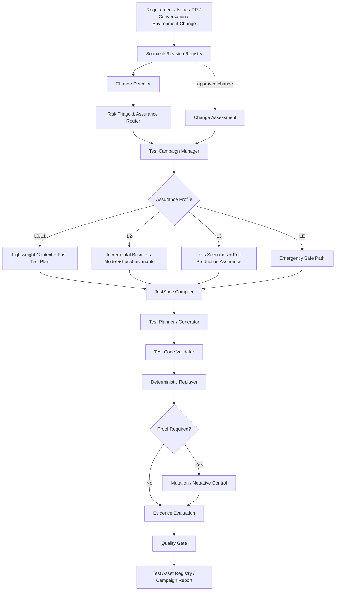
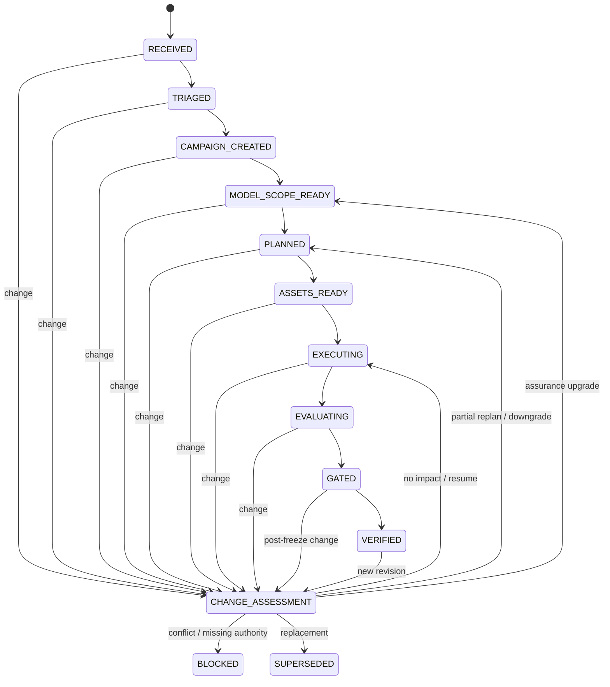

# AI 端到端测试 Agent 闭环实施计划

> 文档状态：规划稿 v2.0  
> 目标仓库：`lsq1030757028/Pytest-playwright-e2e`  
> 核心目标：构建一个风险自适应、需求变更感知、证据可独立重放的专业测试 Agent。系统根据潜在业务损失决定测试投入，在需求、代码和环境持续变化时维护仍然可信的进度、资产和发布结论。

---

## 1. 产品定义

系统不是“自动点网页”或“收到需求就批量生成测试”的工具，而是：

> 将需求与变更编译为最小充分的测试保障计划、可审查的回归代码和可独立复现的执行证据，并根据生产风险与证据有效性动态调整测试深度。

核心交付物：

1. **Assurance Decision**：本次变化需要做多重、为什么、预算是多少。
2. **Test Campaign**：当前需求版本、测试状态、变更事件、有效进度和阻塞项。
3. **Business Understanding / TestSpec**：对受影响业务范围的结构化理解和可信 Oracle。
4. **Regression Code**：用户与 CI 可独立执行的 Pytest / Playwright 代码。
5. **Executable Test Proof**：Baseline、Mutation、Restored、Replay 和证据有效性。

用户不需要相信 Agent 的自然语言判断，而是通过版本、代码、依赖图、Replay 和缺陷敏感性结果验证结论。

---

## 2. 总体设计原则

### 2.1 Production-first，Requirement-grounded，Evidence-gated

保障优先级：

```text
生产安全与业务完整性
> 生产可靠性与恢复能力
> 已确认需求实现
> 健壮性与异常体验
> 低影响优化
```

需求是重要 Oracle 来源，但需求若与生产不变量、财务、安全、权限、审计或数据完整性约束冲突，系统必须阻塞确认。

### 2.2 能力完整，执行路径动态裁剪

系统具备完整业务建模、Mock、Mutation、Replay、诊断和生产保护能力，但普通敏捷需求只执行风险匹配的最小路径。

```text
所有变化先做轻量分流
L0/L1 走快速验证
L2 做局部业务保障
L3 做完整生产保障
LE 走紧急安全路径并发布后补齐
```

### 2.3 AI 负责候选推理，确定性系统负责裁决

AI 可以：

- 提取变化语义；
- 提议业务影响和候选风险；
- 编译局部业务模型；
- 生成 TestSpec、测试代码和修复候选；
- 分析复杂证据。

AI 不可以：

- 自由降低 Assurance Profile；
- 未经授权改变 Oracle；
- 直接决定最终 PASS；
- 删除关键断言或通过重试掩盖失败；
- 将模型猜测直接晋升为发布阻断项。

### 2.4 Versioned、Incremental、Change-aware

需求、Oracle、TestSpec、测试资产、环境和证据均版本化。需求变化进入正式 Change Assessment：

```text
无影响 → 继续
局部影响 → 局部失效与重规划
风险升级 → 提高保障等级
风险降低 → 减少无价值测试
冲突 → 阻塞确认
完全替换 → 封存旧 Campaign
```

### 2.5 回归代码与可执行证明是信任凭证

一条关键测试晋升为正式 Regression，必须至少证明：

```text
正常版本 PASS
目标缺陷或反例版本 FAIL
恢复版本 PASS
独立重放稳定
```

Mutation 不作为每个普通 PR 的默认步骤，只在 L2/L3、新建关键回归、历史 False Green、发布或夜间 Gate 中触发。

### 2.6 成本受预算约束

Assurance Profile 必须控制：

- 风险候选数量；
- 详细损失场景数量；
- Unit / API / E2E 数量；
- Mutation 和 Replay 次数；
- 重试与运行时长；
- 是否调用模型或浏览器。

测试 Agent 的目标不是生成最多测试，而是用最低维护成本保护最重要的不变量。

---

## 3. 当前已验证基线

仓库当前已经完成并验证：

- Pytest / Playwright 执行与证据采集；
- TestSpec、Fact、Assumption、Risk、Oracle 和 Truth Boundary；
- EnvironmentSpec、MockPlan、DataSeedSpec 和契约化虚拟服务；
- ReplayManifest、Artifact 哈希、篡改检测和独立 Replayer；
- 固定开源 TodoMVC Commit 的 Target Runtime；
- TodoMVC Product Adapter 的造数、状态探针和清理；
- 确定性业务 Baseline；
- 五个 Critical Mutation；
- `Baseline 3/3 → Mutation 5/5 Killed → Restored 3/3`；
- Mutation Score 100%，Critical False Green 0。

当前仍缺失：

- 风险分流与测试预算；
- 版本化 Requirement Revision 与 Change Authority；
- Test Campaign 状态机；
- 需求变化后的局部失效和有效进度回算；
- 增量业务理解与生产不变量编译；
- AI TestSpec 与候选测试代码生成；
- 证据驱动诊断与安全修复；
- 影响图、智能回归和 Agent Benchmark。

---

## 4. 目标架构 v2



---

## 5. 核心模块

### 5.1 Source & Revision Registry

统一接收：

- Markdown、Issue、PR 描述和 Diff；
- API / 数据模型 / ADR；
- 对话中的业务说明；
- 环境与配置补充；
- 需求变更和紧急覆盖。

输出不可覆盖的：

- `SourceRecord`；
- `RequirementRevision`；
- `ChangeEvent`；
- 内容哈希；
- 来源角色与变更权限；
- Approved / Proposed / Rejected 状态。

未经授权的说明不能直接改变 Oracle。

### 5.2 Risk Triage & Assurance Router

输入：

- Requirement Revision；
- PR Diff / 文件与接口变化；
- 业务资产、生产不变量和历史事故；
- 已有测试映射和执行历史；
- 模型提供的候选影响。

输出：

- `L0 / L1 / L2 / L3 / LE`；
- 确定性最低等级理由；
- 必做和跳过检查；
- 测试与风险分析预算；
- 是否需要模型、浏览器、Mutation、Replay、Canary 或 Probe。

金额、权限、隐私、迁移、不可逆操作等硬规则不能被模型降级。

### 5.3 Change-Aware Test Campaign

Campaign 记录：

- 当前 Requirement / Code / Environment Revision；
- Assurance Profile；
- 工作流状态；
- Freeze 状态；
- 测试资产和 Evidence 有效性；
- Raw Progress 与 Valid Progress；
- Change Event、阻塞和下一决策。

任意阶段都可以进入 Change Assessment。

### 5.4 Incremental Business Understanding

不再每次从零理解整个项目，而是根据 Router 与 Impact Graph 加载受影响的局部业务范围：

- 业务目标；
- 角色和权限；
- 关键资产；
- 状态与迁移；
- 副作用和外部依赖；
- 生产不变量；
- Facts / Assumptions / Unknowns；
- 需求与不变量冲突。

L0/L1 默认不构建完整损失场景；L2/L3 才逐步展开。

### 5.5 Loss Scenario & Risk Promotion

风险不是宽泛列表，而是：

```text
业务资产
→ 触发条件
→ 失败模式
→ 不可接受损失
→ 影响范围与可恢复性
→ 现有控制
→ 反向证据
→ 可执行测试义务
```

证据阶段：

```text
Candidate → Supported → Reproduced → Proven → Controlled
```

只有达到确定证据门槛，风险才能影响发布 Gate。

### 5.6 TestSpec Compiler

TestSpec 仍是测试生成的核心中间表示，但必须绑定：

- Requirement Revision；
- Production Invariant / Fact / Assumption；
- Oracle Revision；
- Assurance Profile；
- Test Budget；
- Change Impact；
- Truth Boundary；
- EnvironmentSpec / MockPlan。

禁止从当前代码行为反推确认 Oracle。

### 5.7 Environment Control & Product Adapter

继续提供：

- 造数据、身份、时间和随机数；
- 服务虚拟化和契约校验；
- 网络、事件、设备和故障注入；
- 状态探针与清理；
- 固定开源目标和真实应用 Adapter。

Mock 只能消除被测业务逻辑之外的不可控性，不能替代被验证的核心逻辑。

### 5.8 Test Planner / Generator / Validator

优先选择最低成本验证层级：

```text
Static → Unit → API / Service → Integration → Critical E2E → Production Probe
```

生成资产必须先进入 Candidate Bundle，经过 AST、Ruff、Collect、Fixture、Oracle Mapping、隔离和安全校验后才能执行。

### 5.9 Replay、Mutation 与资产晋升

Replay 分级：

- L0/L1：Lightweight Replay；
- L2/L3、关键 Regression、缺陷复现：Full Replay Bundle。

资产生命周期：

```text
Candidate
→ Baseline Validated
→ Proof Verified
→ Regression
→ Deprecated / Historical
```

### 5.10 Evidence Diagnoser & Safe Repairer

规则引擎先处理确定性分类，AI 只分析剩余复杂证据。

允许修复：Locator、同步、Fixture、数据冲突、测试语法和清理。禁止修改确认 Oracle、删除关键断言或掩盖产品缺陷。

### 5.11 Impact Graph & Regression Selector

影响图：

```text
Requirement Revision
→ Business Fact / Invariant / Oracle
→ Source / API / Page / Schema
→ TestSpec
→ Test Asset
→ Evidence
→ Gate Decision
```

它同时服务于：

- 需求变化后的局部失效；
- PR Diff 选测；
- 测试资产维护和退役；
- 有效进度计算；
- 回归漏选审计。

---

## 6. Test Campaign 状态机



每个状态必须记录输入输出 Artifact、版本、哈希、执行者、模型与 Prompt、重试、允许修改范围、预算和 Gate。

---

## 7. 证据有效性与进度

Evidence 状态：

```text
VALID
CONDITIONALLY_VALID
REQUIRES_REVIEW
REQUIRES_RERUN
SUPERSEDED
INVALID
HISTORICAL
```

进度必须同时展示：

- **Raw Progress**：已经完成过的工作；
- **Valid Progress**：对当前 Requirement Revision 仍然可信的工作。

需求变化后，Raw Progress 不删除，Valid Progress 根据影响图重新计算。

---

## 8. Requirement Freeze

```text
OPEN → CANDIDATE_FREEZE → FROZEN → RELEASED
```

最终 Replay、Mutation 和发布 Gate 只在 `FROZEN` Revision 上成立。Freeze 后出现批准变化，必须撤销受影响的 Gate 和 Evidence；紧急路径必须记录批准、回滚和发布后补齐任务。

---

## 9. Replay Bundle v2

```text
runs/<campaign-id>/<run-id>/
├── requirement/
│   ├── revisions/
│   ├── sources/
│   └── change-events/
├── assurance/
│   ├── decision.yaml
│   ├── budget.yaml
│   └── policy-version.txt
├── campaign/
│   ├── state.yaml
│   ├── progress.yaml
│   ├── freeze.yaml
│   └── impact-assessment.yaml
├── understanding/
│   ├── business-model.yaml
│   ├── invariants.yaml
│   ├── facts.yaml
│   ├── assumptions.yaml
│   └── loss-scenarios.yaml
├── spec/
├── environment/
├── generated/
├── evidence/
├── mutation/
├── diagnosis/
├── regression/
└── verdict.json
```

关键 Artifact 必须有内容哈希，历史版本不得覆盖。

---

## 10. CLI 规划

```bash
test-workflow assurance route <requirement> --diff <diff>
test-workflow assurance explain <decision-id>

test-workflow campaign create <requirement-revision>
test-workflow campaign status <campaign-id>
test-workflow campaign apply-change <campaign-id> <change-event>
test-workflow campaign assess-change <campaign-id>
test-workflow campaign replan <campaign-id>
test-workflow campaign freeze <campaign-id>
test-workflow campaign report <campaign-id>

test-workflow understand <campaign-id>
test-workflow spec compile <campaign-id>
test-workflow generate <campaign-id>
test-workflow replay <bundle>
test-workflow verify-test <bundle>
test-workflow diagnose <run-id>
test-workflow repair <run-id>
test-workflow regress <run-id>
test-workflow gate <run-id>
```

---

## 11. 分阶段实施计划 v2

### Phase 0：确定性执行底座

状态：基础能力已完成并进入 `main`。

### Phase 1：TestSpec、Mock、Environment 与 Replay

状态：`VERIFIED` 于 PR #7，尚未合并。

### Phase 2：固定目标、Product Adapter 与 Executable Test Proof

状态：Target / Adapter `VERIFIED` 于 PR #8；Baseline / Mutation / Restored `VERIFIED` 于 PR #9。

### Phase 3：Risk-adaptive Router 与 Change-aware Campaign

详细计划：`docs/module-03-risk-adaptive-change-aware-plan.md`。

交付：

- SourceRecord / RequirementRevision / ChangeEvent；
- Assurance Profile、Policy Floor 和 Budget；
- Test Campaign 状态机；
- Change Assessment 和局部失效；
- Evidence Validity；
- Raw / Valid Progress；
- Requirement Freeze；
- TodoMVC 六个 Golden Change Scenario；
- CLI、单元测试、集成 Gate 和报告。

### Phase 4：增量业务理解与生产风险

交付：

- 局部 Business Model；
- Production Invariants；
- Facts / Assumptions / Unknowns；
- Loss Scenario；
- Risk Promotion；
- Test Obligations；
- Hidden Evaluator。

验收重点：P0/P1 漏检、False Blocker、无证据风险晋升、需求与不变量冲突。

### Phase 5：AI TestSpec、测试规划与候选代码生成

交付：Model Provider、Context Resolver、TestSpec Compiler、Test Planner、AST Generator 和 Code Validator。

所有候选代码必须进入 Campaign / Replay Bundle，并通过 Phase 2 的确定性证明能力。

### Phase 6：探索、证据诊断与安全修复

交付：Snapshot、Action Plan、证据聚合、规则 + AI 诊断、有限 Repair 和多层重放。

### Phase 7：影响图、智能回归与 Benchmark

交付：PR Diff 选测、局部失效统一图、资产退役、成本报告、Golden Campaign 和 Agent Benchmark。

---

## 12. CI 分层

### PR Fast Gate

```text
Lint / Schema / Collect
→ 受影响 Unit / API
→ 必要的关键 E2E
→ Assurance Route 校验
```

### Stage Gate

```text
当前阶段 Golden Campaign
→ 局部 Replay
→ 必要的 Targeted Mutation
→ Artifact 与状态报告
```

### Main / Nightly / Release

```text
全量回归
→ 批量 Mutation
→ 稳定性 Replay
→ Contract Drift
→ Production Probe / Benchmark 子集
```

L0/L1 不应默认触发完整业务建模、浏览器全量回归或 Mutation。

---

## 13. Benchmark 指标

质量指标：

- Critical Risk / Production Invariant 召回率；
- False Blocker Rate；
- 未授权需求变化进入 Oracle 的数量；
- 局部失效精确率；
- Current Evidence 一致率；
- Critical False Green；
- Mutation Score；
- 测试生成首次可收集率与可执行率；
- 产品缺陷被错误修复率；
- 智能回归召回率。

成本指标：

- Assurance Profile 分布；
- PR Fast Gate 时长；
- Unit / API / E2E 数量；
- 模型调用、Token 和成本；
- 重跑数量；
- 因需求变化复用的资产比例；
- 测试维护和退役数量。

最高优先级仍是：

```text
Critical False Green = 0
Critical Production Risk False Negative = 0（Golden Benchmark）
```

---

## 14. 高杠杆实施顺序

```text
TestSpec / Truth Boundary / Replay
→ 固定目标与 Product Adapter
→ Executable Test Proof
→ Assurance Router
→ Change-aware Campaign
→ Incremental Business Understanding
→ Loss Scenario / Risk Promotion
→ AI TestSpec 与测试生成
→ 证据诊断与安全修复
→ 影响图、智能回归与 Benchmark
```

不优先投入：多 Agent 编排、万能视觉、自愈 Dashboard 或每次回归实时调用 LLM。

---

## 15. 最终定义

专业测试 Agent 的最终闭环不是固定线性流程，而是：

```text
需求或变化
→ 风险分流与测试预算
→ 版本化 Test Campaign
→ 局部业务理解与可信 Oracle
→ 最小充分回归代码
→ 确定性 Replay / 必要的 Mutation
→ 需求变化时局部失效与有效进度回算
→ 证据 Gate
→ 长期回归与生产保护
```

其核心能力是：

> 在需求、代码、环境和风险持续变化时，始终知道哪些结论仍可信、哪些工作可以复用、哪些证据已经失效，以及下一单位测试成本应该投入在哪里。