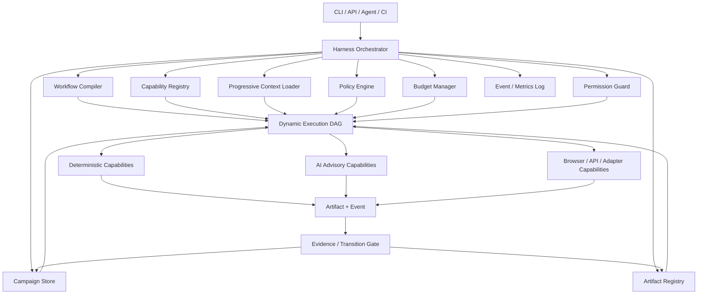
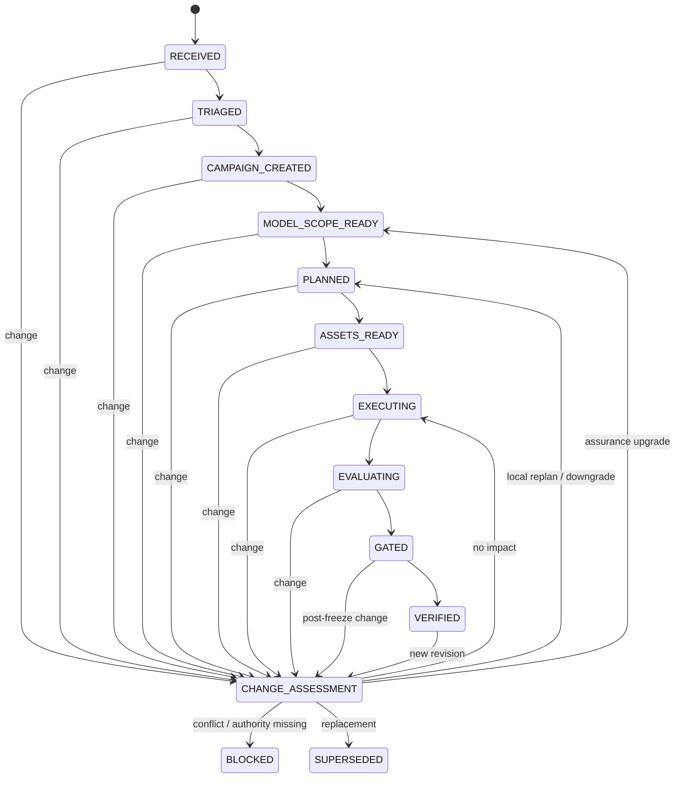

# AI 端到端测试 Agent 闭环实施计划

> 文档状态：规划稿 v2.1  
> 架构方案：`docs/harness-architecture.md`  
> 目标仓库：`lsq1030757028/Pytest-playwright-e2e`  
> 核心目标：构建一个由测试 Harness 编排、风险自适应、需求变更感知、证据可独立重放的专业测试 Agent。

---

## 1. 产品定义

系统对外提供 Test Workflow 和持续演化的 Test Campaign；对内不采用固定串行的大型 Agent，而采用：

```text
Capability Atoms
+ Versioned Artifacts
+ Harness Orchestrator
+ Dynamic Execution Graph
+ Progressive Context Loading
```

系统根据潜在业务损失、变化范围、已有证据和预算，编译出本次最小充分测试路径。

核心交付物：

1. **Assurance Decision**：需要做多重、为什么、预算和跳过理由；
2. **Execution Plan**：本次由 Harness 编译的 Capability DAG；
3. **Test Campaign**：当前版本、状态、变更事件、有效进度和阻塞；
4. **Business Understanding / TestSpec**：受影响业务范围和可信 Oracle；
5. **Regression Code**：可审查、可独立执行的 Pytest / Playwright 代码；
6. **Executable Test Proof**：Baseline、Mutation、Restored、Replay 和 Evidence Validity。

---

## 2. 核心原则

### 2.1 Production-first，Requirement-grounded，Evidence-gated

```text
生产安全与业务完整性
> 生产可靠性与恢复能力
> 已确认需求实现
> 健壮性与异常体验
> 低影响优化
```

需求与生产不变量冲突时必须阻塞确认，不能机械修改 Oracle。

### 2.2 能力完整，执行路径按需裁剪

- `L0`：静态、Lint、Collect、受影响单元检查；
- `L1`：受影响 Unit/API + 一条关键 E2E；
- `L2`：局部业务模型、定向 Replay、1—3 个 Mutation；
- `L3`：完整生产保障、损失场景、对账、发布保护；
- `LE`：紧急安全路径、强监控、快速回滚、发布后补齐。

### 2.3 能力原子化，但不微型 Agent 化

拆分可复用 Capability，不拆分人格角色。Capability 必须有版本化输入输出、权限、成本、副作用、幂等性、重试与超时声明。

### 2.4 Workflow 由 Harness 动态编译

Workflow 不是硬编码链路。Harness 根据 Trigger、Campaign、Assurance、Artifact Validity、预算和 Capability Registry 编译 DAG。需求变化时只重编译受影响子图。

### 2.5 状态归 Harness，不归模型

模型只能提出候选语义、风险、TestSpec 或修复。状态转换、保障最低等级、Evidence 失效和最终 PASS 由确定性 Policy / State Machine / Replayer 决定。

### 2.6 渐进式上下文加载

上下文按 `METADATA → SUMMARY → FOCUSED → DEEP` 逐级加载。Router 默认不读取完整源码、不启动浏览器；只有 L2/L3 或复杂诊断进入深层上下文。

### 2.7 成本与维护预算是一等约束

每个执行计划必须声明模型调用、Token、浏览器、API、Mutation、Replay、重试、时长和 Artifact 预算。系统目标是用最低维护成本保护最重要不变量。

---

## 3. 当前已验证基线

已经完成并验证：

- Pytest / Playwright 执行与证据；
- TestSpec、Oracle、Truth Boundary；
- EnvironmentSpec、MockPlan、DataSeedSpec、Virtual Service；
- ReplayManifest、哈希、篡改检测和独立 Replayer；
- 固定 TodoMVC 目标和 Product Adapter；
- 确定性业务回归；
- 五个 Critical Mutation；
- Baseline `3/3`、Mutation `5/5 Killed`、Restored `3/3`；
- Mutation Score `100%`，Critical False Green `0`。

当前缺失：

- Harness Foundation；
- Capability Registry 和动态 Execution Plan；
- 渐进式 Context Loader、Budget 和 Permission；
- Assurance Router；
- Versioned Test Campaign；
- 需求变化后的局部失效和 Valid Progress；
- 增量业务理解与 Loss Scenario；
- AI TestSpec 与测试生成；
- 诊断、修复、智能回归和 Benchmark。

---

## 4. 目标架构 v2.1



完整协议和组件见 `docs/harness-architecture.md`。

---

## 5. Capability 分层

### 5.1 确定性控制能力

- `source.register`
- `source.authorize-change`
- `assurance.route`
- `campaign.transition`
- `impact.compute`
- `artifact.invalidate`
- `progress.calculate`
- `policy.evaluate`
- `decision.report`

### 5.2 已有执行能力包装

- `spec.validate`
- `mock.verify`
- `environment.build`
- `bundle.validate`
- `replay.execute`
- `target.validate/materialize/start`
- `product.seed/probe/cleanup`
- `test.run`
- `proof.run`

### 5.3 AI 辅助能力

- `ai.propose-change-semantics`
- `ai.propose-business-impact`
- `ai.compile-local-business-model`
- `ai.propose-loss-scenarios`
- `ai.propose-test-spec`
- `ai.propose-test-code`
- `ai.propose-repair`

AI Capability 的输出必须经过 Schema、Authority、Policy Floor、Evidence 和 Budget Gate。

---

## 6. Test Campaign 状态机



Campaign 状态只能通过经过 Policy 校验的 Domain Event 变化。

---

## 7. Artifact 与上下文协议

跨模块信息必须使用不可变、版本化 Artifact：

```text
RequirementRevision
→ AssuranceDecision
→ ExecutionPlan
→ BusinessModelSlice
→ TestSpec
→ TestAsset
→ ExecutionEvidence
→ GateDecision
```

每个 Artifact 绑定 schema version、内容哈希、来源 Revision、Capability Version 和 Validity。

上下文加载：

```text
先加载 Metadata
→ 不足时加载 Summary
→ 影响明确后加载 Focused
→ L2/L3 或复杂诊断才加载 Deep
```

缓存绑定代码 SHA、Requirement Revision、Business Model Revision 和 Capability Version。

---

## 8. 测试有效性与资产晋升

```text
Candidate
→ Baseline Validated
→ Proof Verified
→ Regression
→ Deprecated / Historical
```

关键 Regression 至少需要：

```text
正常版本 PASS
目标缺陷 FAIL
恢复版本 PASS
独立 Replay 稳定
```

Mutation 不作为 L0/L1 默认步骤，只在 L2/L3、关键资产晋升、历史 False Green、Release 或 Nightly 中触发。

---

## 9. 重排后的实施阶段

## Stage 0：确定性执行底座 — `VERIFIED`

Pytest、Playwright、证据、CI、基础 CLI。

## Stage 1：Spec / Environment / Replay — `VERIFIED`

TestSpec、Truth Boundary、Mock、Seed、Replay 和篡改检测。

## Stage 1.5：固定目标与 Product Adapter — `VERIFIED`

固定 TodoMVC Revision、真实启动、造数、Probe 和 Cleanup。

## Stage 2：Executable Test Proof — `VERIFIED`

Baseline、五个 Mutation、Restored、稳定性和 False Green Gate。

## Stage 3.0：Harness Foundation — `NEXT`

### 3.0A Contracts

- CapabilityDescriptor；
- CapabilityRequest / Result；
- ArtifactRef；
- ContextRequest；
- ExecutionBudget；
- PermissionScope；
- DomainEvent。

### 3.0B Registry & Artifact Store

- Capability 注册和版本解析；
- 不可变 Artifact；
- 哈希与内存/文件 Store。

### 3.0C Policy / Budget / Permission

- 统一 Policy Result；
- Budget 消耗和拒绝；
- Permission Scope；
- 决策原因和审计。

### 3.0D Workflow Compiler & Orchestrator

- DAG；
- 拓扑执行；
- 跳过、失败、暂停、恢复；
- 局部重编译骨架。

### 3.0E Existing Capability Adapters

包装 `spec.validate`、`target.validate`、`test.run`、`proof.run`，证明旧能力可由 Harness 编排。

Stage Gate：L1 TodoMVC Campaign 仅执行需要的轻量节点，验证权限、预算、恢复和 Artifact 记录。

## Stage 3A：Source & Revision Registry

- SourceRecord；
- RequirementRevision；
- ChangeEvent；
- Authority；
- Approved / Proposed / Rejected；
- 历史不可覆盖。

## Stage 3B：Assurance Router

- L0/L1/L2/L3/LE；
- Policy Floor；
- Required / Skipped Checks；
- 风险和测试预算；
- 路由解释。

## Stage 3C：Change-aware Campaign

- Campaign 状态机；
- Freeze；
- Block / Resume / Supersede；
- 任意阶段 Change Assessment。

## Stage 3D：Impact & Local Invalidation

- Requirement → Oracle → Test → Evidence 依赖图；
- 局部 Validity 传播；
- Requires Review / Rerun / Superseded。

## Stage 3E：Progress & Decision Report

- Raw Progress；
- Valid Progress；
- 复用、修改、新增、重跑和替代统计；
- 用户可读状态机报告。

## Stage 4：Incremental Business Understanding

- 只加载受影响角色、资产、状态、依赖和历史事故；
- Production Invariants；
- Facts / Assumptions / Unknowns；
- Loss Scenario；
- Candidate → Supported → Reproduced → Proven。

## Stage 5：AI TestSpec 与候选测试生成

- Model Provider；
- AI TestSpec；
- Test Planner；
- API / Playwright 代码生成；
- AST、Ruff、Collect、Oracle Mapping；
- Candidate Bundle → Proof Gate。

## Stage 6：Evidence Diagnosis 与 Safe Repair

- Trace、Network、State Probe 聚合；
- 规则优先诊断；
- Locator、同步、数据和测试代码有限修复；
- 禁止修改确认 Oracle。

## Stage 7：Intelligent Regression 与 Benchmark

- PR Diff 和影响图选测；
- 漏选审计；
- 资产退役；
- P0 Recall、False Blocker、False Green、成本和延迟指标。

---

## 10. 并行开发顺序

```text
3.0A Contracts
    ↓
3.0B Registry / Artifact Store  ||  3.0C Policy / Budget / Permission
    ↓                                      ↓
              3.0D Compiler / Orchestrator
                           ↓
                 3.0E Existing Adapters
                           ↓
        3A Source Registry  ||  3B Assurance Router  ||  3C Campaign
                           ↓
                  3D Impact / Invalidation
                           ↓
                   3E Progress / Report
```

接口、Schema 和 Protocol 先于并行实现。每个子模块必须独立单元测试、阶段集成、实施文档和状态汇报。

---

## 11. Module 03 Golden Scenarios

TodoMVC 验证：

1. 无行为影响澄清：不启动浏览器，不重跑；
2. 新增验收条件：局部 TestSpec 和测试重跑；
3. 跨标签同步：L1 升级 L2；
4. Oracle 改变：相关 Evidence Superseded，无关 Evidence 保持 Valid；
5. 未授权开发建议：拒绝修改确认 Oracle；
6. 需求违反数据完整性：Campaign Blocked；
7. Harness Budget 超限：停止重节点并报告；
8. 执行中断：从 Artifact Checkpoint 恢复。

---

## 12. CLI 演进

```bash
# Harness
 test-workflow capability list
 test-workflow plan compile <campaign>
 test-workflow plan run <execution-plan>
 test-workflow campaign status <campaign>

# Risk and change
 test-workflow source register <input>
 test-workflow assurance route <revision>
 test-workflow campaign apply-change <change>
 test-workflow impact evaluate <campaign>

# Existing deterministic proof
 test-workflow spec validate <spec>
 test-workflow replay <bundle>
 test-workflow proof run <plan>
```

CLI 是 Harness 入口，不能复制业务编排逻辑。

---

## 13. 非目标

近期不做：

- 通用分布式 Workflow 平台；
- 多 Agent 自由讨论；
- 插件市场；
- 每次请求全仓库上下文；
- 每次 PR 全量 Mutation；
- 一次性重构全部已有代码；
- 复杂 Dashboard。

---

## 14. 下一开发迭代

下一迭代只实现 **Stage 3.0A Contracts**：

```text
CapabilityDescriptor
→ Request / Result
→ ArtifactRef
→ ContextRequest
→ Budget / Permission
→ DomainEvent
→ Schema / 序列化 / 拒绝路径单元测试
```

该模块完成后按统一状态机汇报，再进入 Registry 和 Policy 两条并行线。
