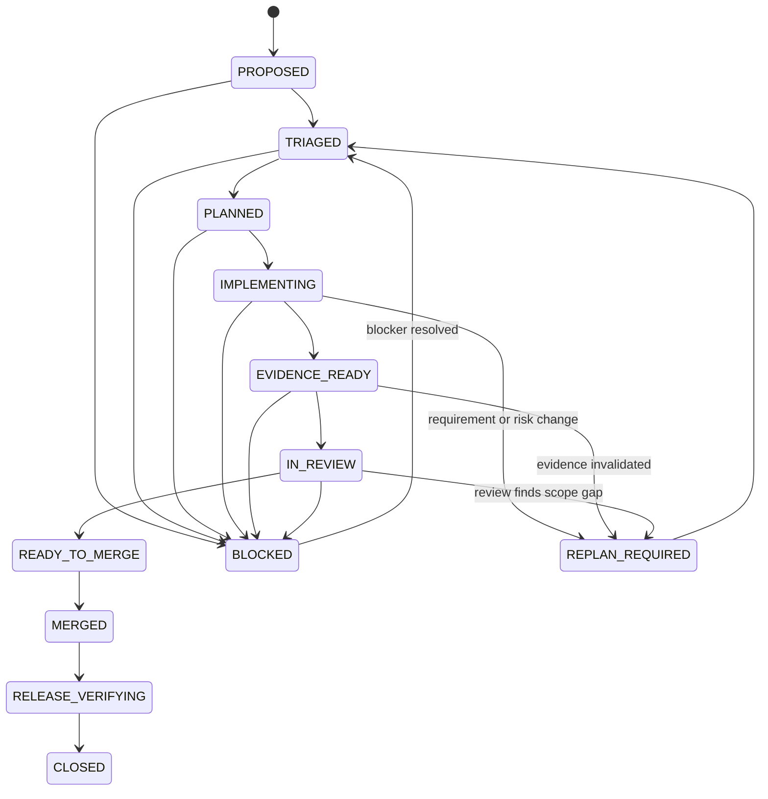

# GitHub 云端研发全流程 SSOT

> 状态：`ACTIVE`  
> 版本：`1.0`  
> 适用对象：人类开发者、AI 开发 Agent、Review Agent、Release Agent  
> 适用范围：本仓库所有需求、代码、测试、文档、配置、发布和研究实验变更  
> 机器可读策略：`docs/github-development-ssot.yaml`  
> Agent 强制入口：`AGENTS.md`

---

## 1. 目标

本文件是仓库基于 GitHub 开发、测试、Review、合并、发布和台账归档的唯一研发流程事实源。

它解决的不是“规定每次都执行同样的命令”，而是：

> 对每一次变化，基于业务风险、技术边界和证据缺口，选择最小但充分的研发与验证路径，并将全过程保存在 GitHub 中。

核心公式不是“模块完成 = 单元测试 + 集成测试”，而是：

```text
可交付变化
= 已批准目标
+ 可追踪实现
+ 与风险匹配的充分证据
+ 可恢复发布
+ 可审计资产与状态
```

---

## 2. SSOT 权威顺序

发生冲突时，按以下顺序裁决：

1. 法律、隐私、安全和组织级政策；
2. 已确认生产不变量、Oracle、权限和发布保护；
3. 本文件与 `docs/github-development-ssot.yaml`；
4. `docs/agent-os-evolution-roadmap.md`、`docs/implementation-status.md` 和正式台账；
5. 已批准 Goal / Issue 的范围与验收条件；
6. PR 中的计划、实现说明和证据；
7. 临时聊天、评论、模型输出和个人假设。

低权威来源不能静默覆盖高权威来源。出现冲突时必须创建明确的 `BLOCKED`、`REPLAN_REQUIRED` 或 `AUTHORITY_REQUIRED` 状态。

---

## 3. GitHub 对象职责

| GitHub 对象 | 研发职责 | 不承担的职责 |
|---|---|---|
| Goal / Issue | 业务目标、范围、验收、限制和风险入口 | 不存储最终代码状态 |
| Branch | 隔离实现和可回滚变更 | 不作为长期状态事实源 |
| Pull Request | 设计、实现、证据、Review 和合并决策 | 不能替代正式需求或 Oracle |
| Check / GitHub Actions | 权威自动验证与发布保护 | 不能证明未设计的业务风险 |
| Workflow Artifact | JUnit、Replay、Trace、日志、构建和证明资产 | 不应成为唯一无索引存储 |
| Review Thread | 缺陷、风险、设计和证据质疑 | 不用于隐藏待办事项 |
| Merge Commit | 一次已审核的不可变集成点 | 不等于已验证生产发布 |
| `main` | 权威代码与文档基线 | 不保存聊天中的临时状态 |
| Tag / Release / GHCR | 可部署的不可变发布版本 | 不替代主干质量证据 |
| Status / Ledger | 项目进度、能力状态和资产索引 | 不得提前声明不存在的证据 |

---

## 4. 云端优先原则

本仓库采用 Cloud-first GitHub Development：

- 所有正式变更通过 Branch 和 PR；
- GitHub Actions 是权威验证环境；
- GitHub Workflow Artifact 保存正式执行证据；
- `main` 推送触发构建和发布验证；
- PR、Commit、CI、Artifact、Release 和 Ledger 必须可相互追溯；
- 本地或对话中的测试结果仅作为辅助，不得替代远端 Gate；
- 所有环境、依赖、目标版本、设备和模型都应尽量版本化。

禁止直接向 `main` 写入功能或流程变化。

---

## 5. 研发状态机



### 状态含义

- `PROPOSED`：目标已提出，尚未判断范围和风险；
- `TRIAGED`：已完成影响和保障等级初判；
- `PLANNED`：实现、证据和资产计划可执行；
- `IMPLEMENTING`：代码或资产正在变更；
- `EVIDENCE_READY`：变更特定证据已生成；
- `IN_REVIEW`：PR 接受代码、设计和证据 Review；
- `READY_TO_MERGE`：所有必需 Gate 满足；
- `MERGED`：已进入 `main`；
- `RELEASE_VERIFYING`：验证构建、发布、迁移和运行产物；
- `CLOSED`：主干、发布、台账和清理均完成；
- `REPLAN_REQUIRED`：需求、影响或证据发生变化；
- `BLOCKED`：缺少权限、信息、环境、设备、决策或可信证据。

---

## 6. Development Assurance Profile

研发保障等级使用 `DEV0`—`DEV3` 和 `DEV-E`。它与产品测试的 L0—L3 相关，但职责不同：产品等级决定业务保障深度，DEV 等级决定本次仓库变更需要什么研发证据。

## 6.1 DEV0：非行为变化

适用：

- 文档、注释、排版；
- 不影响运行结果的元数据；
- 已证明无行为影响的重命名；
- 路线与状态说明。

默认证据：

- 格式、Lint；
- YAML / JSON / Schema 校验；
- 链接、路径和引用检查；
- 受影响策略或台账的一致性测试。

**不默认要求虚构的单元测试或集成测试。**

如文档或配置会改变 Agent、CI、发布或用户行为，则不能归类为 DEV0。

## 6.2 DEV1：隔离的确定性逻辑

适用：

- 单一纯函数；
- 无外部副作用的解析、转换和校验；
- 局部错误修复；
- 不改变跨模块契约的内部重构。

优先证据：

- 目标明确的 Unit / Property / Contract 测试；
- 边界和拒绝路径；
- 必要的静态检查。

只有触及真实边界或历史风险时才增加 Integration。

## 6.3 DEV2：边界和工作流变化

适用：

- Capability 输入输出；
- API、存储、Artifact、序列化和迁移；
- Orchestrator、状态机和流程；
- CLI、网络、浏览器、外部进程；
- GitHub Actions、构建和发布流程；
- 跨模块数据契约。

默认需要：

- 目标 Unit / Contract 证据；
- 至少一个真实受影响边界的 Integration 证据；
- 负向、权限、超时或失败路径；
- 受影响回归选择；
- 资产和部署影响说明。

如果某类测试不适用，必须说明由什么更可信证据替代。

## 6.4 DEV3：生产关键或系统治理变化

适用：

- Oracle、Policy、Permission、Assurance Floor；
- Memory 写入、共享、晋升、遗忘和自我迭代；
- 模型路由、自动升级和 Verifier；
- 真实设备、Secret、生产数据和远程执行；
- 金额、权限、隐私、安全、删除、迁移和不可逆状态；
- Release Gate、自动合并和供应链；
- 正式回归或 Capability 的自动晋升。

必须具备：

- 独立测试设计与威胁模型；
- Unit / Contract 与真实边界 Integration；
- Adversarial / Negative 证据；
- Replay、Mutation、Benchmark 或等价证伪方法中与风险匹配的组合；
- 稳定性或重复运行；
- Canary、Rollback、Recovery 或明确不可回滚说明；
- 明确人类批准。

DEV3 不能由 Agent 单方面降级。

## 6.5 DEV-E：紧急变化

适用：线上事故、严重安全缺陷或无法等待标准流程的恢复操作。

执行原则：

```text
最小安全变更
→ 最小可信验证
→ 小范围发布
→ 强监控
→ 可立即回滚
→ 事后补齐完整证据和资产
```

紧急状态不是跳过证据，而是将部分证据延期，并留下有期限的 Backfill 事项。

---

## 7. 动态证据选择

## 7.1 先定义 Test Obligation

每个验收条件和关键风险应转换成可证伪义务：

```yaml
obligation:
  id: OBL-M1-001
  statement: stale memory must not override the current approved requirement
  failure_mode: outdated memory is treated as current truth
  affected_assets:
    - memory.semantic
    - requirement.current_revision
  oracle: current approved requirement wins
  evidence:
    - conflict-resolution unit test
    - stale-memory integration scenario
    - memory-poisoning benchmark case
```

## 7.2 选择最便宜但充分的层级

证据成本顺序通常为：

```text
Static / Schema
→ Unit / Property
→ Contract / API
→ Boundary Integration
→ Browser / Device / End-to-End
→ Replay / Mutation / Benchmark / Canary
```

不应把所有组合规则都放进 E2E，也不应使用 Unit Test 假装证明真实存储、网络、浏览器、设备或发布行为。

## 7.3 选择算法

1. 确认发生了什么行为变化；
2. 找出业务资产、数据、状态、接口、权限和发布边界；
3. 描述失败模式、损失和影响范围；
4. 为每个义务选择能观察真实结果的最低成本证据；
5. 添加失败路径与历史缺陷；
6. 对高风险义务增加独立证伪；
7. 明确哪些层级未执行以及原因；
8. 新证据扩大风险时，升级 DEV Profile 并重编译计划。

## 7.4 两类测试必须分开

### Change-specific Evidence

证明“本次变化为什么正确”，由风险和变更图动态选择。

### Repository Regression Gate

证明“本次变化没有破坏已建立基线”，由 GitHub Actions 执行。当前仓库规模下可以运行完整基线；未来可在可信影响图成熟后分层选择。

完整 CI 不能替代变更测试设计，变更测试设计也不能取消主干发布保护。

---

## 8. GitHub 全流程

## 8.1 Goal / Issue Intake

进入实现前应明确：

- 业务目标和成功结果；
- In Scope / Out of Scope；
- 验收条件；
- 已知约束和依赖；
- 风险信号；
- 需求与 Oracle 权威来源；
- 部署、设备、数据和 Secret 影响；
- 是否允许 Agent 自动合并。

可以使用 `.github/ISSUE_TEMPLATE/goal.yml`。

小型 DEV0 变更可以在 PR 中直接表达 Goal；DEV2 / DEV3 应有独立 Issue、计划或等价的可追踪入口。

## 8.2 Baseline Sync

Agent 开始工作时必须：

- 读取 `AGENTS.md` 和本 SSOT；
- 获取最新 `main`；
- 读取状态、路线和相关架构；
- 确认是否存在并行 PR 或冲突；
- 记录当前代码、需求和资产版本。

## 8.3 Triage

输出：

- Change Map；
- 初始 DEV Profile；
- 业务和技术影响；
- Test Obligations；
- 计划复用、新增、修改、失效和退役的资产；
- 需要澄清或批准的事项。

模型可以提出候选，最终 Profile Floor 和安全边界由规则与人类授权决定。

## 8.4 Plan

计划必须是可执行的纵向切片：

```text
行为或协议
→ 资产和实现
→ 变更特定证据
→ 阶段集成
→ PR Gate
```

禁止把大量未来抽象一次性放入单个 PR，而没有当前可执行场景。

DEV2 / DEV3 在编码前应完成独立测试设计。DEV0 / DEV1 可以在 PR 中内联简化设计。

## 8.5 Branch

推荐命名：

```text
feature/<goal>
fix/<defect>
agent/<capability>
docs/<topic>
chore/<operation>
experiment/<benchmark>
```

分支是临时实现容器。合并后应自动或人工清理。

## 8.6 Implementation

实现要求：

- 保持 Capability 和 Artifact 边界；
- 避免隐藏全局状态；
- 副作用、权限、预算和上下文需求显式；
- 数据和 Schema 版本化；
- 对失败、回滚和恢复负责；
- 不修改测试标准来迎合实现；
- 发现需求变化时暂停并执行 Change Assessment。

## 8.7 Evidence Production

每个 PR 应记录：

- 执行命令或 Workflow Step；
- 测试选择理由；
- PASS、FAIL、BLOCKED 和 Skip；
- JUnit、日志、Trace、Replay、Mutation 或 Benchmark Artifact；
- 运行环境、版本和哈希；
- 失败后的修复与重新验证；
- 未覆盖风险。

只报告实际执行的证据，不使用“应该通过”“看起来没问题”等替代。

## 8.8 Pull Request

PR 必须回答：

1. 为什么改；
2. 改了什么；
3. 哪些行为和资产受影响；
4. 选择了哪个 DEV Profile；
5. 如何证明正确；
6. 哪些证据未运行以及为什么；
7. 如何发布、恢复和回滚；
8. 是否满足自动合并条件。

使用 `.github/pull_request_template.md`。

## 8.9 Review

Review 不仅看代码，还审查：

- Goal 是否漂移；
- 业务事实和 Oracle 是否正确；
- DEV Profile 是否过低；
- 证据是否真正观察到目标行为；
- Mock 是否越过 Truth Boundary；
- 是否存在 False Green；
- 权限、预算、上下文和副作用是否越界；
- 数据、设备、Memory 和 Model 是否可追踪；
- 资产是否重复、脆弱或难以维护；
- 发布和回滚是否可信。

所有阻塞性 Review Finding 必须解决、明确接受风险或进入 `BLOCKED`，不能通过关闭讨论隐藏。

## 8.10 Merge

允许合并的共同条件：

- Goal 与范围仍有效；
- 所有 Required Checks 绿色；
- Change-specific Evidence 满足 Profile；
- Review Thread 为 0 或均有明确解决结论；
- 无 Critical False Green；
- 资产和状态已更新；
- 部署和回滚可执行；
- 无未披露 Blocker。

Agent 可在已批准 Goal 内自动合并合格的 DEV0、DEV1、DEV2 PR。

以下情况必须人类明确批准：

- DEV3；
- DEV-E 的生产操作；
- Oracle、Policy、Permission、Assurance Floor；
- Memory / Prompt / Skill / Capability 自动晋升；
- Secret、真实设备池、生产数据；
- 破坏性迁移；
- 发布和自动合并控制面。

## 8.11 Main and Release Verification

合并后必须验证：

- 主干 CI；
- 构建产物；
- GHCR、Tag 或 Release；
- 数据迁移和兼容性；
- Smoke / Probe / Canary；
- 回滚路径；
- Artifact 摘要和哈希。

PR 绿色但主干或发布失败时，状态不能关闭为完成。

## 8.12 Ledger and Closure

关闭前更新：

- `docs/implementation-status.md`；
- `docs/implementation-ledger.yaml` 或对应路线、实验和资产台账；
- PR / Commit / CI / Release / Artifact 映射；
- 新增、修改、失效和退役资产；
- 已知限制和下一状态；
- 临时分支清理。

---

## 9. 测试设计与资产管理

## 9.1 测试资产类型

| 资产 | 典型位置 | 说明 |
|---|---|---|
| Test Design | `docs/testing/` | 风险、义务、层级和数据环境设计 |
| Golden / Negative / Adversarial | `tests/assets/` | 可版本化固定场景 |
| Unit / Contract | `tests/unit/`、`tests/api/` | 纯逻辑、契约和拒绝路径 |
| Integration | `tests/integration/` | 真实模块或边界组合 |
| E2E | `tests/e2e/` | 用户关键流程 |
| Regression | `tests/regression/` | 已晋升长期保护资产 |
| Replay | `experiments/`、Replay Bundle | 独立确定性重放 |
| Mutation Proof | `proofs/` | 证明测试能发现关键错误 |
| Benchmark | `benchmarks/` 或实验资产 | Memory、Model、Agent、Device 对照 |
| Runtime Artifact | GitHub Actions Artifact | JUnit、日志、Trace、视频、构建产物 |

## 9.2 资产准入

长期资产至少应满足：

- 绑定明确 Requirement、Invariant、Risk 或 Defect；
- Oracle 清晰；
- 失败可诊断；
- 数据和环境可恢复；
- 运行成本可接受；
- 与已有资产不重复；
- 对关键回归，能够杀死合理 Mutation 或有等价证伪证据；
- Owner、版本和适用范围明确。

## 9.3 资产退役

满足任一条件时评估退役：

- 需求已删除或替代；
- 测试长期高 Flake 且无修复价值；
- 与更高质量资产重复；
- 维护成本高于降低的风险；
- 从未增加可观察缺陷价值；
- 目标架构或设备已停止支持。

退役不是直接删除，应保留原因和历史映射。

## 9.4 Requirement Change

需求变化时：

```text
Requirement Revision
→ Change Authority
→ Impact Graph
→ Artifact Validity
→ Evidence Validity
→ Valid Progress
→ Remaining Plan
```

只使受影响资产失效。旧证据保存为 Historical 或 Superseded。

---

## 10. Agent 自主权边界

## 10.1 Agent 可以自主执行

在批准范围内：

- 创建分支和 PR；
- 编写实现和测试；
- 选择与解释证据；
- 触发 GitHub Actions；
- 修复测试工程、代码和文档问题；
- 在 DEV0—DEV2 且全部 Gate 满足时自动合并；
- 发布后验证并更新台账；
- 清理已合并临时分支。

## 10.2 Agent 必须暂停或升级

- 需求权威或 Oracle 不明确；
- 风险等级可能达到 DEV3；
- 需要生产写入、Secret 或真实设备危险操作；
- 新增费用、外部供应商或不可逆资源；
- Policy、Permission、自动晋升或 Release Gate 变化；
- 证据之间冲突；
- 无法满足 Critical False Green = 0；
- 需要扩大已批准 Goal。

## 10.3 禁止行为

- 直接向 `main` 推送；
- 使用聊天状态替代仓库状态；
- 使用模型自信度替代证据；
- 通过删除断言、固定 sleep、盲目 retry 或修改 Oracle 制造绿色；
- 将 Candidate Memory、Prompt、Procedure、Skill 或 Capability 直接投入生产；
- 未记录地跳过失败或删除失败 Artifact；
- 在 PR 之外执行不可审计的发布变更。

---

## 11. Definition of Done

一个变化只有同时满足以下条件才算完成：

```text
Goal satisfied
+ Scope remains approved
+ Profile is justified
+ Obligations have sufficient evidence
+ Repository regression gate passes
+ Review blockers are resolved
+ Main and release verification pass
+ Assets and ledgers are truthful
+ Rollback or recovery is credible
+ Temporary state is cleaned
```

DoD 不要求每次执行相同测试，而要求每次提供与风险匹配、可复现、可审计的充分证据。

---

## 12. 当前仓库默认策略

- GitHub Actions 当前运行完整仓库质量基线；
- 变更特定测试仍必须单独设计和解释；
- M1 Memory、自主迭代、模型路由、设备控制默认 DEV3；
- 路线、状态和纯文档通常为 DEV0，但改变 Agent、CI 或发布行为时升级；
- Capability、Artifact、Store、Orchestrator 和 API 通常至少 DEV2；
- 正式回归晋升必须有证伪能力证明；
- 主干和发布失败时，不得标记 CLOSED。

---

## 13. 维护本 SSOT

本 SSOT 自身的修改至少为 DEV2，因为它改变仓库研发行为。

修改必须：

- 说明治理问题和目标；
- 更新 Markdown、YAML、`AGENTS.md` 和相关模板；
- 运行 SSOT 一致性测试；
- 通过完整仓库回归 Gate；
- 经过 Review；
- 合并后验证主干与发布；
- 保留变更历史。

任何对安全边界、自动合并、Oracle、Policy、Permission 或生产批准规则的放宽，按 DEV3 处理。