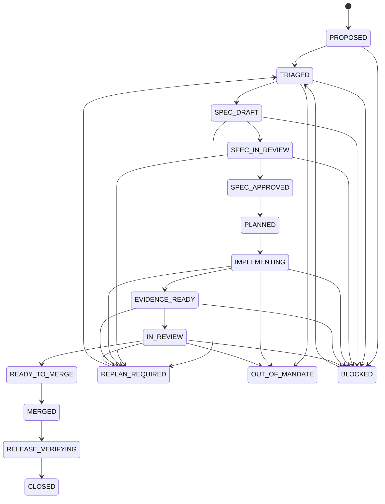

# GitHub 云端研发全流程 SSOT

> 状态：`ACTIVE`  
> 版本：`1.2`  
> 适用对象：人类开发者、AI 开发 Agent、Review Agent、Release Agent  
> 适用范围：本仓库所有需求、模块、代码、测试、文档、配置、发布和研究实验变更  
> 机器可读策略：`docs/github-development-ssot.yaml`  
> 当前自治授权：`docs/specs/autonomous-execution-mandate.yaml`  
> Agent 强制入口：`AGENTS.md`

---

## 1. 目标

本文件是仓库基于 GitHub 进行需求、SPEC、开发、测试、Review、合并、发布和台账归档的唯一研发流程事实源。

```text
可交付变化
= 已批准 Goal
+ 已批准 SPEC
+ 有效授权或自治 Mandate
+ 可追踪实现
+ 与风险匹配的充分证据
+ 可恢复发布
+ 可审计资产与状态
```

它不要求每次机械执行相同的 Unit Test 和 Integration Test，而要求针对真实风险选择最小但充分的证据。

---

## 2. 权威顺序

发生冲突时按以下顺序裁决：

1. 法律、隐私、安全和组织级政策；
2. 已确认生产不变量、Oracle、Permission 和发布保护；
3. 本文件与机器可读 SSOT；
4. 当前有效 Autonomous Mandate；
5. 路线、项目状态和正式台账；
6. 已批准 Goal / Issue；
7. 已批准 Module SPEC；
8. PR 中的实现计划和证据；
9. 临时聊天、评论、模型输出和个人假设。

低权威来源不能静默覆盖高权威来源。冲突必须进入 `BLOCKED`、`REPLAN_REQUIRED`、`OUT_OF_MANDATE` 或 `AUTHORITY_REQUIRED`。

---

## 3. SPEC-first 模块规则

每个非平凡模块或可独立交付的行为变化，在写运行时代码前必须先落 SPEC。

```text
Goal / Issue
→ Triage
→ SPEC_DRAFT
→ SPEC PR / CI / Review
→ SPEC_APPROVED 并合入 main
→ Implementation Plan
→ Runtime Implementation
```

Module SPEC 至少明确：

- Goal、范围和排除项；
- Requirement、Oracle、Mandate 和决策权威；
- 架构、状态、数据、接口和依赖；
- 安全、隐私、Permission、生产、设备和成本边界；
- 可证伪验收条件和失败模式；
- Test Obligations、证据和资产计划；
- Migration、Deployment、Rollback 和 Recovery；
- 未决事项和实现边界。

`DEV2`、`DEV3` 默认拆成两个阶段：

```text
SPEC PR
→ main
→ Implementation PR
```

例外：

- `DEV0`：没有运行时或治理影响时，可在 Goal / PR 中使用轻量 Inline SPEC；
- 小型 `DEV1`：没有共享契约变化且完整 SPEC 可独立 Review 时，可以 Inline；
- `DEV-E`：行动前仍需 Emergency SPEC，事后限期补齐完整 SPEC 与证据。

SPEC 合并后需求发生变化时，必须创建版本化 Change Event、Impact Assessment 和必要的 SPEC Addendum。禁止静默改写已批准 SPEC。

SPEC 完成不代表模块实现完成，也不代表 Milestone Gate 通过。

---

## 4. Standing Autonomous Mandate

当前有效授权为：

```text
MANDATE-AUTONOMY-M1-M3@1.0.0
```

它由仓库所有者通过 Issue #23 授权，覆盖 M1、M2、M3 路线内的 `DEV0`—`DEV3` 工作。

### 4.1 Mandate 的作用

它将：

```text
每个 DEV3 PR 单独等待人类批准
```

替换为：

```text
Approved Roadmap
+ Active Mandate
+ Approved SPEC
+ DEV3 Evidence
+ Deterministic Review Gate
→ Autonomous Merge / Release / Closure
```

Mandate 只改变授权频率，不降低任何 SPEC、测试、威胁模型、证据、Review、Rollback、Release 或审计要求。

### 4.2 自治范围

在覆盖范围内，Agent 可以自主：

- 创建 Goal、Change Event、SPEC、实现和测试资产；
- 选择或升级 DEV Profile；
- 修复有证据支持的问题；
- 创建、Review 和合并 PR；
- 发布 Python 包和 GHCR 镜像；
- 验证 Main、Release、Ledger 和 Branch Cleanup；
- 逐模块推进 M1—M3，不再重复请求人类批准。

### 4.3 DEV3 自治前置条件

必须同时满足：

1. Mandate 为 `ACTIVE`；
2. Goal 属于 M1—M3；
3. 必需 SPEC 已合并到 `main`；
4. PR 引用 Mandate ID 和 SPEC 版本；
5. 最终 Diff 未超出范围；
6. 独立 Test Design、Threat Model、Negative / Adversarial、真实边界证据和 Rollback 完整；
7. 必需 Checks 全绿；
8. Review Thread 和 Blocker 为 0；
9. Critical False Green 为 0；
10. Main、Release 和 Cleanup 验证成功。

### 4.4 不在 Mandate 内的动作

以下动作不能被“自治”绕过：

- M1—M3 之外的范围扩张；
- 法律、Oracle、生产不变量、Policy 或 Permission 冲突；
- 真实生产数据写入或个人数据暴露；
- Secret 获取、泄漏或权限提升；
- 破坏性生产迁移或不可逆外部写入；
- 实质性不可逆费用或无约束外部资源创建；
- 没有受控 Device SPEC、Lease、Reset 和 Recovery 的危险真实设备操作；
- `DEV-E` 生产动作；
- 绕过失败的 CI、Evidence、Replay、Mutation、Benchmark、Rollback 或 Review。

这些情况必须进入 `OUT_OF_MANDATE`、`BLOCKED` 或 `REPLAN_REQUIRED`。

### 4.5 Revocation

Mandate 可通过版本化 Change Event 撤销。撤销后禁止新的自治 DEV3 合并，但历史 Commit、Evidence 和审计记录必须保留。

---

## 5. GitHub 对象职责

| 对象 | 负责 | 不负责 |
|---|---|---|
| Goal / Issue | 目标、范围、验收、权威、风险和 Mandate 引用 | 不代表最终实现状态 |
| Module SPEC | 模块契约、边界、失败模式、证据和恢复设计 | 不代表代码已经实现 |
| Autonomous Mandate | 持续授权、覆盖范围、排除边界和撤销规则 | 不替代 Module SPEC 或质量 Gate |
| Branch | 隔离 SPEC 或实现变更 | 不作为长期 SSOT |
| Pull Request | SPEC/实现 Review、证据和合并决策 | 不能覆盖 Oracle 或 Requirement |
| GitHub Actions | 权威自动验证、构建和发布 Gate | 不能证明未设计的业务风险 |
| Workflow Artifact | JUnit、Replay、Trace、日志、Benchmark 和构建产物 | 不应成为无索引唯一存储 |
| Review Thread | 设计、代码、风险和证据质疑 | 不用于隐藏待办 |
| Merge Commit | 已 Review 的不可变集成点 | 不等于发布验证完成 |
| `main` | 权威代码、SPEC、Mandate 和文档基线 | 不保存聊天临时状态 |
| Tag / Release / GHCR | 可部署的不可变版本 | 不替代主干质量证据 |
| Status / Ledger | 项目状态、能力和资产索引 | 不得提前声明不存在的证据 |

---

## 6. Cloud-first 原则

- 所有正式变更通过 Branch 和 PR；
- 禁止直接向 `main` 写入；
- GitHub Actions 是权威验证环境；
- 本地和对话结果仅作为辅助证据；
- Main Push 后继续验证 Build、Release、Migration 和运行产物；
- Goal、SPEC、Mandate、PR、Commit、CI、Artifact、Release 和 Ledger 必须互相追溯；
- 环境、依赖、代码、目标项目、模型、Memory、设备和测试资产应版本化；
- 合并后的临时分支必须清理。

---

## 7. 研发状态机



状态要点：

- `SPEC_APPROVED`：SPEC 已通过 Gate 并进入 `main`；
- `IMPLEMENTING`：只允许在 Goal、SPEC 和 Mandate 范围内实现；
- `OUT_OF_MANDATE`：动作超出持续授权，禁止继续；
- `MERGED`：进入主干，但任务尚未关闭；
- `RELEASE_VERIFYING`：验证主干、构建、发布、迁移和 Smoke；
- `CLOSED`：Goal、SPEC、实现、证据、发布、台账和清理全部完成。

---

## 8. Development Assurance Profile

### DEV0：非行为变化

典型：排版、注释、无行为影响的元数据。

默认证据：Lint、Schema、引用、链接或策略一致性。**不默认虚构 Unit / Integration。**

### DEV1：隔离确定性逻辑

典型：纯函数、Parser、Validator、无共享契约变化的局部修复。

优先证据：Unit、Property、Contract、边界和拒绝路径。

### DEV2：边界或工作流变化

典型：Capability 契约、API、Store、Artifact、状态机、CLI、网络、浏览器、外部进程、GitHub Actions 和发布流程。

默认要求：已批准 SPEC、Unit / Contract、真实边界 Integration、Negative / Failure Path、受影响回归、资产和 Rollback。

### DEV3：生产关键或系统治理

典型：Oracle、Policy、Permission、Assurance Floor、Memory、自主迭代、模型路由、真实设备、Secret、生产数据、金额、隐私、安全、破坏性迁移、Release Gate 和正式资产晋升。

必须具备：

- 已批准 SPEC；
- 独立 Test Design 和 Threat Model；
- Unit / Contract 与真实边界 Integration；
- Adversarial / Negative；
- 与风险匹配的 Replay、Mutation、Benchmark、Independent Verifier、Stability 或 Canary；
- Rollback / Recovery；
- Active Mandate 覆盖，或单独 Explicit Authority。

DEV3 不能由 Agent 降级。Mandate 覆盖的 DEV3 可以在所有 Gate 通过后自治合并。

### DEV-E：紧急变化

```text
Emergency SPEC
→ 最小安全变更
→ 最小可信证据
→ 小范围发布
→ 强监控
→ 可立即回滚
→ 限期补齐 SPEC 和证据
```

`DEV-E` 生产动作不在当前 Standing Mandate 内。

---

## 9. 动态证据选择

先把验收和风险转换成 Test Obligation：

```yaml
obligation:
  statement: stale memory must not override the approved requirement
  failure_mode: outdated memory is treated as current truth
  oracle: current approved requirement wins
  evidence:
    - conflict-resolution contract test
    - stale-memory store integration
    - memory-poisoning benchmark
```

证据通常按成本递增：

```text
Static / Schema
→ Unit / Property
→ Contract / API
→ Boundary Integration
→ Browser / Device / E2E
→ Replay / Mutation / Benchmark / Canary
```

选择原则：观察真实行为、选择最低成本充分证据、不 Mock Truth Boundary、说明跳过层级、风险扩大时升级 Profile。

区分：

- **Change-specific Evidence**：证明本次变化；
- **Repository Regression Gate**：保护既有基线。

---

## 10. GitHub 全流程

### 10.1 Goal / Issue

明确 Goal、In/Out Scope、验收、权威、Mandate、约束、风险、数据/设备/Secret/发布影响。

### 10.2 Baseline Sync

读取 `AGENTS.md`、SSOT、Mandate、状态、路线、相关 SPEC 和架构；获取最新 `main`；检查并行 PR 和资产版本。

### 10.3 Triage

输出 Change Map、DEV Profile、Mandate Coverage、风险、SPEC 深度、Test Obligations、资产计划和 Blocker。

### 10.4 SPEC Phase

建立独立 SPEC Branch / PR，完成人类和机器可读规范、Test Design、Golden / Negative / Adversarial 资产目录、一致性 Gate、状态和路线更新。

### 10.5 Implementation Phase

实现必须引用已批准 SPEC 和适用 Mandate。新发现超出范围时停止扩展，创建 Change Event 和 SPEC Addendum。

### 10.6 Pull Request

PR 必须说明：Goal、SPEC、Mandate、Phase、Profile、Change Map、Acceptance/Evidence Matrix、执行与跳过证据、资产、Requirement/Oracle、Deployment/Rollback、Blocker 和 Merge Eligibility。

### 10.7 Review

Review 必须检查 Goal/SPEC/Mandate 漂移、Oracle、Profile 低估、证据可观测性、False Green、Mock Truth Boundary、Permission/Budget/Context/Side Effect、外部效果和发布恢复。

### 10.8 Merge 与 Release

合并条件：Mandate 覆盖或 Explicit Authority、必需 Checks 全绿、Review Thread 为 0、证据充分、状态真实、Rollback 可信。

合并后进入 `RELEASE_VERIFYING`，验证 Main CI、Build、Release/GHCR、Migration/Compatibility、Smoke/Probe/Canary、Ledger 和 Branch Cleanup。

任何适用 Gate 失败，都不能进入 `CLOSED`。

---

## 11. Agent 自主权限

在已批准 Goal、SPEC 和有效 Mandate 内，Agent 可以：

- 创建 Goal、SPEC 和实现分支；
- 创建、Review 和合并 SPEC / Implementation PR；
- 选择并解释证据；
- 修复有证据支持的问题；
- 更新状态和台账；
- 清理已合并临时分支；
- 对满足条件的 DEV0—DEV3 自治合并和发布。

必须暂停或升级：

- 缺少或冲突的 Goal / SPEC / Mandate / Authority；
- Oracle / Policy / Permission 或更高权威冲突；
- Out-of-Mandate 生产写、Secret、个人数据或危险设备操作；
- 不可逆资源或成本；
- Goal / SPEC / Mandate 范围扩张；
- 证据冲突；
- `DEV-E` 生产动作。

禁止：

- 直接写 `main`；
- 在必需 SPEC 合并前写运行时代码；
- 没有 Active Covering Mandate 的自治 DEV3；
- 静默改写 SPEC、Mandate 或 Requirement；
- 静默降低 Profile；
- 删除断言、固定 Sleep 或盲目 Retry 制造绿色；
- Candidate 直接晋升生产；
- 绕过失败的 CI、Evidence、Review 或 Release Gate。

---

## 12. 资产管理

| 资产 | 默认位置 |
|---|---|
| Module SPEC / Mandate | `docs/specs/` |
| Test Design | `docs/testing/` |
| Golden / Negative / Adversarial | `tests/assets/` 或 `benchmarks/` |
| Unit / Contract | `tests/unit/` |
| API | `tests/api/` |
| Integration | `tests/integration/` |
| E2E | `tests/e2e/` |
| Regression | `tests/regression/` |
| Replay | `experiments/` |
| Mutation | `proofs/` |
| Benchmark | `benchmarks/` |
| Runtime Evidence | GitHub Actions Artifact |

资产进入正式库必须绑定 Requirement、Invariant、Risk 或 Defect，拥有显式 Oracle、可诊断失败、可复现环境、Owner、Version 和 Scope。

---

## 13. Definition of Done

```text
Goal satisfied
+ Mandate coverage or explicit authority confirmed
+ required SPEC approved and merged
+ Profile justified
+ obligations have sufficient evidence
+ repository regression passed
+ review blockers resolved
+ main and release verified
+ assets and ledgers truthful
+ rollback or recovery credible
+ temporary state cleaned
```

---

## 14. SSOT 与 Mandate 自身变更

修改本 SSOT 至少为 `DEV2`。放宽 SPEC Gate、安全边界、自动合并、Oracle、Policy、Permission、Mandate Scope 或生产批准时升级为 `DEV3`。

本次 Standing Mandate 的创建已由 Issue #23 中的仓库所有者指令明确授权。

以下文件必须保持一致：

- `AGENTS.md`；
- `docs/github-development-ssot.md`；
- `docs/github-development-ssot.yaml`；
- `docs/specs/autonomous-execution-mandate.yaml`；
- `.github/ISSUE_TEMPLATE/goal.yml`；
- `.github/pull_request_template.md`；
- `tests/unit/test_github_development_ssot.py`；
- `tests/unit/test_autonomous_execution_mandate.py`。
