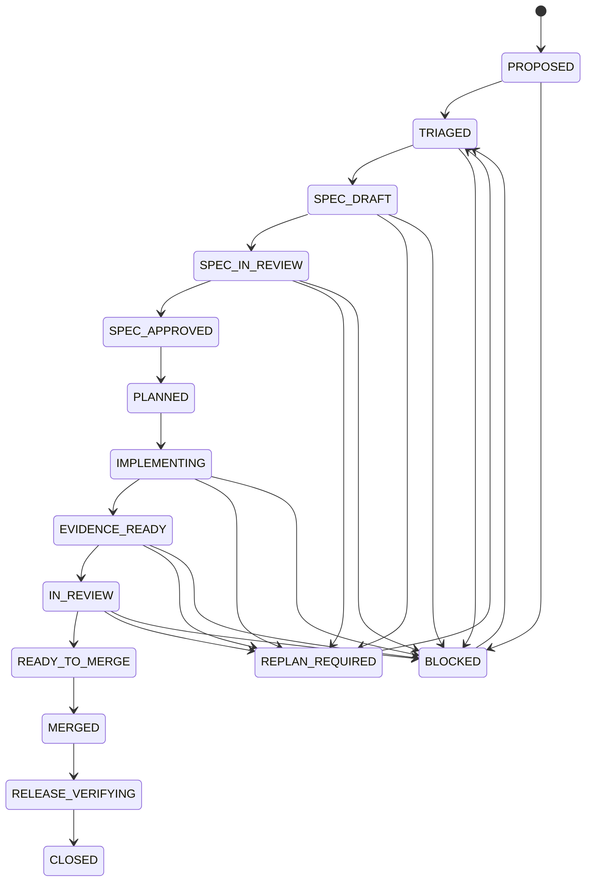

# GitHub 云端研发全流程 SSOT

> 状态：`ACTIVE`  
> 版本：`1.1`  
> 适用对象：人类开发者、AI 开发 Agent、Review Agent、Release Agent  
> 适用范围：本仓库所有需求、模块、代码、测试、文档、配置、发布和研究实验变更  
> 机器可读策略：`docs/github-development-ssot.yaml`  
> Agent 强制入口：`AGENTS.md`

---

## 1. 目标

本文件是仓库基于 GitHub 进行需求、SPEC、开发、测试、Review、合并、发布和台账归档的唯一研发流程事实源。

核心原则：

```text
可交付变化
= 已批准 Goal
+ 已批准 SPEC
+ 可追踪实现
+ 与风险匹配的充分证据
+ 可恢复发布
+ 可审计资产与状态
```

它不要求每次机械执行相同的 Unit Test 和 Integration Test，而是要求对每一次变化选择最小但充分、能够观察真实风险的证据。

---

## 2. 权威顺序

发生冲突时按以下顺序裁决：

1. 法律、隐私、安全和组织级政策；
2. 已确认生产不变量、Oracle、Permission 和发布保护；
3. 本文件与 `docs/github-development-ssot.yaml`；
4. 路线、项目状态和正式台账；
5. 已批准 Goal / Issue；
6. 已批准 Module SPEC；
7. PR 中的实现计划和证据；
8. 临时聊天、评论、模型输出和个人假设。

低权威来源不能静默覆盖高权威来源。冲突必须进入 `BLOCKED`、`REPLAN_REQUIRED` 或 `AUTHORITY_REQUIRED`。

---

## 3. SPEC-first 模块规则

每个非平凡模块或可独立交付的行为变化，在写运行时代码之前必须先落 SPEC。

### 3.1 正常路径

```text
Goal / Issue
→ Triage
→ SPEC_DRAFT
→ SPEC PR / CI / Review
→ SPEC_APPROVED 并合入 main
→ Implementation Plan
→ Runtime Implementation
```

运行时实现不得早于相关 SPEC 合并到 `main`。

### 3.2 Module SPEC 最低内容

SPEC 应按风险深度明确：

- Goal、范围和排除项；
- 需求、Oracle 和决策权威；
- 架构、状态、数据、接口和依赖；
- 安全、隐私、Permission、生产和成本边界；
- 可证伪验收条件和失败模式；
- Test Obligations、证据和资产计划；
- 迁移、部署、Rollback 和 Recovery；
- 未决事项和实现边界。

### 3.3 SPEC 与实现 PR

`DEV2`、`DEV3` 默认拆成两个阶段：

```text
SPEC PR
→ main
→ Implementation PR
```

允许例外：

- `DEV0`：没有运行时或治理影响时，可在 Goal / PR 中使用轻量 Inline SPEC；
- 小型 `DEV1`：没有共享契约变化，且完整 SPEC 可独立 Review 时，可以 Inline；
- `DEV-E`：行动前仍需 Emergency SPEC，至少包含最小范围、风险、证据、Rollout 和 Rollback；事后必须限期补齐完整 SPEC 与证据。

### 3.4 SPEC 变更

SPEC 合并后需求发生变化时：

```text
Change Event
→ Authority Check
→ Semantic / Risk Classification
→ Impact Assessment
→ 局部失效 SPEC、计划、资产和证据
→ 新版本 SPEC 或 Addendum
→ Re-review
```

禁止静默改写已批准 SPEC 的语义。旧版本必须保留历史并标记 `SUPERSEDED`、`REQUIRES_REVIEW` 或 `REQUIRES_RERUN`。

SPEC 完成不代表模块实现完成，也不代表 Milestone Gate 通过。

---

## 4. GitHub 对象职责

| 对象 | 负责 | 不负责 |
|---|---|---|
| Goal / Issue | 业务目标、范围、验收、限制、权威和初始风险 | 不代表最终实现状态 |
| Module SPEC | 模块契约、边界、失败模式、证据和恢复设计 | 不代表代码已经实现 |
| Branch | 隔离 SPEC 或实现变更 | 不作为长期 SSOT |
| Pull Request | SPEC/实现 Review、证据和合并决策 | 不能覆盖 Oracle 或正式 Requirement |
| GitHub Actions | 权威自动验证、构建和发布 Gate | 不能证明未设计的业务风险 |
| Workflow Artifact | JUnit、Replay、Trace、日志、Benchmark 和构建产物 | 不应成为无索引的唯一存储 |
| Review Thread | 设计、代码、风险和证据质疑 | 不用于隐藏待办 |
| Merge Commit | 已 Review 的不可变集成点 | 不等于发布验证完成 |
| `main` | 权威代码、SPEC 和文档基线 | 不保存聊天临时状态 |
| Tag / Release / GHCR | 可部署的不可变版本 | 不替代主干质量证据 |
| Status / Ledger | 项目状态、能力和资产索引 | 不得提前声明不存在的证据 |

---

## 5. Cloud-first 原则

- 所有正式变更通过 Branch 和 PR；
- 禁止直接向 `main` 写入；
- GitHub Actions 是权威验证环境；
- 本地和对话结果仅作为辅助证据；
- `main` 推送后继续验证构建、发布、迁移和运行产物；
- Goal、SPEC、PR、Commit、CI、Artifact、Release 和 Ledger 必须相互追溯；
- 环境、依赖、代码、目标项目、模型、Memory、设备和测试资产应版本化；
- 合并后的临时分支必须清理。

---

## 6. 研发状态机



状态要点：

- `SPEC_DRAFT`：模块边界、验收和证据正在形成；
- `SPEC_IN_REVIEW`：SPEC 接受结构、风险和权威 Review；
- `SPEC_APPROVED`：SPEC 已通过 Gate 并进入 `main`；
- `IMPLEMENTING`：只允许在已批准 SPEC 范围内实现；
- `MERGED`：进入主干，但任务尚未关闭；
- `RELEASE_VERIFYING`：验证主干、构建、发布、迁移和 Smoke；
- `CLOSED`：Goal、SPEC、实现、证据、发布、台账和清理全部完成。

---

## 7. Development Assurance Profile

### DEV0：非行为变化

典型：排版、注释、无行为影响的元数据。

默认证据：Lint、Schema、引用、链接或策略一致性。**不默认虚构 Unit / Integration。**

如果文档会改变 Agent、CI、发布或用户行为，必须升级。

### DEV1：隔离确定性逻辑

典型：纯函数、Parser、Validator、无共享契约变化的局部修复。

优先证据：Unit、Property、Contract、边界和拒绝路径。只有触及真实边界或历史风险时增加 Integration。

### DEV2：边界或工作流变化

典型：Capability 契约、API、Store、Artifact、状态机、CLI、网络、浏览器、外部进程、GitHub Actions 和发布流程。

默认要求：

- 已批准 SPEC；
- Unit / Contract；
- 真实受影响边界的 Integration；
- Negative / Failure Path；
- 受影响回归；
- 资产、部署和 Rollback 说明。

不适用的测试层必须解释替代证据。

### DEV3：生产关键或系统治理

典型：Oracle、Policy、Permission、Assurance Floor、Memory、自主迭代、模型路由、真实设备、Secret、生产数据、金额、隐私、安全、破坏性迁移、Release Gate 和正式资产晋升。

必须具备：

- 已批准 SPEC；
- 独立测试设计和威胁模型；
- Unit / Contract 与真实边界 Integration；
- Adversarial / Negative；
- 与风险匹配的 Replay、Mutation、Benchmark、独立 Verifier、稳定性或 Canary；
- Rollback / Recovery；
- 明确人类批准。

DEV3 不能由 Agent 单方面降级或自动合并。

### DEV-E：紧急变化

```text
Emergency SPEC
→ 最小安全变更
→ 最小可信证据
→ 小范围发布
→ 强监控
→ 可立即回滚
→ 限期补齐 SPEC 和证据
```

---

## 8. 动态证据选择

先把验收和风险转换成 Test Obligation：

```yaml
obligation:
  statement: stale memory must not override the approved requirement
  failure_mode: outdated memory is treated as current truth
  oracle: current approved requirement wins
  evidence:
    - conflict-resolution contract test
    - stale-memory store integration
    - memory-poisoning benchmark
```

证据通常按成本递增：

```text
Static / Schema
→ Unit / Property
→ Contract / API
→ Boundary Integration
→ Browser / Device / E2E
→ Replay / Mutation / Benchmark / Canary
```

选择规则：

1. 确认真实行为变化；
2. 找到业务资产、数据、状态、接口、Permission 和发布边界；
3. 描述失败模式和损失；
4. 选择能观察真实结果的最低成本证据；
5. 加入失败路径和历史缺陷；
6. 高风险义务增加独立证伪；
7. 说明跳过哪些层级及原因；
8. 新证据扩大风险时升级 Profile 并重新规划。

区分：

- **Change-specific Evidence**：证明本次变化；
- **Repository Regression Gate**：保护既有基线。

完整 CI 不能替代本次变化的测试设计，本次测试设计也不能取消主干回归保护。

---

## 9. GitHub 全流程

### 9.1 Goal / Issue

明确 Goal、In/Out Scope、验收、权威、约束、风险、数据/设备/Secret/发布影响和自动合并范围。

### 9.2 Baseline Sync

读取 `AGENTS.md`、本 SSOT、状态、路线、相关 SPEC 和架构；获取最新 `main`；检查并行 PR 和资产版本。

### 9.3 Triage

输出 Change Map、DEV Profile、风险、SPEC 深度、Test Obligations、资产计划和待批准事项。

### 9.4 SPEC Phase

建立独立 SPEC Branch / PR，完成：

- 人类可读规范；
- 必要的机器可读契约；
- Test Design；
- Golden / Negative / Adversarial 资产目录；
- 一致性 Gate；
- 状态和路线更新。

SPEC PR 合并并完成主干验证后，才能开始实现分支。

### 9.5 Implementation Phase

实现必须引用已批准 SPEC 版本。新发现超出 SPEC 时停止扩展，创建 Change Event 和 SPEC Addendum。

### 9.6 Pull Request

PR 必须说明：

- Goal 和 SPEC 引用；
- 当前阶段是 SPEC 还是 Implementation；
- Profile 和原因；
- Change Map；
- Acceptance / Evidence Matrix；
- 执行和跳过的证据及原因；
- 资产、Requirement、Oracle、部署和 Rollback；
- Blocker、残余风险和 Merge Eligibility。

### 9.7 Review

Review 必须检查 Goal / SPEC 漂移、Oracle、Profile 低估、证据可观测性、False Green、Mock Truth Boundary、Permission / Budget / Context / Side Effect、资产维护和发布恢复。

### 9.8 Merge 与 Release

合并条件：必需 Checks 全绿、未解决 Thread 为 0、证据充分、状态真实、Rollback 可信。

合并后进入 `RELEASE_VERIFYING`，验证：

- Main CI；
- 构建产物；
- Release / GHCR；
- Migration / Compatibility；
- Smoke / Probe / Canary；
- 台账和临时分支清理。

任何适用发布 Gate 失败，都不能进入 `CLOSED`。

---

## 10. Agent 自主权限

在已批准 Goal 和 SPEC 内，Agent 可以：

- 创建 Goal、SPEC 和实现分支；
- 创建 SPEC / Implementation PR；
- 选择并解释证据；
- 修复有证据支持的问题；
- 更新状态和台账；
- 清理已合并临时分支；
- 对满足条件的 DEV0—DEV2 自动合并。

必须暂停或升级：

- 缺少或冲突的 Goal / SPEC / Authority；
- DEV3 信号；
- Oracle / Policy / Permission 冲突；
- 生产写、Secret、真实设备危险操作；
- 不可逆资源或成本；
- Goal / SPEC 范围扩张；
- 证据冲突。

明确需要人类批准：

- DEV3；
- DEV-E 生产动作；
- Oracle、Policy、Permission、Assurance Floor；
- Memory、Prompt、Procedure、Skill、测试或 Capability 晋升；
- Secret、生产数据、真实设备池；
- 破坏性迁移；
- Release Gate 和自动合并控制。

禁止：

- 直接写 `main`；
- 在必需 SPEC 合并前写运行时代码；
- 静默改写 SPEC 或 Requirement；
- 静默降低 Profile；
- 删除断言、固定 Sleep 或盲目 Retry 制造绿色；
- 把聊天状态当仓库 SSOT；
- Candidate 直接晋升生产。

---

## 11. 资产管理

| 资产 | 默认位置 |
|---|---|
| Module SPEC | `docs/specs/` |
| Test Design | `docs/testing/` |
| Golden / Negative / Adversarial | `tests/assets/` 或 `benchmarks/` |
| Unit / Contract | `tests/unit/` |
| API | `tests/api/` |
| Integration | `tests/integration/` |
| E2E | `tests/e2e/` |
| Regression | `tests/regression/` |
| Replay | `experiments/` |
| Mutation | `proofs/` |
| Benchmark | `benchmarks/` |
| Runtime Evidence | GitHub Actions Artifact |

资产进入正式库必须绑定 Requirement、Invariant、Risk 或 Defect，拥有显式 Oracle、可诊断失败、可复现环境、Owner、Version 和 Scope。

---

## 12. Definition of Done

```text
Goal satisfied
+ required SPEC approved and merged
+ Profile justified
+ obligations have sufficient evidence
+ repository regression passed
+ review blockers resolved
+ main and release verified
+ assets and ledgers truthful
+ rollback or recovery credible
+ temporary state cleaned
```

---

## 13. SSOT 自身变更

修改本 SSOT 至少为 `DEV2`。放宽 SPEC Gate、安全边界、自动合并、Oracle、Policy、Permission 或生产批准时升级为 `DEV3`，必须获得人类批准。

以下文件必须保持一致：

- `AGENTS.md`；
- `docs/github-development-ssot.md`；
- `docs/github-development-ssot.yaml`；
- `.github/pull_request_template.md`；
- `tests/unit/test_github_development_ssot.py`。
