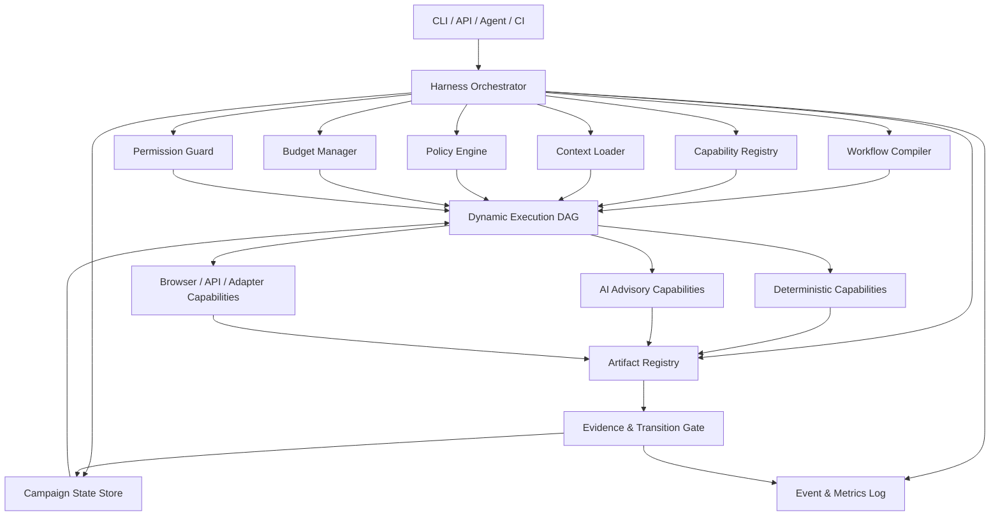

# 测试 Harness 架构设计

> 文档状态：架构方案 v1.0  
> 适用范围：`test_workflow` 后续全部新增能力  
> 核心结论：对外提供风险自适应 Test Workflow，对内使用原子 Capability、版本化 Artifact、动态执行图和渐进式上下文加载。

---

## 1. 架构定位

当前项目对用户呈现为测试 Workflow，但内部不能实现成固定串行的大型 Agent：

```text
对外：Test Workflow / Test Campaign
对内：Capability Atoms + Harness + Dynamic Execution Graph
```

Harness 的职责不是理解全部业务，而是：

- 根据风险、状态、预算和证据编译本次执行图；
- 按需加载上下文；
- 调用确定性或 AI 辅助 Capability；
- 持有 Campaign 状态和 Artifact 引用；
- 执行权限、预算、重试、超时和发布 Gate；
- 保留完整事件、版本、成本和证据审计记录。

模型负责提出候选，Capability 负责完成动作，Harness 负责控制系统。

---

## 2. 设计原则

### 2.1 能力原子化，但不微型 Agent 化

拆分的是可复用能力，不是人格角色。第一阶段控制在约 15—25 个核心 Capability，不把普通内部函数包装成独立节点。

适合成为 Capability 的边界至少满足一项：

- 有独立业务意义或明确输入输出 Artifact；
- 可被多个 Workflow 复用；
- 需要独立权限、预算、重试或回滚；
- 需要独立审计、版本或可替换实现。

### 2.2 Workflow 动态编译，不固定串行

Workflow 是 Harness 根据输入变化、Assurance Profile、Campaign 状态和可用 Capability 编译出的 Execution Plan。

```text
文案变更：source.register → assurance.route → lint → affected-unit
普通需求：source.register → assurance.route → facts.extract → unit/api → critical-e2e
关键需求：source.register → assurance.route → invariants.resolve → loss-scenario → mutation → replay → gate
```

需求变化后只重新编译受影响的剩余子图。

### 2.3 状态归 Harness，不归模型

Capability 不能直接修改 Campaign。它只能返回：

- 新 Artifact；
- Domain Event；
- Suggested Transition；
- Metrics；
- Warning / Blocker。

Harness 使用 Policy Engine 验证后再提交状态变化。

### 2.4 上下文按需加载

任何 Capability 必须声明 `ContextRequest`，禁止默认加载整个仓库、全部需求、全部测试和全部 Evidence。

上下文深度分为：

| 层级 | 内容 |
|---|---|
| `METADATA` | 文件路径、Diff 统计、标签、资产映射、版本 |
| `SUMMARY` | 模块摘要、契约摘要、历史风险与测试摘要 |
| `FOCUSED` | 受影响源码、TestSpec、Oracle、映射测试和局部状态机 |
| `DEEP` | 局部调用链、完整 Evidence、事故记录和生产指标 |

Router 通常只使用 `METADATA/SUMMARY`；L2/L3 才加载 `FOCUSED/DEEP`。

### 2.5 AI 仅作为受控 Capability

AI Capability 使用 `propose` 语义：

```text
ai.propose-change-semantics
ai.propose-business-impact
ai.propose-risk-candidates
ai.compile-local-business-model
ai.propose-test-spec
```

模型输出必须经过 Schema、Authority、Policy Floor、Evidence 和 Budget Gate，不能直接决定 PASS、发布阻断、Oracle 修改或保障降级。

---

## 3. 总体架构



---

## 4. 核心协议

### 4.1 Capability Descriptor

每个 Capability 必须声明：

```yaml
name: assurance.route
version: 1.0.0
input_types:
  - RequirementRevision@1
  - ChangeSummary@1
output_types:
  - AssuranceDecision@1
side_effects: []
cost_class: low
context_level: summary
permissions:
  read:
    - requirements
    - diff_metadata
    - business_asset_index
  write:
    - artifacts/assurance
idempotency: deterministic
retry_policy: none
timeout_seconds: 5
```

必需字段：

- 名称和语义版本；
- 输入与输出 Artifact 类型；
- 副作用；
- 成本等级；
- 上下文需求；
- 读写权限；
- 幂等性；
- 超时与重试策略；
- 是否允许模型、网络、浏览器或进程。

### 4.2 Capability Request / Result

```python
class CapabilityRequest:
    capability: str
    input_artifacts: list[ArtifactRef]
    context_request: ContextRequest
    budget: ExecutionBudget
    permissions: PermissionScope

class CapabilityResult:
    artifacts: list[ArtifactRef]
    events: list[DomainEvent]
    suggested_transition: str | None
    metrics: ExecutionMetrics
    warnings: list[str]
    blockers: list[str]
```

Capability 不接收可任意修改的全局对象。

### 4.3 Artifact Reference

所有跨模块数据都通过版本化 Artifact：

```yaml
artifact_id: assurance-decision/CAMPAIGN-001/0003
artifact_type: AssuranceDecision
schema_version: 1
content_hash: sha256:...
source_revision:
  requirement: REQ-TODO-001@v3
  code: abc123
created_by:
  capability: assurance.route@1.0.0
validity: VALID
```

Artifact 默认不可变。更新产生新版本，旧版本保留为 Historical 或 Superseded。

### 4.4 Context Request

```yaml
context_request:
  level: focused
  requirement:
    revision: current
  code:
    mode: changed_files_and_direct_dependencies
  business:
    assets:
      - todo.persistence
      - todo.cleanup
  tests:
    mode: mapped_only
  evidence:
    mode: relevant_failures_only
  max_tokens: 12000
```

Context Loader 必须记录实际加载了什么、摘要版本和缓存命中情况。

---

## 5. Harness 核心组件

### 5.1 Capability Registry

- 注册名称、版本、Descriptor 和实现；
- 解析兼容版本；
- 防止重复和隐式覆盖；
- 支持同一 Capability 的 deterministic、mock-provider 和 model-provider 实现；
- 提供发现接口，但不让模型自由调用未授权能力。

### 5.2 Workflow Compiler

输入：

- Trigger / Change Event；
- Campaign State；
- Assurance Decision；
- Artifact Validity；
- Budget / Permission；
- Capability 可用性。

输出版本化 `ExecutionPlan` DAG：

- 节点依赖；
- 跳过理由；
- Gate；
- 失败策略；
- 可并行组；
- 预算分配；
- 预期 Artifact。

同一输入必须生成稳定计划，AI 只能提出候选节点，最终图由规则编译。

### 5.3 Orchestrator

- 按 DAG 执行；
- 支持暂停、恢复、取消和局部重编译；
- 对副作用节点做 Before/After Checkpoint；
- 捕获超时、失败和部分成功；
- 不在内存对话中隐式保存状态。

### 5.4 Policy Engine

负责：

- Assurance Policy Floor；
- Source Authority；
- Oracle 修改权限；
- Campaign 状态转换；
- 高风险发布 Gate；
- 自动修复边界；
- Mock Truth Boundary；
- 风险晋升证据门槛。

### 5.5 Budget Manager

预算维度：

- 模型调用次数和 Token；
- Browser / API / Mutation / Replay 数量；
- 运行时长和并发；
- 重试次数；
- 风险候选和详细场景数量；
- Artifact 体积。

超预算时应降级、暂停或请求批准，不能静默继续。

### 5.6 Artifact Registry 与 Campaign Store

- Artifact 不可变版本；
- Requirement、Oracle、TestSpec、Test Code、Evidence、Decision 依赖图；
- Valid / Requires Review / Requires Rerun / Superseded / Historical；
- Raw Progress 与 Valid Progress；
- Change Assessment 后局部失效传播。

### 5.7 Event Log 与 Observability

每次执行记录：

- Capability 和版本；
- 输入输出哈希；
- Context 实际加载量；
- 模型、Token、费用和延迟；
- 浏览器与外部进程耗时；
- 缓存命中；
- 重试、降级和失败；
- 状态转换和 Policy 决策原因。

---

## 6. 渐进式加载与缓存

### 6.1 结构化知识资产

```text
business/
├── assets.yaml
├── invariants.yaml
├── state-machines.yaml
├── dependencies.yaml
└── incidents.yaml

context/
├── module-summaries/
├── api-contracts/
└── code-test-map/
```

缓存绑定：代码 SHA、Requirement Revision、业务模型 Revision 和 Capability Version。任一依赖变化只失效相关切片。

### 6.2 加载策略

```text
先 Metadata
→ 证据不足再 Summary
→ 影响明确后 Focused
→ L2/L3 或复杂诊断才 Deep
```

不得因为模型支持更长上下文就默认全量加载。

---

## 7. 第一批 Capability

### 已有实现包装

- `spec.validate`
- `mock.verify`
- `environment.build`
- `bundle.validate`
- `replay.execute`
- `target.validate`
- `target.materialize`
- `target.start`
- `product.seed`
- `product.probe`
- `test.run`
- `proof.run`

### Module 03 新能力

- `source.register`
- `source.authorize-change`
- `change.classify`
- `assurance.route`
- `campaign.transition`
- `impact.compute`
- `artifact.invalidate`
- `progress.calculate`
- `decision.report`

### 后续 AI 能力

- `ai.propose-change-semantics`
- `ai.compile-local-business-model`
- `ai.propose-loss-scenarios`
- `ai.propose-test-spec`
- `ai.propose-repair`

---

## 8. 目录规划

```text
src/test_workflow/harness/
├── capability.py
├── registry.py
├── artifacts.py
├── execution.py
├── orchestrator.py
├── workflow.py
├── context.py
├── policy.py
├── budget.py
├── permissions.py
├── events.py
└── metrics.py

src/test_workflow/capabilities/
├── existing/
├── source/
├── assurance/
├── campaign/
├── impact/
└── ai/
```

CLI / API / Agent 都通过 Harness 进入，不在各入口复制编排逻辑。

---

## 9. Module 03.0：Harness Foundation

### 03.0A Contracts

交付：CapabilityDescriptor、Request/Result、ArtifactRef、ContextRequest、ExecutionBudget、PermissionScope、DomainEvent。

### 03.0B Registry 与 Artifact Store

交付：注册、版本解析、不可变 Artifact、哈希和内存/文件实现。

### 03.0C Policy、Budget 与 Permission

交付：统一决策接口、预算消耗、越权拒绝和审计原因。

### 03.0D Minimal Workflow Compiler / Orchestrator

交付：DAG、依赖排序、跳过、失败、暂停、恢复和局部重编译骨架。

### 03.0E Existing Capability Adapters

至少包装并集成：`spec.validate`、`target.validate`、`test.run`、`proof.run`。

### Stage Gate

使用一个 L1 TodoMVC Campaign 验证：

```text
source.register
→ assurance.route fixture
→ target.validate
→ affected test.run
→ artifact / event / metrics persisted
```

并验证：

- 不需要的 Mock、Mutation 和 Deep Context 未加载；
- Capability 顺序稳定；
- 超预算和越权被拒绝；
- 中断后可以从 Artifact 恢复；
- 单个节点失败不会污染已完成 Artifact。

---

## 10. 非目标

Harness Foundation 第一版不做：

- 通用分布式工作流平台；
- 任意用户脚本插件市场；
- 多 Agent 自由协商；
- 长时间后台调度；
- 复杂 Dashboard；
- 全部现有代码一次性重构。

目标是建立清晰边界，让后续能力不再各自实现状态、权限、上下文和编排。

---

## 11. 架构验收标准

- 新 Capability 无需修改 Orchestrator 核心即可注册；
- 同一输入、Policy 和 Registry 生成相同 Execution Plan；
- Campaign 状态只能通过 Policy 校验的 Event 转换；
- Capability 无法越过声明的读写权限；
- Router 场景不加载 Deep Context 或启动浏览器；
- L1 场景不执行 Mutation；
- Requirement 变化只重新执行受影响节点；
- 每个节点具备独立单元测试；
- Stage Gate 能从中断点恢复；
- 报告包含上下文、成本、缓存和决策原因。
