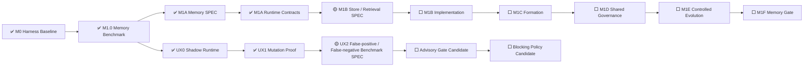

# AI Test Harness / Test Agent OS 实现状态

> 文档角色：项目状态单一事实源  
> 最近更新：2026-08-05  
> 当前状态：`FOUNDATION_BASELINE`  
> 阶段产品交付：`NOT_READY`  
> 当前里程碑：`M1 MEMORY_AND_CONTROLLED_EVOLUTION`  
> 已关闭主模块：`M1A RUNTIME_CONTRACTS`  
> 当前主模块：`M1B STORE_AND_PROGRESSIVE_RETRIEVAL_SPEC`  
> 当前主模块阶段：`SPEC_NEXT`  
> 并行跨切面：`UX Assurance Plane`  
> 下一 UX 模块：`UX2 FALSE_POSITIVE_FALSE_NEGATIVE_BENCHMARK_SPEC`  
> UX Gate：`SHADOW_NONBLOCKING`  
> Human UAT：`REQUIRED`  
> 当前自治授权：`MANDATE-AUTONOMY-M1-M3@1.0.0 ACTIVE`

---

## 1. 状态结论

```text
M0 Harness Baseline：MERGED
M1.0 Memory Benchmark Harness：MERGED / CLOSED
M1A Memory Contracts & Namespaces SPEC：MERGED / CLOSED
M1A Runtime Contracts：MERGED / CLOSED
M1B Store & Progressive Retrieval：NEXT / SPEC
TodoMVC UX Mutation Proof SPEC：MERGED / CLOSED
UX Mutation Proof Runner：MERGED / CLOSED
Five-mutation Campaign：5 / 5 KILLED
UX False-positive / False-negative Benchmark：NEXT / SPEC
UX Gate Mode：SHADOW / NONBLOCKING
Human UAT：REQUIRED
M1 Memory Gate：0 / 1
Stage Delivery：NOT_READY
```

当前项目已经具备需求到测试执行、证据、诊断、回归、重放和发布的基础闭环，也具备真实 Playwright 用户体验 Shadow 验证、UX Mutation 证明，以及可执行的治理型 Memory 领域契约。

项目仍未达到阶段产品交付标准：当前没有生产 Memory Store，尚未验证渐进式检索、跨模型泛化和跨项目架构能力，M1 Memory Gate 仍保持 OPEN。

---

## 2. 当前推进链



Memory 仍是主执行路径。UX Assurance 是跨 M1—M3 的并行质量面，不改变 M1B SPEC 的当前执行优先级。

---

## 3. 已交付基础能力

### M0 Harness Baseline

已具备：Capability Contract、Registry、不可变 Artifact Store、Policy、Permission、Budget、Workflow Compiler、Orchestrator、Requirement Revision、Impact、Campaign、Generation、Diagnosis、Regression、Verdict、Replay、功能 Mutation Proof、Browser、Pinned Target、Python Package 与 GHCR 发布。

### M1.0 Memory Benchmark Harness

已完成 16 个 Memory 场景、60 次运行、独立 Replay 和安全优先判定；Critical False Green 为 0。该模块证明了 Memory 价值和威胁评估基线，但不实现生产 Memory Store，也不关闭 M1 Memory Gate。

### M1A Memory Contracts & Namespaces SPEC

已明确五类 Memory、Namespace、ACL、Provenance、Revision、Lifecycle、Promotion、CAS、Conflict、Forget、Compatibility 和厂商无关 Port 的规范边界。

### M1A Runtime Contracts

已把上述规范变成可执行代码与证据：

- 稳定 Canonical JSON、Memory ID、Revision ID 与 SHA-256；
- Revision 和嵌套 Provenance JSON 不可原地修改，Revision 只允许 Append；
- Project、Campaign、Agent、Organization、Shared Namespace 精确隔离；
- 委派范围和过期时间强制执行；
- ACL 默认拒绝、DENY 优先，相关性和向量相似度不能授权；
- Candidate、Verified、Promoted、Conflicting、Quarantined、Superseded、Revoked、Expired、Forgotten 状态机；
- Promotion 必须绑定真实 Actor、Evidence、Benchmark 和 Revision Provenance；
- CAS、Idempotency、显式 Conflict 和禁止最后写入静默覆盖；
- 过期、撤销、遗忘后的内容不会进入有效读取；
- Procedural / Skill 必须通过代码、Schema、Capability、权限和环境兼容性检查；
- 六类厂商无关 Port 与确定性内存参考适配器；
- Artifact Manifest、15 项确定性 Proof、独立 Replay 和 Tamper 拒绝。

最终交付事实：

```text
Goal：Issue #43 — 待台账合并后关闭
Implementation PR：#44 — MERGED
Merge Commit：0585e357aebda650ee50ee95ff962b3ac81f6d4c
PR M1A Runtime Gate：31018116312 — SUCCESS
PR Full Quality：31018117595 — SUCCESS
PR UX0 Shadow：31018115286 — SUCCESS
PR UX1 Mutation Proof：31018115295 — SUCCESS
Main M1A Runtime Gate：31018460853 — SUCCESS
Main Full Quality：31018460602 — SUCCESS
Main UX0 Shadow：31018460951 — SUCCESS
Main UX1 Mutation Proof：31018460698 — SUCCESS
Release：31018460644 — SUCCESS
Cleanup：31018460853 / 31018460929 — SUCCESS
Focused Tests：29 / 29 PASS
Deterministic Proof：15 / 15 PASS
Critical False Green：0
Unauthorized Namespace Actions：0
Unauthorized Promotion Actions：0
Review Threads：0
Implementation Branch：DELETED
```

M1A Runtime Contracts 已满足实现、CI、Review、Merge、Release、证据与 Cleanup 条件。关闭台账合并后，Issue #43 将正式关闭。

---

## 4. 当前主模块：M1B Store & Progressive Retrieval SPEC

M1B 现在只进入 SPEC 阶段，尚未进入实现，也没有选定数据库、向量引擎、Embedding、Ranking 或索引方案。

SPEC 必须定义：

- 哪些 M1A Port 由生产 Store 实现，哪些仍保持纯领域逻辑；
- 事务边界、Append-only Revision、Head CAS、Conflict 与 Idempotency 的持久化语义；
- Project、Campaign、Agent、Organization、Shared Namespace 的物理与逻辑隔离；
- Hot / Warm / Cold 渐进式检索阶梯和每级预算；
- ACL、Lifecycle、Retention、Compatibility 在检索前的 Fail-closed 顺序；
- Keyword、Metadata、Vector、Graph 等召回信号如何组合，但绝不能授予权限；
- 删除、撤销、过期、遗忘和 Tombstone 的一致性、审计与恢复边界；
- 故障、超时、索引陈旧、部分不可用和回滚策略；
- Benchmark、迁移、Replay、Tamper、性能和安全验收标准。

M1B 实现继续被阻塞，直到该 SPEC 完成 Review、Approval、Merge 和 Evidence Gate。

---

## 5. UX Assurance 当前事实

UX0 Synthetic User Runtime：MERGED / CLOSED。它能够通过真实 Playwright Journey 生成体验证据，但 Release Effect 固定为 `NONBLOCKING_SHADOW`，不能替代 Human UAT。

UX1 已完成五类真实体验退化证明：

```text
MISSING_FEEDBACK
VISIBLE_SUCCESS_STATE_LOSS
KEYBOARD_FOCUS_SEMANTIC_BARRIER
INTERRUPTED_RESUME_FAILURE
FILTER_ROUTE_STATE_DRIFT
```

当前结果为 5 / 5 Mutation Killed、正常基线零误报、精确恢复 100%、独立 Replay 100%、Critical False Green 0。Advisory 和 Blocking 仍未启用。

---

## 6. 当前自治与安全边界

`MANDATE-AUTONOMY-M1-M3@1.0.0` 覆盖 M1—M3 范围内的 Goal、SPEC、实现、测试、Benchmark、Review、Merge、Release、Ledger 和 Cleanup。

仍不覆盖：真实生产数据、个人数据和 Secret；破坏性生产迁移；不可逆外部写或费用；危险设备动作；更高权威、Oracle、Experience Oracle、Policy 或 Permission 冲突；DEV-E；绕过失败的 CI、Evidence、Review 或 Release Gate。

Synthetic User / UX Mutation 额外禁止：真实客户账号、敏感属性和生物识别推断、无限制网页探索、AI-only Blocker 或 Kill、修改生产目标、替代 Human UAT。

---

## 7. 近期执行顺序

```text
1. M1B Store & Progressive Retrieval SPEC
2. M1B implementation / verification / closure
3. UX False-positive / False-negative Benchmark SPEC
4. M1C Memory Formation
```

UX 与 Memory 可以交错推进，但不能通过并行降低各自 Evidence Gate。

---

## 8. 阶段交付条件

项目只有在以下全部通过后，才从 `FOUNDATION_BASELINE` 晋升为 `TEST_AGENT_RUNTIME_BETA`：

```text
M1 Memory Gate：PASS
M2 Model Generalization Gate：PASS
M3 Project / Architecture Gate：PASS
Global Safety Gate：PASS
```

全局要求继续是：Critical False Green 0、未授权 Oracle / Experience Oracle / Policy / Permission 修改 0、Out-of-Mandate 动作 0、关键 Evidence 可重放率 100%、Memory / Model / Device / UX Asset 可追溯、自动晋升资产可回滚。
