# AI Test Harness / Test Agent OS 实现状态

> 文档角色：项目状态单一事实源  
> 最近更新：2026-08-05  
> 当前状态：`FOUNDATION_BASELINE`  
> 阶段产品交付：`NOT_READY`  
> 当前里程碑：`M1 MEMORY_AND_CONTROLLED_EVOLUTION`  
> 当前模块：`M1.0 MEMORY_BENCHMARK_AND_THREAT_MODEL`  
> 当前模块阶段：`SPEC_CLOSED / IMPLEMENTATION_NEXT`  
> M1.0 SPEC：`SPEC-M1.0-MEMORY-BENCHMARK@1.0.0`  
> 当前自治授权：`MANDATE-AUTONOMY-M1-M3@1.0.0`  
> GitHub 研发流程：`docs/github-development-ssot.md`

---

## 1. 状态结论

当前项目已完成测试领域 Agent OS 微内核基线和 M1.0 Memory Benchmark & Threat Model SPEC，但尚未实现 Memory Benchmark Harness、Memory Store 或 M1 Memory Gate。

仓库所有者通过 Goal Issue #23 授权 M1—M3 进入持续自治模式。授权合并后，覆盖范围内的 `DEV0`—`DEV3` 不再逐模块等待人类批准，但仍必须满足 SPEC、Threat Model、Evidence、Review、Rollback、Main、Release 和 Ledger Gate。

```text
M0 Harness Baseline：MERGED
M1.0 SPEC：MERGED / CLOSED
Autonomous Mandate：ACTIVE when merged
M1.0 Benchmark Harness：NEXT
M1 Memory Gate：0 / 1
Stage Delivery：NOT_READY
```

---

## 2. 当前推进链

```mermaid
flowchart LR
    A[✅ M0 Harness Baseline]
    --> B[✅ M1.0 Goal / SPEC]
    --> C[🟡 Autonomous Mandate]
    --> D[⬜ M1.0 Benchmark Harness]
    --> E[⬜ M1A Memory Contracts]
    --> F[⬜ M1B Store / Retrieval]
    --> G[⬜ M1C Formation]
    --> H[⬜ M1D Shared Governance]
    --> I[⬜ M1E Controlled Evolution]
    --> J[⬜ M1F Memory Gate]
```



M1.0 SPEC 已定义：

- 受保护资产和 Trust Zones；
- `MEM-T01`—`MEM-T20` 威胁基线；
- Memory Off / Verified / Candidate / Adversarial 条件；
- Golden、Negative、Poisoning、ACL、Rollback 和 Replay 场景；
- 配对实验、隐藏 Holdout、污染失效和重复运行；
- 正确率、人工介入、成本、延迟和安全指标；
- `Critical False Green = 0`；
- Candidate、Promotion、Canary 和 Rollback 边界；
- M1A 与 M1B 的接口职责。

SPEC 不等于实现。当前尚未实现：

- Memory Off / On Campaign Runner；
- Scenario Fixture Loader；
- Retrieval / Context Evidence；
- Hidden Evaluator；
- Benchmark Verdict；
- Memory Store 和 Progressive Retrieval。

---

## 3. 自治授权边界

`MANDATE-AUTONOMY-M1-M3@1.0.0` 覆盖：

- M1 Memory & Controlled Evolution；
- M2 Cross-model Generalization；
- M3 Project / Architecture Generalization；
- 对应 SPEC、实现、测试、Benchmark、Review、Merge、Release、Ledger 和 Cleanup；
- 覆盖范围内的 DEV0—DEV3 自动推进。

自治不覆盖：

- M1—M3 外的范围扩张；
- 真实生产数据、个人数据和 Secret；
- 破坏性生产迁移和不可逆外部写；
- 实质性不可逆费用；
- 无受控 Device SPEC 的危险真实设备动作；
- 更高权威、Oracle、Policy 或 Permission 冲突；
- DEV-E 生产动作；
- 绕过失败的 CI、Evidence、Review 或 Release Gate。

这些情况必须进入 `OUT_OF_MANDATE`、`BLOCKED` 或 `REPLAN_REQUIRED`。

---

## 4. 当前可信基线

主干质量流水线持续覆盖：

- Ruff / Pytest Collect；
- Development SSOT 和 Autonomous Mandate Gate；
- M1.0 Memory SPEC Gate；
- Unit / API；
- Harness 3.0A—3.0E；
- Stage 3—7；
- Requirement-to-Verdict；
- Ledger / Release Asset；
- Replay；
- Browser Smoke / Live Integration；
- Pinned TodoMVC Target；
- TodoMVC Mutation Proof。

既有证明：

```text
Baseline：3 / 3 PASS
关键 Mutation：5 / 5 KILLED
Restored：3 / 3 PASS
Critical False Green：0
```

---

## 5. GitHub 研发执行规则

```text
AGENTS.md
→ GitHub Development SSOT
→ Active Mandate
→ Goal / Issue
→ Module SPEC
→ Implementation Branch / PR
→ Change-specific Evidence
→ Review / Merge
→ Main / Release / Ledger / Cleanup
```

每个模块开工先落 SPEC。测试和证据按风险与真实边界动态选择，不机械要求固定测试层级或数量。

覆盖 Mandate 的 DEV3 可以在以下条件满足后自治合并：

- Goal、SPEC、Mandate 范围一致；
- 独立 Test Design 和 Threat Model 完整；
- Unit / Contract、真实边界 Integration、Negative / Adversarial 和适用 Proof 通过；
- Review Thread、Blocker、Critical False Green 均为 0；
- Rollback / Recovery 可信；
- Main、Release、Ledger、Cleanup 成功。

---

## 6. 下一执行节点

```text
M1.0 Benchmark Harness IMPLEMENTATION / DEV3
→ deterministic Memory Off / On Campaign Runner
→ scenario fixture loader
→ evidence and metric artifacts
→ hidden evaluator boundary
→ benchmark verdict gate
→ replayable benchmark report
```

该实现直接引用已经合并的 `SPEC-M1.0-MEMORY-BENCHMARK@1.0.0`，无需再次等待人类批准。超出 SPEC 时必须创建 Change Event 或 Addendum。

---

## 7. 阶段交付条件

项目只有在以下全部通过后，才从 `FOUNDATION_BASELINE` 晋升为 `TEST_AGENT_RUNTIME_BETA`：

```text
M1 Memory Gate：PASS
M2 Model Generalization Gate：PASS
M3 Project / Architecture Gate：PASS
Global Safety Gate：PASS
```

全局指标继续要求：

- Critical False Green：0；
- 未授权 Oracle / Policy / Permission 修改：0；
- Out-of-Mandate 动作执行：0；
- 关键 Evidence 可重放率：100%；
- Memory、Model、Device 和 Asset 全部可追溯；
- 所有自动晋升资产可回滚。
