# AI 测试 Agent 实现状态

> 文档角色：项目状态的单一事实源（Single Source of Truth）  
> 最近更新：2026-08-04  
> 默认分支：`main`  
> Phase 1 PR：[#7 Mock control plane and replay bundles](https://github.com/lsq1030757028/Pytest-playwright-e2e/pull/7)  
> Module 01 PR：[#8 Pinned TodoMVC target runtime and product adapter](https://github.com/lsq1030757028/Pytest-playwright-e2e/pull/8)  
> 当前模块 PR：[#9 TodoMVC mutation proof and GREEN-RED-GREEN gate](https://github.com/lsq1030757028/Pytest-playwright-e2e/pull/9)

---

## 1. 状态规则

| 状态 | 含义 |
|---|---|
| `PLANNED` | 已进入计划，尚未编码 |
| `IN_PROGRESS` | 正在开发，接口或行为仍可能变化 |
| `PARTIAL` | 已有部分实现，但无法独立完成目标场景 |
| `IMPLEMENTED` | 功能代码完成，并具备对应单元测试 |
| `VERIFIED` | 单元测试、拒绝路径、阶段集成、文档和远端 CI 全部通过 |
| `MERGED` | 已验证并合并进入 `main` |
| `BLOCKED` | 因依赖、环境、权限或需求冲突无法继续 |

`IMPLEMENTED` 不等于 `VERIFIED`，`VERIFIED` 不等于 `MERGED`。

能力只有满足以下条件才能标记为 `VERIFIED`：

- 功能代码已提交；
- 核心行为和拒绝路径有单元测试；
- 与上下游模块完成阶段性集成；
- 实现或使用文档已更新；
- GitHub Actions 对应步骤通过；
- 没有通过放宽断言、跳过测试或静默重试获得绿色结果。

---

## 2. 总体状态机

```mermaid
flowchart LR
    A[确定性执行底座\nMERGED] --> B[TestSpec 与 Oracle\nVERIFIED · PR #7]
    B --> C[环境 / Mock / 造数\nVERIFIED · PR #7]
    C --> D[Replay Bundle\nVERIFIED · PR #7]
    D --> E[固定开源目标运行时\nVERIFIED · PR #8]
    E --> F[TodoMVC Product Adapter\nVERIFIED · PR #8]
    F --> G[业务 Baseline 回归\nVERIFIED · PR #9]
    G --> H[Mutation 证伪\nVERIFIED · PR #9]
    H --> I[GREEN → RED → GREEN\nVERIFIED · PR #9]
    I --> J[AI 需求理解与风险识别\nNEXT]
    J --> K[AI TestSpec 编译\nPLANNED]
    K --> L[测试代码生成\nPLANNED]
    L --> M[诊断与安全修复\nPLANNED]
    M --> N[智能回归与 Benchmark\nPLANNED]
```



按以上 14 个主要能力节点统计：

- `MERGED / VERIFIED`：9 个；
- `NEXT / IN_PROGRESS`：1 个；
- `PLANNED`：4 个；
- 节点完成度：`9 / 14 ≈ 64%`。

该比例只表示架构节点数量，不代表剩余工时。AI 生成、诊断与 Benchmark 的复杂度高于前置节点。

---

## 3. 当前已验证链路

```text
人工整理的粗糙需求与 TestSpec
→ EnvironmentSpec / MockPlan / DataSeedSpec
→ 真实性边界与契约校验
→ 确定性环境编译
→ 哈希锁定 Replay Bundle
→ 固定上游 TodoMVC Commit
→ Product Adapter 造数与状态探针
→ 确定性业务回归代码
→ Baseline GREEN × 3
→ Critical Mutation RED × 5
→ 每次恢复 SHA-256 一致
→ Restored GREEN × 3
→ Mutation Score 100%
→ Critical False Green 0
→ CI 证明通过
```

尚未打通：

```text
粗糙自然语言需求
→ AI 事实 / 假设 / 风险识别
→ AI TestSpec
→ AI 生成候选回归代码
→ 独立 Replay 与 Mutation Gate
→ 证据诊断与有限修复
→ 智能回归选择与 Benchmark
```

---

## 4. 分支与发布状态

| 范围 | 状态 | 分支 / PR | 验证 |
|---|---|---|---|
| Pytest + Playwright 基础框架 | `MERGED` | `main` | CI 已通过 |
| AI 闭环总体计划 | `MERGED` | `main` | 文档已落地 |
| TestSpec / Mock / Env / Replay | `VERIFIED` | PR #7 | CI Run #14 |
| 固定 TodoMVC Target Runtime | `VERIFIED` | PR #8 | CI Run #20 |
| TodoMVC Product Adapter | `VERIFIED` | PR #8 | 真实目标集成通过 |
| Baseline 业务回归 | `VERIFIED` | PR #9 | 3 / 3 PASS |
| Mutation / Negative Control | `VERIFIED` | PR #9 | 5 / 5 KILLED |
| GREEN → RED → GREEN | `VERIFIED` | PR #9 | Restored 3 / 3 PASS |
| AI Runtime 与需求编译 | `PLANNED` | 下一模块 | 尚未实现 |

PR #7、#8、#9 当前均尚未进入 `main`，所以对应状态不能标记为 `MERGED`。

---

## 5. 能力状态矩阵

### 5.1 确定性执行与环境

| 能力 | 状态 | 代码 / 资产 | 测试 / 集成 |
|---|---|---|---|
| Pytest Fixture / Marker | `MERGED` | `tests/`、`pyproject.toml` | Unit/API + Collect |
| Playwright 生命周期与证据 | `MERGED` | `tests/conftest.py` | Smoke + Live E2E |
| TestSpec / Oracle / Truth Boundary | `VERIFIED` | `specs.py`、`mocking.py` | Schema、越界负测、Replay |
| EnvironmentSpec / DataSeedSpec | `VERIFIED` | `control_plane.py` | Env Build + Replay |
| MockPlan / Contract / Virtual Service | `VERIFIED` | `mocking.py`、`virtual_service.py` | Contract Drift + CI |
| ReplayManifest / Hash / Replayer | `VERIFIED` | `bundle.py`、`integrity.py` | Tamper Test + 独立重放 |
| TargetManifest / 固定 Revision | `VERIFIED` | `targets.py`、`targets/.../target.yaml` | Drift 拒绝 + 真实 Clone |
| TodoMVC Product Adapter | `VERIFIED` | `adapters/todomvc.py` | Seed / Probe / Cleanup |

### 5.2 测试有效性证明

| 能力 | 状态 | 代码 / 资产 | 验证结果 |
|---|---|---|---|
| 确定性业务回归 | `VERIFIED` | `tests/regression/test_todomvc_business.py` | 4 条业务测试，Baseline 3 / 3 |
| MutationProofPlan | `VERIFIED` | `proofs/todomvc/plan.yaml` | Schema 与 CLI 验证 |
| 精确文本 Mutation | `VERIFIED` | `proof.py` | 唯一匹配、路径安全、No-op 拒绝 |
| Mutation 后文件恢复 | `VERIFIED` | `TextMutation` | 每次恢复 SHA-256 一致 |
| Mutation Runner | `VERIFIED` | `MutationProofRunner` | 5 / 5 KILLED |
| Proof JSON / Markdown | `VERIFIED` | `proof-report.json/.md` | CI Artifact 已上传 |
| False Green Gate | `VERIFIED` | `MutationProofReport` | Critical False Green = 0 |
| 稳定性重放 | `VERIFIED` | Baseline / Restored | 3 / 3 + 3 / 3 |

### 5.3 AI Agent 与后续能力

| 能力 | 状态 | 下一步 |
|---|---|---|
| RequirementInput | `PLANNED` | 保留来源、原文、版本和哈希 |
| Model Provider 抽象 | `PLANNED` | Mock Provider + 可替换真实 Provider |
| 业务理解 Agent | `NEXT` | 输出 Facts / Assumptions / Unknowns |
| 风险识别 Agent | `NEXT` | 输出风险等级、依据和建议测试层级 |
| AI TestSpec Compiler | `PLANNED` | 从经过审计的理解结果生成 TestSpec |
| Test Planner / Code Generator | `PLANNED` | 输出 Candidate Bundle，不直写正式回归 |
| Evidence Diagnoser / Repairer | `PLANNED` | 聚合 Trace、Network、Probe 后有限修复 |
| 智能回归 / Benchmark | `PLANNED` | 影响图、False Green、召回率、成本 |

---

## 6. 阶段集成 Gate

| 阶段 | 集成场景 | 状态 |
|---|---|---|
| Stage 0 | Pytest + Playwright Smoke + Live E2E | `VERIFIED` |
| Stage 1 | TestSpec + MockPlan + Env Build + Replay | `VERIFIED` · PR #7 |
| Stage 1.5 | 固定真实 TodoMVC + Adapter + UI / State Probe | `VERIFIED` · PR #8 |
| Stage 2 | Baseline + Mutation + Restored | `VERIFIED` · PR #9 / CI Run #23 |
| Stage 3 | 粗糙需求 → AI 理解 → AI TestSpec | `NEXT` |
| Stage 4 | 候选测试生成 → Replay → Mutation Gate | `PLANNED` |
| Stage 5 | 失败 → 诊断 → 安全修复 → 回归 | `PLANNED` |
| Stage 6 | PR Diff → 智能选测 → Golden Benchmark | `PLANNED` |

---

## 7. 并行工作流

| 工作流 | 范围 | 状态 |
|---|---|---|
| A. Core Runtime | CLI、状态机、Artifact、Evidence | `PARTIAL` |
| B. Spec & Oracle | TestSpec、Oracle Gate | `VERIFIED` 基础版 |
| C. Environment Control | Seed、Mock、Clock、Target Adapter | `VERIFIED` 当前阶段 |
| D. AI Intake & Planning | 业务理解、风险、测试计划 | `NEXT` |
| E. Test Generation | Pytest / Playwright 生成 | `PLANNED` |
| F. Mutation & Proof | Baseline、Mutation、Restored | `VERIFIED` 基础版 |
| G. Diagnosis & Repair | 证据聚合、有限修复 | `PLANNED` |
| H. Regression & Benchmark | 影响图、指标、成本 | `PLANNED` |

并行开发强制规则：

1. Schema / Protocol 先于实现；
2. 模块间只通过版本化 Artifact 交互；
3. 每个模块使用独立分支和小型 PR；
4. 功能、单元测试、阶段集成、实现文档和状态更新在同一个 PR；
5. AI 候选资产先进入 Replay Bundle；
6. 未通过阶段 Gate 的能力不得标记 `VERIFIED`。

---

## 8. 模块完成记录

### Module 01：固定 TodoMVC Target Runtime 与 Product Adapter

- 状态：`VERIFIED`，尚未合并；
- PR：#8；
- 上游目标：`percy/example-todomvc@4a2344b2207a72c680e5c559c72617498fb5b75b`；
- 本地：`31 passed, 2 skipped`；
- 远端：CI Run #20 全部通过；
- 结果：真实克隆、安装、启动、造数、筛选、状态探针和清理通过。

### Module 02：TodoMVC Baseline 与 Mutation 测试证明

- 状态：`VERIFIED`，尚未合并；
- PR：#9；
- 本地：`37 passed, 6 skipped`；
- 远端：CI Run #23 全部通过；
- Baseline：`3 / 3 PASS`；
- Mutation：`5 / 5 KILLED`；
- Restored：`3 / 3 PASS`；
- Mutation Score：`100%`；
- Critical False Green：`0`；
- 文件恢复：每次 Mutation 后 SHA-256 与原始文件一致；
- 实施报告：`docs/module-02-todomvc-mutation-proof-report.md`。

---

## 9. 当前下一步

```text
粗糙 RequirementInput
→ 来源与完整性校验
→ Mock Model Provider
→ Facts / Assumptions / Unknowns
→ 风险识别与优先级
→ Hidden Evaluator
→ 结构化 AI Understanding Artifact
→ 下一模块 Gate
```

Module 03 聚焦业务理解和风险识别，暂不生成浏览器代码，避免把“理解错误”和“代码生成错误”混在同一阶段。
