# AI Test Harness / Test Agent OS 实现状态

> 文档角色：项目状态单一事实源  
> 最近更新：2026-08-05  
> M0 基线提交：`11aabf0351376830a817b5b7bf5cdecdbe8560d2`  
> 当前状态：`FOUNDATION_BASELINE`  
> 阶段产品交付：`NOT_READY`  
> 演进路线：`docs/agent-os-evolution-roadmap.md` v3.0  
> 机器可读路线台账：`docs/agent-os-roadmap.yaml`  
> GitHub 研发流程：`docs/github-development-ssot.md`

---

## 1. 状态结论

当前项目已经完成并合并测试领域 Agent OS 的微内核基线：

- Capability Contracts；
- Registry / Artifact Store；
- Policy / Budget / Permission；
- Workflow Compiler / Orchestrator；
- Existing Capability Adapters；
- Risk Router 与 Change-aware Campaign；
- Incremental Business Understanding；
- TestSpec 与测试代码生成；
- Mutation Proof；
- Diagnosis / Safe Repair；
- Intelligent Regression / Benchmark；
- Python Package、Docker 和 GHCR 发布。

现有实施台账中的基线模块全部为 `MERGED`。这代表 v0.1 工程基线已经收口，不代表 Test Agent OS 已达到阶段产品交付条件。

当前证据主要集中在仓库 Demo 与固定 TodoMVC Web 场景。项目尚未证明长期记忆、自主迭代、跨模型稳定性、复杂项目泛化和真实设备控制。

---

## 2. 当前能力状态机

```mermaid
flowchart LR
    A[✅ 确定性测试执行]
    --> B[✅ TestSpec / Oracle / Truth Boundary]
    --> C[✅ Environment / Mock / Seed]
    --> D[✅ Replay Bundle]
    --> E[✅ Target / Product Adapter]
    --> F[✅ Mutation Proof]
    --> G[✅ Harness Microkernel]
    --> H[✅ Risk / Change-aware Campaign]
    --> I[✅ Understanding / Generation]
    --> J[✅ Diagnosis / Regression]
    --> K[✅ Build / Package / GHCR]
    --> L[🟡 M1 Memory & Controlled Evolution]
    --> M[⬜ M2 Cross-model Generalization]
    --> N[⬜ M3 Project / Architecture Generalization]
    --> O{阶段交付 Gate}
    --> P[⬜ M4 Multi-agent Orchestration]
    --> Q[⬜ M5 Durable Runtime]
    --> R[⬜ M6 Test Agent OS Beta]
```



---

## 3. 当前验证事实

最终主干质量流水线已经覆盖：

- Ruff 和 Pytest Collect；
- Unit / API；
- Harness 3.0A—3.0E；
- Stage 3—7；
- Requirement-to-Verdict；
- Ledger / Release Asset；
- Replay；
- Browser Smoke / Live Integration；
- Pinned TodoMVC Target；
- TodoMVC Mutation Proof。

可信证明：

```text
Baseline：3 / 3 PASS
关键 Mutation：5 / 5 KILLED
Restored：3 / 3 PASS
Critical False Green：0
```

发布事实：

- Python wheel / sdist：已构建；
- GHCR `main` 镜像：已发布；
- 实施临时分支：已清理；
- 开放实施 PR：0。

---

## 4. 为什么当前不是阶段产品交付

### 4.1 项目与架构代表性不足

尚未完成：

- 复杂模块化单体；
- 微服务与异步消息；
- Android / iOS；
- 小程序；
- 嵌入式模拟器与 Hardware-in-the-loop；
- 真实设备 Inventory、Lease、Reset 和 Quarantine。

### 4.2 缺少生产级 Memory 与自主迭代闭环

尚未完成：

- Working / Semantic / Episodic / Procedural / Skill Memory；
- Memory Provenance、TTL、Conflict、Forget 和 Rollback；
- Shared Memory ACL；
- Memory Poisoning Benchmark；
- Experience → Candidate → Benchmark → Canary → Promote / Rollback。

### 4.3 缺少跨模型泛化证据

尚未证明：

- 强、中、弱模型使用相同 Harness 时都能稳定执行；
- 弱模型可以安全降级或显式升级；
- 模型变化不会导致 Critical False Green；
- 模型差异能通过 Benchmark、Routing 和 Escalation 解释。

---

## 5. 新路线与进度口径

不再使用旧的“17 个能力节点百分比”，因为当前阶段转换为跨阶段研究与产品化路线，节点工作量差异过大。

采用里程碑口径：

| 里程碑 | 状态 | 说明 |
|---|---|---|
| M0 Harness Microkernel Baseline | `MERGED` | 当前已完成工程基线 |
| M1 Memory & Controlled Evolution | `NEXT` | 下一实施阶段 |
| M2 Cross-model Generalization | `PLANNED` | M1 后执行 |
| M3 Project / Architecture Generalization | `PLANNED` | M2 后执行 |
| Stage Delivery Gate | `NOT_READY` | M1、M2、M3 和 Safety 全部通过后 |
| M4 Multi-agent Orchestration | `PLANNED_AFTER_GATE` | 先稳定，再并行提效 |
| M5 Durable Runtime / Control Plane | `FUTURE` | 服务化和平台化 |
| M6 Test Agent OS Beta | `FUTURE` | Agent OS 阶段目标 |

当前阶段交付核心 Gate：

```text
Memory Gate：0 / 1
Model Generalization Gate：0 / 1
Project / Architecture Gate：0 / 1
Safety Gate：沿用并持续验证
```

---

## 6. GitHub 研发流程治理

仓库研发统一遵循：

```text
AGENTS.md
→ docs/github-development-ssot.md
→ docs/github-development-ssot.yaml
→ Goal / Issue
→ Branch / PR / GitHub Actions
→ Main / Release / Ledger
```

研发验证不再使用“每个模块固定跑单元测试和集成测试”的机械口径。

每个变化必须：

- 选择 `DEV0`—`DEV3` 或 `DEV-E`；
- 建立 Change Map 和可证伪 Test Obligations；
- 根据真实业务和技术边界选择最小但充分的证据；
- 说明执行和跳过的测试层级及原因；
- 保留 GitHub Actions、Artifact、Review、Merge 和 Release 证据；
- 合并后再验证主干、发布和台账。

基本选择逻辑：

| Profile | 典型证据 |
|---|---|
| DEV0 | Lint、Schema、引用和策略一致性；不默认要求 Unit / Integration |
| DEV1 | 目标 Unit / Property / Contract；按边界决定 Integration |
| DEV2 | Unit / Contract + 真实边界 Integration + 失败路径 + 受影响回归 |
| DEV3 | 独立测试设计、威胁模型、Integration、Adversarial、Replay / Mutation / Benchmark、Rollback、人工批准 |
| DEV-E | 最小安全验证、小范围发布、强监控、回滚和限期 Evidence Backfill |

仓库完整 CI 是回归和发布保护基线，不替代本次变化的专属测试设计。

---

## 7. 下一阶段 M1

```text
M1.0 Memory Benchmark & Threat Model
→ M1A Memory Contracts / Namespace
→ M1B Store / Progressive Retrieval
→ M1C Hot-path / Background Formation
→ M1D Shared Memory Governance
→ M1E Controlled Self-Evolution
→ M1F Memory Benchmark Gate
```

M1 的每个变化需要按照 GitHub 研发 SSOT 选择证据，而不是机械复用相同测试清单。M1 默认存在 Memory、晋升、自我迭代和治理风险，多数核心变化至少为 DEV3。

M1 通常需要的资产包括：

- 独立测试设计和 Memory Threat Model；
- Unit / Contract 与真实 Store / Retrieval Integration；
- Golden / Negative / Adversarial / Poisoning 场景；
- Memory Off / On Benchmark；
- Promotion / Rollback / Forget / Conflict 证据；
- GitHub Actions 和机器可读实验台账。

M1 不允许 Agent 直接自修改 Oracle、Policy、Permission 或生产 Capability。所有学习结果先作为 Candidate，经独立 Benchmark 和 Rollback Gate 后才能晋升。

---

## 8. 阶段交付条件

项目只有在以下全部通过后，才从 `FOUNDATION_BASELINE` 晋升为 `TEST_AGENT_RUNTIME_BETA`：

```text
M1 Memory Gate：PASS
M2 Model Generalization Gate：PASS
M3 Project / Architecture Gate：PASS
Global Safety Gate：PASS
```

最低项目矩阵：

- Complex Web：2；
- Mobile：2；
- Mini-program：1；
- Embedded / IoT：1；
- 总计：至少 6 个代表性项目；
- 至少 3 个技术栈、2 个业务领域；
- 至少 1 台 Android 实机和 1 块嵌入式开发板；
- 强、中、弱 3 档模型交叉验证。

全局 Safety 指标继续要求：

- Critical False Green：0；
- 未授权 Oracle / Policy / Permission 修改：0；
- 关键 Evidence 可重放率：100%；
- Memory、Model、Device 和 Asset 全部可追溯；
- 所有自动晋升资产可回滚。
