# AI 测试 Agent 实现状态

> 文档角色：项目状态的单一事实源（Single Source of Truth）  
> 最近更新：2026-08-04  
> 默认分支：`main`  
> 基础能力 PR：[#7 Mock control plane and replay bundles](https://github.com/lsq1030757028/Pytest-playwright-e2e/pull/7)  
> 当前模块 PR：[#8 Pinned TodoMVC target runtime and product adapter](https://github.com/lsq1030757028/Pytest-playwright-e2e/pull/8)

---

## 1. 状态规则

| 状态 | 含义 |
|---|---|
| `PLANNED` | 已进入计划，尚未编码 |
| `IN_PROGRESS` | 正在开发，接口或行为仍可能变化 |
| `PARTIAL` | 已有部分实现，但无法独立完成目标场景 |
| `IMPLEMENTED` | 功能代码完成，并具备对应单元测试 |
| `VERIFIED` | 单元测试、边界测试、阶段集成测试、文档和远端 CI 全部通过 |
| `MERGED` | 已验证并合并进入 `main` |
| `BLOCKED` | 因依赖、环境、权限或需求冲突无法继续 |

`IMPLEMENTED` 不等于 `VERIFIED`，`VERIFIED` 不等于 `MERGED`。

一项能力只有满足以下条件才能标记为 `VERIFIED`：

- 功能代码已提交；
- 核心行为和拒绝路径有单元测试；
- 与上下游模块完成阶段性集成；
- 实现或使用文档已更新；
- GitHub Actions 对应步骤通过；
- 没有通过放宽断言、跳过测试或静默重试获得绿色结果。

---

## 2. 总体状态机

```mermaid
flowchart LR
    A[确定性执行底座\nMERGED] --> B[TestSpec 与 Oracle\nVERIFIED · PR #7]
    B --> C[环境 / Mock / 造数\nVERIFIED · PR #7]
    C --> D[Replay Bundle\nVERIFIED · PR #7]
    D --> E[固定开源目标运行时\nVERIFIED · PR #8]
    E --> F[TodoMVC Product Adapter\nVERIFIED · PR #8]
    F --> G[业务 Baseline 回归\nNEXT]
    G --> H[Mutation 证伪\nPLANNED]
    H --> I[GREEN → RED → GREEN\nPLANNED]
    I --> J[AI 需求理解\nPLANNED]
    J --> K[AI TestSpec 编译\nPLANNED]
    K --> L[测试代码生成\nPLANNED]
    L --> M[诊断与安全修复\nPLANNED]
    M --> N[智能回归与 Benchmark\nPLANNED]
```



按上述 14 个主要能力节点计算：

- `MERGED / VERIFIED`：6 个；
- `NEXT / IN_PROGRESS`：1 个；
- `PLANNED`：7 个；
- 节点完成度：`6 / 14 ≈ 43%`。

该百分比只表示架构节点数量，不代表剩余工作量；AI 生成、诊断和 Benchmark 的实现复杂度高于前置节点。

---

## 3. 当前可验证链路

```text
人工整理的粗糙需求与 TestSpec
→ EnvironmentSpec / MockPlan / DataSeedSpec
→ 真实性边界与契约校验
→ 确定性环境编译
→ 哈希锁定 Replay Bundle
→ 固定上游 TodoMVC Commit
→ Product Adapter 造数与状态探针
→ 真实浏览器操作与清理
→ GitHub Actions 阶段集成验证
```

尚未打通：

```text
粗糙自然语言需求
→ AI 事实 / 假设 / 风险识别
→ AI TestSpec
→ AI 生成回归代码
→ Baseline GREEN
→ Mutation RED
→ Restored GREEN
→ 自动诊断与有限修复
→ 智能回归选择
```

---

## 4. 分支与发布状态

| 范围 | 状态 | 分支 / PR | 说明 |
|---|---|---|---|
| Pytest + Playwright 基础框架 | `MERGED` | `main` | 执行、证据、基础 CLI、CI、Docker |
| AI 闭环总体计划 | `MERGED` | `main` | `docs/ai-test-agent-closed-loop-plan.md` |
| TestSpec / Mock / Env / Replay | `VERIFIED` | PR #7 | CI Run #14 通过，尚未合并 |
| 实现状态事实源 | `VERIFIED` | PR #7 / #8 | 本文件随能力变化更新 |
| 固定 TodoMVC Target Runtime | `VERIFIED` | PR #8 | CI Run #19 真实克隆、安装、启动通过 |
| TodoMVC Product Adapter | `VERIFIED` | PR #8 | 造数、读取、清理和真实 UI 集成通过 |
| TodoMVC Baseline + Mutation | `IN_PROGRESS` | 下一模块 | 目标与 Adapter 就绪，业务证明尚未完成 |
| AI Runtime 与需求编译 | `PLANNED` | 未建立 | 尚无 Model Provider 与 Intake Pipeline |

---

## 5. 能力状态矩阵

### 5.1 确定性执行与证据

| 能力 | 状态 | 代码 / 资产 | 单元测试 | 阶段集成 | 下一步 |
|---|---|---|---|---|---|
| Pytest Fixture / Marker | `MERGED` | `tests/`、`pyproject.toml` | 有 | Unit/API + Collect | 抽取正式插件包 |
| Playwright 生命周期 | `MERGED` | `tests/conftest.py` | 部分 | Smoke + Live E2E | 移入 `src/` |
| Trace / 截图 / 视频 / Console / Network | `MERGED` | `tests/conftest.py` | 部分 | Browser CI | 统一 Evidence Schema |
| Preflight / Runner / Report | `MERGED` | `src/test_workflow/` | 有 | CI | 统一状态机编排 |
| 基础失败分类 | `MERGED` | `classifier.py` | 有 | 单元级 | 升级为证据诊断 |

### 5.2 TestSpec、Mock 与 Replay

| 能力 | 状态 | 代码 / 资产 | 单元测试 | 阶段集成 | 下一步 |
|---|---|---|---|---|---|
| Fact / Assumption / Risk | `VERIFIED` | `specs.py` | 有 | Todo Bundle | AI 自动生成候选 |
| Scenario / Oracle / Truth Boundary | `VERIFIED` | `specs.py`、`mocking.py` | 有 | Spec + 越界负测 | 强化 Oracle 依据 |
| EnvironmentSpec / DataSeedSpec | `VERIFIED` | `specs.py`、`control_plane.py` | 有 | Env Build + Replay | 扩展 API/DB Adapter |
| MockPlan / Contract Hash / JSON Schema | `VERIFIED` | `mocking.py`、`integrity.py` | 有 | Contract Drift Test | OpenAPI / Protobuf |
| Virtual Service | `VERIFIED` | `virtual_service.py` | 有 | CI Replay | Fault / 时序事件 |
| ReplayManifest / Artifact Hash | `VERIFIED` | `bundle.py`、`integrity.py` | 有 | Tamper Tests | 镜像 Digest / 签名 |
| 独立 Replayer | `VERIFIED` | `bundle.py`、CLI | 有 | 本地 + CI | 纳入真实业务回归 |

### 5.3 固定目标与 Product Adapter

| 能力 | 状态 | 代码 / 资产 | 单元测试 | 阶段集成 | 文档 |
|---|---|---|---|---|---|
| TargetManifest | `VERIFIED` | `src/test_workflow/targets.py` | Schema、路径逃逸 | CI Collect | `target-runtime-and-todomvc-adapter.md` |
| 精确 Git Revision 固定 | `VERIFIED` | `targets/percy-example-todomvc/target.yaml` | Revision Drift | 真实克隆 Checkout | 同上 |
| Target 安装与启动 | `VERIFIED` | `TargetManager` / `TargetProcess` | 本地静态服务 | CI 真实 npm 安装与健康检查 | 同上 |
| 随机端口与进程清理 | `VERIFIED` | `targets.py` | 有 | CI Target Integration | 同上 |
| Todo 数据编码 / 解码 | `VERIFIED` | `adapters/todomvc.py` | Round-trip | CI Seed + Probe | 同上 |
| 重复 ID / 损坏数据拒绝 | `VERIFIED` | `adapters/todomvc.py` | 有 | 间接集成 | 同上 |
| 浏览器造数 / 状态读取 / 清理 | `VERIFIED` | `TodoMVCAdapter` | 有 | 真实 TodoMVC UI | 同上 |
| Active 筛选 / 完成 / 清理链路 | `VERIFIED` | `tests/integration/test_todomvc_target.py` | 不适用 | CI Run #19 | 同上 |

### 5.4 AI 与测试有效性

| 能力 | 状态 | 下一步 |
|---|---|---|
| RequirementInput | `PLANNED` | 定义来源、版本、原文哈希 |
| Model Provider 抽象 | `PLANNED` | Mock Provider + 可替换真实模型 |
| 业务理解与风险识别 | `PLANNED` | 输出 Facts / Assumptions / Risks |
| AI TestSpec Compiler | `PLANNED` | Hidden Evaluator 验证 |
| Test Planner | `PLANNED` | 决定 Unit / API / E2E 层级 |
| Test Code Generator | `PLANNED` | 输出 Candidate Bundle |
| Baseline 业务回归 | `IN_PROGRESS` | 基于真实 TodoMVC 编写确定性回归 |
| Mutation / Negative Control | `PLANNED` | 空白项、持久化、筛选、清理逻辑 |
| GREEN → RED → GREEN | `PLANNED` | 下一阶段 Gate |
| Evidence Diagnoser / Repairer | `PLANNED` | Mutation 后开始实现 |
| 智能回归 / Benchmark | `PLANNED` | 影响图稳定后实现 |

---

## 6. 阶段集成 Gate

| 阶段 | 集成场景 | 状态 |
|---|---|---|
| Stage 0 | Pytest + Playwright Smoke + Live E2E | `VERIFIED` |
| Stage 1 | TestSpec + MockPlan + Env Build + Replay | `VERIFIED` · PR #7 |
| Stage 1.5 | 固定真实 TodoMVC + Adapter + UI/State Probe | `VERIFIED` · PR #8 / CI #19 |
| Stage 2 | Baseline + Mutation + Restored | `IN_PROGRESS` |
| Stage 3 | 粗糙需求 → AI TestSpec → 候选测试 | `PLANNED` |
| Stage 4 | 失败 → 诊断 → 安全修复 → 回归 | `PLANNED` |
| Stage 5 | PR Diff → 智能选测 → 漏选审计 | `PLANNED` |
| Stage 6 | Golden Benchmark | `PLANNED` |

---

## 7. 并行工作流

| 工作流 | 范围 | 状态 | 约束 |
|---|---|---|---|
| A. Core Runtime | CLI、状态机、Artifact、Evidence | `PARTIAL` | 与 B/C 并行 |
| B. Spec & Oracle | TestSpec、Oracle Gate | `VERIFIED` 基础版 | 为 AI Intake 提供接口 |
| C. Environment Control | Seed、Mock、Clock、Target Adapter | `VERIFIED` 当前阶段 | 可扩展 Fault Adapter |
| D. AI Intake & Planning | 业务理解、风险、测试计划 | `PLANNED` | 依赖 B Schema |
| E. Test Generation | Pytest / Playwright 生成 | `PLANNED` | 依赖 B/C/D |
| F. Mutation & Proof | Baseline、Mutation、Restored | `IN_PROGRESS` | 可与 D 并行 |
| G. Diagnosis & Repair | 证据聚合、有限修复 | `PLANNED` | 依赖 Evidence |
| H. Regression & Benchmark | 影响图、指标、False Green | `PLANNED` | E/F 稳定后推进 |

并行开发强制规则：

1. Schema / Protocol 先于实现；
2. 模块间只通过版本化 Artifact 交互；
3. 每个模块使用独立分支和小型 PR；
4. 功能代码、单元测试、阶段集成测试、实现文档和状态更新在同一 PR；
5. AI 候选资产进入 Replay Bundle，不直接写正式回归集；
6. 未通过阶段 Gate 的能力不得标记 `VERIFIED`。

---

## 8. 模块完成记录

### Module 01：固定 TodoMVC Target Runtime 与 Product Adapter

- 状态：`VERIFIED`，尚未合并；
- PR：#8；
- 上游目标：`percy/example-todomvc@4a2344b2207a72c680e5c559c72617498fb5b75b`；
- 本地测试：`31 passed, 2 skipped`；
- 远端验证：GitHub Actions Run #19 全部通过；
- 新增单元测试：6 条；
- 阶段集成：真实克隆、安装、启动、造数、筛选、完成、状态探针、清理；
- 主要风险：依赖 PR #7 尚未合并；上游 npm 依赖较旧，已通过固定 lockfile 和 commit 限制漂移；
- 下一模块：真实 TodoMVC Baseline 回归与 Mutation 测试证明。

---

## 9. 当前下一步

```text
真实 TodoMVC TestSpec
→ 确定性业务回归代码
→ Baseline GREEN
→ 注入至少四个高价值 Mutation
→ 每个 Mutation 必须 RED
→ 恢复原始版本
→ Restored GREEN
→ 连续重放三次
→ 形成 Executable Test Proof
```

同时可并行启动 AI Intake Schema，但不得阻塞 Stage 2 测试有效性证明。
