# AI 测试 Agent 实现状态

> 文档角色：项目状态单一事实源  
> 最近更新：2026-08-05  
> 总体计划：`docs/ai-test-agent-closed-loop-plan.md` v2.1  
> Harness 架构：`docs/harness-architecture.md`  
> Module 03 计划：`docs/module-03-risk-adaptive-change-aware-plan.md` v1.1  
> Phase 1 PR：#7；Module 01 PR：#8；当前堆叠 PR：#9

---

## 1. 状态定义

| 状态 | 含义 |
|---|---|
| `PLANNED` | 已进入计划，尚未编码 |
| `IN_PROGRESS` | 正在实现，接口仍可能变化 |
| `PARTIAL` | 已有部分实现，尚不能独立完成目标 |
| `IMPLEMENTED` | 代码和单元测试完成 |
| `VERIFIED` | 拒绝路径、阶段集成、文档和远端 CI 全部通过 |
| `MERGED` | 已验证并合并进入 `main` |
| `BLOCKED` | 因权限、环境、依赖或冲突暂停 |

`IMPLEMENTED` 不等于 `VERIFIED`，`VERIFIED` 不等于 `MERGED`。

---

## 2. 架构调整

项目对外仍是 Test Workflow，但内部正式调整为：

```text
Capability Atoms
+ Versioned Artifacts
+ Harness Orchestrator
+ Dynamic Execution Graph
+ Progressive Context Loading
```

新增 Harness Foundation 的原因：

- 防止 Router、Campaign、业务理解、生成和诊断各自实现状态与编排；
- 防止固定 Workflow 越来越长；
- 防止每个 Agent 节点全量加载上下文；
- 统一权限、预算、重试、暂停恢复和审计；
- 让需求变化能够局部重编译，而不是全部重跑。

已有能力不回退，后续将通过 Adapter 逐步接入 Harness，不做一次性重构。

---

## 3. 总体状态机 v2.1

```mermaid
flowchart LR
    A[确定性执行底座\nMERGED]
    --> B[TestSpec 与 Oracle\nVERIFIED · PR #7]
    --> C[环境 / Mock / 造数\nVERIFIED · PR #7]
    --> D[Replay Bundle\nVERIFIED · PR #7]
    --> E[固定目标运行时\nVERIFIED · PR #8]
    --> F[Product Adapter\nVERIFIED · PR #8]
    --> G[业务 Baseline\nVERIFIED · PR #9]
    --> H[Mutation 证伪\nVERIFIED · PR #9]
    --> I[GREEN → RED → GREEN\nVERIFIED · PR #9]
    --> J[Harness Foundation\nNEXT]
    --> K[Assurance Router\nPLANNED]
    --> L[Change-aware Campaign\nPLANNED]
    --> M[增量业务理解与 Loss Scenario\nPLANNED]
    --> N[AI TestSpec 编译\nPLANNED]
    --> O[测试代码生成\nPLANNED]
    --> P[诊断与安全修复\nPLANNED]
    --> Q[智能回归与 Benchmark\nPLANNED]
```



按 17 个主要能力节点统计：

- `MERGED / VERIFIED`：9；
- `NEXT`：1；
- `PLANNED`：7；
- 架构节点完成度：`9 / 17 ≈ 53%`。

此前 v2.0 为 `9 / 16 ≈ 56%`。比例变化来自新增 Harness Foundation，不代表已有工作回退。

---

## 4. 当前已验证链路

```text
人工 TestSpec
→ Environment / Mock / Seed
→ Truth Boundary / Contract
→ Replay Bundle
→ 固定 TodoMVC Revision
→ Product Adapter
→ Baseline GREEN × 3
→ Mutation RED × 5
→ Restored GREEN × 3
→ Mutation Score 100%
→ Critical False Green 0
```

尚未验证：

```text
Trigger / Change Event
→ Harness 编译 Execution Plan
→ Progressive Context
→ Capability DAG
→ Assurance Router
→ Versioned Campaign
→ Local Invalidation / Valid Progress
→ Incremental Business Understanding
→ AI TestSpec / Code Generation
```

---

## 5. 分支与发布状态

| 范围 | 状态 | 位置 | 验证 |
|---|---|---|---|
| Pytest + Playwright 基础 | `MERGED` | `main` | CI |
| TestSpec / Mock / Replay | `VERIFIED` | PR #7 | Run #14 |
| Target Runtime / Adapter | `VERIFIED` | PR #8 | Run #20 |
| Baseline / Mutation / Restored | `VERIFIED` | PR #9 | Run #23 / #25 |
| 总体计划 v2.1 | `IMPLEMENTED` | PR #9 | 待本次 CI |
| Harness 架构方案 | `IMPLEMENTED` | PR #9 | 待本次 CI |
| Harness Foundation | `PLANNED` | 下一模块 | 尚未编码 |
| Assurance Router / Campaign | `PLANNED` | Harness 后 | 尚未编码 |

PR #7、#8、#9 尚未进入 `main`，对应能力不能标记 `MERGED`。

---

## 6. 能力矩阵

### 6.1 已验证底座

| 能力 | 状态 | 代码 / 资产 | 验证 |
|---|---|---|---|
| Pytest / Playwright 执行与证据 | `MERGED` | `tests/`、`conftest.py` | Unit/API、Smoke、Live E2E |
| TestSpec / Oracle / Truth Boundary | `VERIFIED` | `specs.py`、`mocking.py` | Schema、越界负测 |
| Environment / Seed / Virtual Service | `VERIFIED` | `control_plane.py`、`virtual_service.py` | Env、Contract Drift |
| Replay / Hash / Tamper Detection | `VERIFIED` | `bundle.py`、`integrity.py` | 独立 Replay |
| Target Runtime | `VERIFIED` | `targets.py` | 固定 Revision、真实 Clone/Start |
| TodoMVC Adapter | `VERIFIED` | `adapters/todomvc.py` | Seed / Probe / Cleanup |
| Mutation Proof | `VERIFIED` | `proof.py`、`proofs/todomvc/` | 5/5 Killed、False Green 0 |

### 6.2 Stage 3.0 Harness Foundation

| 子模块 | 状态 | 交付 | 关键验收 |
|---|---|---|---|
| 3.0A Contracts | `NEXT` | Descriptor、Request/Result、ArtifactRef、Context、Budget、Permission、Event | Schema、拒绝路径、序列化 |
| 3.0B Registry / Artifact Store | `PLANNED` | 注册、版本解析、不可变 Store | 重复注册、哈希、历史保护 |
| 3.0C Policy / Budget / Permission | `PLANNED` | Policy、预算消耗、越权拒绝 | Floor、超预算、审计原因 |
| 3.0D Workflow Compiler / Orchestrator | `PLANNED` | DAG、暂停恢复、局部重编译 | 稳定计划、中断恢复 |
| 3.0E Existing Capability Adapters | `PLANNED` | spec/target/test/proof 包装 | L1 TodoMVC Harness Gate |

### 6.3 风险自适应与变更感知

| 子模块 | 状态 | 交付 | 关键验收 |
|---|---|---|---|
| 03A Source & Revision Registry | `PLANNED` | Revision、Authority、ChangeEvent | 不可覆盖、未授权拒绝 |
| 03B Assurance Router | `PLANNED` | L0/L1/L2/L3/LE、Floor、Budget | 高风险不降级、低风险不误升级 |
| 03C Campaign State Machine | `PLANNED` | Campaign、Freeze、Block/Resume | 非法转换、任意阶段 Change |
| 03D Impact & Invalidation | `PLANNED` | 依赖图、Validity、局部传播 | Oracle 变化不误伤无关 Evidence |
| 03E Progress & Report | `PLANNED` | Raw/Valid Progress、决策报告 | 进度回算和 DAG 变化正确 |

### 6.4 后续 AI 能力

| 能力 | 状态 |
|---|---|
| Incremental Business Model / Invariants | `PLANNED` |
| Loss Scenario / Risk Promotion | `PLANNED` |
| AI TestSpec Compiler | `PLANNED` |
| Test Planner / Code Generator | `PLANNED` |
| Evidence Diagnoser / Repairer | `PLANNED` |
| Impact Regression / Benchmark | `PLANNED` |

---

## 7. 阶段 Gate v2.1

| 阶段 | 集成场景 | 状态 |
|---|---|---|
| Stage 0 | Pytest + Playwright Smoke + Live E2E | `VERIFIED` |
| Stage 1 | TestSpec + Mock + Env + Replay | `VERIFIED` · PR #7 |
| Stage 1.5 | 固定目标 + Adapter | `VERIFIED` · PR #8 |
| Stage 2 | Baseline + Mutation + Restored | `VERIFIED` · PR #9 |
| Stage 3.0 | Harness Contracts → DAG → Existing Adapters | `NEXT` |
| Stage 3A | Requirement Revision + Assurance Router | `PLANNED` |
| Stage 3B | Campaign + Local Invalidation + Valid Progress | `PLANNED` |
| Stage 4 | Incremental Business Understanding + Loss Scenario | `PLANNED` |
| Stage 5 | AI TestSpec + Candidate Generation + Proof Gate | `PLANNED` |
| Stage 6 | Diagnosis + Safe Repair | `PLANNED` |
| Stage 7 | Intelligent Regression + Benchmark | `PLANNED` |

---

## 8. 新实施顺序

```text
3.0A Capability Contracts
        ↓
3.0B Registry / Artifact Store  ||  3.0C Policy / Budget / Permission
        ↓                                      ↓
              3.0D Workflow Compiler / Orchestrator
                              ↓
                    3.0E Existing Adapters
                              ↓
          03A Source  ||  03B Router  ||  03C Campaign
                              ↓
                    03D Impact / Invalidation
                              ↓
                     03E Progress / Report
```

每完成一个子模块必须单独汇报状态机、单元测试、阶段集成、CI 和剩余节点。

---

## 9. Harness 第一阶段 Golden Gate

L1 TodoMVC Campaign：

```text
source fixture
→ assurance fixture
→ compile plan
→ target.validate
→ selected test.run
→ artifact/event/metrics persisted
```

验收：

- 不加载 Deep Context；
- 不启动无关 Mock、Mutation 和浏览器探索；
- DAG 顺序稳定；
- Budget 和 Permission 拒绝有效；
- 中断可恢复；
- 节点失败不污染其他 Artifact；
- 现有确定性测试结果保持不变。

---

## 10. 当前下一步

```text
3.0A CapabilityDescriptor
→ CapabilityRequest / Result
→ ArtifactRef
→ ContextRequest
→ ExecutionBudget
→ PermissionScope
→ DomainEvent
→ 单元测试
→ 实施文档
→ CI
→ 模块状态机汇报
```
