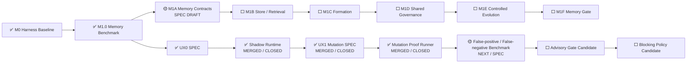

# AI Test Harness / Test Agent OS 实现状态

> 文档角色：项目状态单一事实源  
> 最近更新：2026-08-05  
> 当前状态：`FOUNDATION_BASELINE`  
> 阶段产品交付：`NOT_READY`  
> 当前里程碑：`M1 MEMORY_AND_CONTROLLED_EVOLUTION`  
> 当前主模块：`M1A MEMORY_CONTRACTS_AND_NAMESPACES`  
> 当前主模块阶段：`SPEC_DRAFT_NEXT`  
> 并行跨切面：`UX Assurance Plane`  
> 已关闭 UX 模块：`UX0 SYNTHETIC_USER_SHADOW_RUNTIME`、`UX1 TODOMVC_UX_MUTATION_PROOF_RUNNER`  
> 下一 UX 模块：`UX2 FALSE_POSITIVE_FALSE_NEGATIVE_BENCHMARK_SPEC`  
> 当前 UX 阶段：`UX1_MERGED_CLOSED / UX2_SPEC_NEXT`  
> UX Gate：`SHADOW_NONBLOCKING`  
> Human UAT：`REQUIRED`  
> 当前自治授权：`MANDATE-AUTONOMY-M1-M3@1.0.0 ACTIVE`

---

## 1. 状态结论

```text
M0 Harness Baseline：MERGED
M1.0 Memory Benchmark Harness：MERGED / CLOSED
M1A Memory Contracts & Namespaces：SPEC_DRAFT_NEXT
UX0 Synthetic User SPEC：MERGED / CLOSED
UX0 Synthetic User Runtime：MERGED / CLOSED
TodoMVC UX Mutation Proof SPEC：MERGED / CLOSED
UX Mutation Proof Runner：MERGED / CLOSED
Five-mutation Campaign：5 / 5 KILLED
UX False-positive / False-negative Benchmark：NEXT / SPEC
UX Gate Mode：SHADOW / NONBLOCKING
Human UAT：REQUIRED
M1 Memory Gate：0 / 1
Stage Delivery：NOT_READY
```

历史阶段记录（非当前状态）：

```text
UX Mutation Proof Runner：NOT_IMPLEMENTED
UX Mutation Proof Runner：VERIFIED / MERGE_PENDING
```

M1.0 已证明 Memory Benchmark、威胁场景、证据和独立 Replay 基线；它不实现生产 Memory Store，也不关闭完整 M1 Memory Gate。

UX0 Synthetic User Shadow Runtime 已完成规范、实现、四条真实 Playwright Journey、独立 Replay、主干合并、Python/GHCR 发布、台账和分支清理。它能够在 UAT 前生成体验证据，但仍是非阻断 SHADOW，不替代 Human UAT。

UX1 TodoMVC Mutation Proof SPEC 与 Runner 均已合并。Runner 已完成五类真实 Mutation 的 Baseline / Mutated / Restored Playwright 证明、精确恢复、独立 Replay、Tamper 拒绝、主干验证、Python/GHCR 发布和实现分支清理。下一 UX 节点是 False-positive / False-negative Benchmark SPEC；Advisory / Blocking 仍禁用。

---

## 2. 当前推进链



Memory 仍是项目主里程碑；UX Assurance 是跨 M1—M3 的并行质量面，不抢占 M1A 的主执行指针。

---

## 3. 已交付基础能力

### M0 Harness Baseline

已具备：Capability Contract、Registry、不可变 Artifact Store、Policy、Permission、Budget、Workflow Compiler、Orchestrator、Requirement Revision、Impact、Campaign、Generation、Diagnosis、Regression、Verdict、Replay、功能 Mutation Proof、Browser、Pinned Target、Python Package 与 GHCR 发布。

### M1.0 Memory Benchmark Harness

```text
Versioned Campaign Plan
→ Typed Scenario / Fixture
→ Namespace / ACL / Validity / Integrity Filtering
→ Actor Context without Evaluator-only Fields
→ Hidden Evaluator
→ Paired Metrics
→ Safety-first Verdict
→ Artifact Manifest
→ Independent Replay
```

权威事实：

```text
Implementation Commit：0038a741a130add9432f8dc2dbc626a1ba1e0a00
Final Ledger Commit：89e0ab38b895dfceb604089ef3cc729ac8d17220
Main Quality：Run #99 / 30979625315 — SUCCESS
Release：Run #10 / 30979625302 — SUCCESS
Scenarios：16
Runs：60
Critical False Green：0
Semantic Digest：sha256:001fd1b17d903983a0dae4fd6b7b3c9f492fa663a45d0073c6d1c3b761af254b
```

---

## 4. UX0 Synthetic User Shadow Runtime

```text
Experience Oracle
→ Synthetic User Profile
→ ExperienceEnvironment
→ Pinned TodoMVC Target
→ Real Playwright Journey
→ Semantic State / Interaction Evidence
→ Deterministic UX Evaluation
→ Nonblocking AI Candidate Finding
→ UAT Report / Artifact Manifest / Replay
```

最终证据：

```text
Runtime Merge：f687fd9c30873c4a81d9ffb57b20459fdcebe4ee
Final Ledger Merge：8760cf785ecb4d75415b8a155739fc7d69e7546d
Final Main Quality：Run #142 / 30994343760 — SUCCESS
Final UX Shadow Gate：Run #33 / 30994343819 — SUCCESS
Final Release：Run #13 / 30994343839 — SUCCESS
Final Cleanup：Run #11 / 30994343939 — SUCCESS
Real Playwright Journeys：4 / 4 PASS
Journey Checkpoints：14 / 14 PASS
Independent Replay：PASS
Critical False Green：0
```

当前 Runtime 只能 `SHADOW`，Release Effect 固定为 `NONBLOCKING_SHADOW`，Human UAT 保持 `REQUIRED`。

---

## 5. 当前主模块：M1A Memory Contracts & Namespaces

M1A 仍是主执行指针，目标是定义厂商无关的 Memory 身份、Revision、Hash、Provenance、Namespace、ACL、Lifecycle、CAS、Conflict、Retention、Forget、Store / Query Port。M1A 不选择数据库、向量库、Embedding Model 或 Ranking Algorithm。

---

## 6. 已关闭 UX1 模块：TodoMVC UX Mutation Proof Runner

```text
Pinned Baseline PASS
→ Apply one bounded UX Mutation
→ Mutation KILLED with E3/E4 Oracle evidence
→ Restore exact source bytes
→ Restored PASS
→ Independent Replay PASS
```

首批五类 Mutation：

```text
MISSING_FEEDBACK
VISIBLE_SUCCESS_STATE_LOSS
KEYBOARD_FOCUS_SEMANTIC_BARRIER
INTERRUPTED_RESUME_FAILURE
FILTER_ROUTE_STATE_DRIFT
```

固定目标和安全边界：

```text
Target：percy/example-todomvc@4a2344b2207a72c680e5c559c72617498fb5b75b
Mutable File：Disposable Checkout / index.html only
Preimage SHA-256：8abcb565e24e7fdbe75feb21f986e9b7550173c04122727e4e07e7ec9c4d5f70
Mutation：Exact Text Replace / Match Count 1
Repository / Remote / Production Write：FORBIDDEN
AI-only Kill：FORBIDDEN
Exact Restore：REQUIRED
```

已交付：

- Frozen Domain Models、Catalog Loader 和 source inventory binding；
- Disposable Target Sandbox、path traversal / symlink / undeclared-file 拒绝；
- Exact Patch、preimage / postimage / replacement-count 验证；
- Baseline / Mutated / Restored Runner；
- Hidden Mutation / Evaluator metadata boundary；
- 失败恢复和 byte-for-byte restore；
- JSON / Markdown Report、Artifact Manifest、Replay Manifest；
- `test-workflow ux-mutation validate | run | replay`；
- Unit / Contract、真实五 Mutation Playwright Campaign、独立 Replay 与 Tamper 拒绝；
- 专用 GitHub Action、运行时文档、状态台账和 branch cleanup。

最终交付事实：

```text
Goal：Issue #36 — CLOSED
Implementation PR：#37 — MERGED
Implementation Merge：2b5bc958e5c302cef8649e28ff13d8ebafa3afcc
Final PR UX1 Gate：Run #16 / 31002474167 — SUCCESS
Final PR Full Quality：Run #173 / 31002474184 — SUCCESS
Main UX1 Gate：Run #17 / 31002717005 — SUCCESS
Main Full Quality：Run #174 / 31002716954 — SUCCESS
Release：Run #14 / 31002716980 — SUCCESS
Cleanup：Run #12 / 31002717017 — SUCCESS
Implementation Branch：DELETED
Focused Unit / Contract / Delivery：10 / 10 PASS
Real Mutation Campaign：5 / 5 KILLED
Baseline False Positive：0
Critical False Green：0
Exact Restore：100%
Independent Replay：100%
Oracle / Journey Coverage：100% / 100%
Hidden Metadata Leakage：0
Undeclared Changed Files：0
AI-only Kills：0
Main UX Artifact：8929019254
Main UX Artifact Digest：sha256:c7e5f7e9ce4e2190c7e043765b3176fcc459782439f58c472954de417396c1fa
Main Semantic Digest：sha256:0ec56a6ca9f0b5f2c9b4564b5bc173df7f0621e32a15d1d84fa8711dad1c6322
Main Manifest Digest：sha256:34c8915bccb010a814b7783f43db25bcaf320c8a4634497e3eb70a4417622fed
Python Distribution：8928961328
Python Digest：sha256:bd18044e8fa442c54afb0e1d4e90d25e0caec81fc07b7b1be6b7152a2880d086
Docker Build Record：8928992374
Docker Digest：sha256:5e857db4bfe699961cb3d6934926e8587728763d5422c3f5c93ccb3dfb0f4761
Image Digest：sha256:e119014c9810d745ff989bf5b46f5aa19f71acf094e854130c968a26d2aa10ac
Image Config：sha256:7f6d6488d9562074a53ac0acd0de8768d93764b2c2bf1757a400ea0d2023287e
```

尚未完成、且不属于 UX1 Runtime closure：

- False-positive / False-negative Benchmark SPEC 与实现；
- Advisory 或 Blocking promotion；
- 替代 Human UAT。

---

## 7. 当前自治与安全边界

`MANDATE-AUTONOMY-M1-M3@1.0.0` 覆盖 M1—M3 范围内的 Goal、SPEC、实现、测试、Benchmark、Review、Merge、Release、Ledger 和 Cleanup。

仍不覆盖：真实生产数据、个人数据和 Secret；破坏性生产迁移；不可逆外部写或费用；危险设备动作；更高权威、Oracle、Experience Oracle、Policy 或 Permission 冲突；DEV-E；绕过失败的 CI、Evidence、Review 或 Release Gate。

Synthetic User / UX Mutation 额外禁止：真实客户账号、敏感属性和生物识别推断、无限制网页探索、AI-only Blocker 或 Kill、修改当前仓库/远程服务/生产目标、替代 Human UAT。

---

## 8. 近期执行顺序

```text
1. UX1 Closure Ledger PR / Merge
2. M1A Memory Contracts SPEC PR / Merge
3. UX False-positive / False-negative Benchmark SPEC
4. M1B Store & Progressive Retrieval
```

UX 与 Memory 可交错推进，但不能通过并行降低各自的 Evidence Gate。

---

## 9. 阶段交付条件

项目只有在以下全部通过后，才从 `FOUNDATION_BASELINE` 晋升为 `TEST_AGENT_RUNTIME_BETA`：

```text
M1 Memory Gate：PASS
M2 Model Generalization Gate：PASS
M3 Project / Architecture Gate：PASS
Global Safety Gate：PASS
```

全局要求继续是：Critical False Green 0、未授权 Oracle / Experience Oracle / Policy / Permission 修改 0、Out-of-Mandate 动作 0、关键 Evidence 可重放率 100%、Memory / Model / Device / UX Asset 可追溯、自动晋升资产可回滚。
