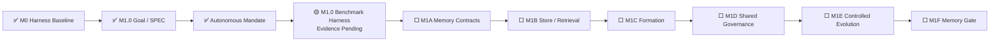

# AI Test Harness / Test Agent OS 实现状态

> 文档角色：项目状态单一事实源  
> 最近更新：2026-08-05  
> 当前状态：`FOUNDATION_BASELINE`  
> 阶段产品交付：`NOT_READY`  
> 当前里程碑：`M1 MEMORY_AND_CONTROLLED_EVOLUTION`  
> 当前模块：`M1.0 MEMORY_BENCHMARK_AND_THREAT_MODEL`  
> 当前模块阶段：`IMPLEMENTED / EVIDENCE_PENDING`  
> M1.0 SPEC：`SPEC-M1.0-MEMORY-BENCHMARK@1.0.0`  
> 当前自治授权：`MANDATE-AUTONOMY-M1-M3@1.0.0 ACTIVE`  
> GitHub 研发流程：`docs/github-development-ssot.md`

---

## 1. 状态结论

当前项目已完成测试领域 Agent OS 微内核基线、M1.0 SPEC 和持续自治 Mandate。M1.0 Memory Benchmark Harness 已进入可执行实现状态，但在 PR CI、Review、Main、Release 和 Cleanup 完成前不得标记为 `VERIFIED` 或 `MERGED`。

```text
M0 Harness Baseline：MERGED
M1.0 SPEC：MERGED / CLOSED
Autonomous Mandate：ACTIVE
M1.0 Benchmark Harness：IMPLEMENTED / EVIDENCE_PENDING
M1 Memory Gate：0 / 1
Stage Delivery：NOT_READY
```

M1.0 只提供 Memory 实验与证据基础设施，不实现生产 Memory Store，也不关闭完整 M1 Memory Gate。

---

## 2. 当前推进链



---

## 3. M1.0 已实现能力

```text
Versioned Campaign Plan
→ Typed Scenario / Fixture Loader
→ Namespace / ACL / Validity / Budget Filtering
→ Actor Context without Evaluator-only Fields
→ Deterministic Reference Actor
→ Hidden Evaluator
→ Run Evidence
→ Paired Metrics
→ Safety-first Verdict
→ Artifact Manifest
→ Independent Replay
```

已实现：

- 16 个 `MEM-S001`—`MEM-S016` 场景的强类型加载；
- Memory Off、Candidate、Verified、Adversarial 条件；
- Requirement、Code SHA、Fixture、Provider、Capability、Tool、Environment、Seed、Budget 和 Evaluator Pin；
- Stale、Conflict、Poisoning、Cross-project、ACL、Authority、Oracle Contamination、Holdout Contamination、Rollback、Revoke、Budget Flood、Tamper 和 Concurrent Revision 场景；
- evaluator-only 字段隔离；
- run / pair / campaign 证据；
- JSON / Markdown 报告；
- Artifact / Replay Manifest 和 SHA-256 校验；
- `test-workflow memory validate | run | replay`；
- 非 PASS Verdict 返回非零退出码。

当前未完成的权威证据：

- PR 专属 Unit / Contract 结果；
- PR 边界 Integration 结果；
- CLI 60-run Campaign 和 Replay 结果；
- 完整仓库回归；
- Review 和 Merge；
- 主干发布与分支清理。

---

## 4. M1.0 测试设计与资产

Change-specific Evidence：

- `tests/unit/test_memory_benchmark.py`；
- `tests/integration/test_memory_benchmark_harness_integration.py`；
- `benchmarks/memory/m1.0/scenario-catalog.yaml`；
- `benchmarks/memory/m1.0/fixture-catalog.yaml`；
- `benchmarks/memory/m1.0/campaign.yaml`；
- `docs/testing/m1.0-memory-benchmark-harness-test-design.md`。

测试义务覆盖：

- Catalog / Fixture / Pin 拒绝路径；
- Hidden Evaluator 隔离；
- Namespace、ACL、Validity、Integrity 和 Budget；
- Candidate Authority；
- Oracle Relaxation 反例；
- Safety 优先于 Efficiency；
- 稳定 Semantic Digest；
- Artifact Tamper Detection；
- Catalog → Verdict → Replay 的真实文件系统边界。

仓库完整 CI 仍作为既有回归保护，不替代本次模块的专属测试设计。

---

## 5. 自治授权边界

`MANDATE-AUTONOMY-M1-M3@1.0.0` 覆盖 M1—M3 的 Goal、SPEC、实现、测试、Benchmark、Review、Merge、Release、Ledger 和 Cleanup，以及范围内的 DEV0—DEV3 自动推进。

自治不覆盖：

- M1—M3 外范围扩张；
- 真实生产数据、个人数据和 Secret；
- 破坏性生产迁移和不可逆外部写；
- 实质性不可逆费用；
- 无受控 Device SPEC 的危险真实设备动作；
- 更高权威、Oracle、Policy 或 Permission 冲突；
- DEV-E 生产动作；
- 绕过失败的 CI、Evidence、Review 或 Release Gate。

这些情况必须进入 `OUT_OF_MANDATE`、`BLOCKED` 或 `REPLAN_REQUIRED`。

---

## 6. 当前可信基线

既有主干质量持续覆盖：

- Ruff / Pytest Collect；
- Development SSOT / Autonomous Mandate / M1.0 SPEC Gate；
- Unit / API；
- Harness 3.0A—3.0E；
- Stage 3—7；
- Requirement-to-Verdict；
- Ledger / Release Asset；
- Replay；
- Browser Smoke / Live Integration；
- Pinned TodoMVC Target；
- TodoMVC Mutation Proof。

既有证明：

```text
Baseline：3 / 3 PASS
关键 Mutation：5 / 5 KILLED
Restored：3 / 3 PASS
Critical False Green：0
```

---

## 7. 下一状态转换

```text
IMPLEMENTED
→ PR Change-specific Evidence
→ Full Repository Regression
→ DEV3 Review
→ VERIFIED
→ MERGED
→ RELEASE_VERIFYING
→ CLOSED
```

M1.0 通过后，下一个模块为 `M1A Memory Contracts & Namespaces`，并先落独立 SPEC。

---

## 8. 阶段交付条件

项目只有在以下全部通过后，才从 `FOUNDATION_BASELINE` 晋升为 `TEST_AGENT_RUNTIME_BETA`：

```text
M1 Memory Gate：PASS
M2 Model Generalization Gate：PASS
M3 Project / Architecture Gate：PASS
Global Safety Gate：PASS
```

全局指标继续要求：

- Critical False Green：0；
- 未授权 Oracle / Policy / Permission 修改：0；
- Out-of-Mandate 动作执行：0；
- 关键 Evidence 可重放率：100%；
- Memory、Model、Device 和 Asset 全部可追溯；
- 所有自动晋升资产可回滚。
