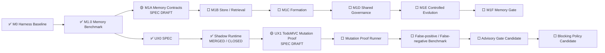

# AI Test Harness / Test Agent OS 实现状态

> 文档角色：项目状态单一事实源  
> 最近更新：2026-08-05  
> 当前状态：`FOUNDATION_BASELINE`  
> 阶段产品交付：`NOT_READY`  
> 当前里程碑：`M1 MEMORY_AND_CONTROLLED_EVOLUTION`  
> 当前主模块：`M1A MEMORY_CONTRACTS_AND_NAMESPACES`  
> 当前主模块阶段：`SPEC_DRAFT_NEXT`  
> 并行跨切面：`UX Assurance Plane`  
> 已关闭 UX 模块：`UX0 SYNTHETIC_USER_SHADOW_RUNTIME`  
> 当前 UX 模块：`UX1 TODOMVC_UX_MUTATION_PROOF`  
> 当前 UX 阶段：`SPEC_DRAFT`  
> UX Gate：`SHADOW_NONBLOCKING`  
> Human UAT：`REQUIRED`  
> 当前自治授权：`MANDATE-AUTONOMY-M1-M3@1.0.0 ACTIVE`

---

## 1. 状态结论

```text
M0 Harness Baseline：MERGED
M1.0 Memory Benchmark Harness：MERGED / CLOSED
M1A Memory Contracts & Namespaces：SPEC_DRAFT_NEXT
UX0 Synthetic User SPEC：MERGED / CLOSED
UX0 Synthetic User Runtime：MERGED / CLOSED
TodoMVC UX Mutation Proof：SPEC_DRAFT
UX Mutation Proof Runner：NOT_IMPLEMENTED
UX Gate Mode：SHADOW / NONBLOCKING
Human UAT：REQUIRED
M1 Memory Gate：0 / 1
Stage Delivery：NOT_READY
```

M1.0 已证明 Memory Benchmark、威胁场景、证据和独立 Replay 基线；它不实现生产 Memory Store，也不关闭完整 M1 Memory Gate。

UX0 Synthetic User Shadow Runtime 已完成规范、实现、四条真实 Playwright Journey、独立 Replay、主干合并、Python/GHCR 发布、台账和分支清理。它能够在 UAT 前生成体验证据，但仍是非阻断 SHADOW，不替代 Human UAT。

UX1 当前只进入 Mutation Proof SPEC，定义如何证明 Synthetic User 能杀死真实体验退化。Mutation Runner 尚未实现，也没有修改任何目标源码。

---

## 2. 当前推进链



Memory 仍是项目主里程碑；UX Assurance 是跨 M1—M3 的并行质量面，不抢占 M1A 的主执行指针。

---

## 3. 已交付基础能力

### M0 Harness Baseline

已具备：

- Capability Contract；
- Registry 与不可变 Artifact Store；
- Policy、Permission 和 Budget；
- Dynamic Workflow Compiler / Orchestrator；
- Requirement Revision、Impact、Campaign 和 Valid Progress；
- Generation、Diagnosis、Regression 和 Verdict；
- Replay、Mutation Proof、Browser 和 Pinned Target；
- Python Package 与 GHCR 发布。

### M1.0 Memory Benchmark Harness

```text
Versioned Campaign Plan
→ Typed Scenario / Fixture
→ Namespace / ACL / Validity / Integrity Filtering
→ Actor Context without Evaluator-only Fields
→ Hidden Evaluator
→ Paired Metrics
→ Safety-first Verdict
→ Artifact Manifest
→ Independent Replay
```

权威事实：

```text
Implementation Commit：0038a741a130add9432f8dc2dbc626a1ba1e0a00
Final Ledger Commit：89e0ab38b895dfceb604089ef3cc729ac8d17220
Main Quality：Run #99 / 30979625315 — SUCCESS
Release：Run #10 / 30979625302 — SUCCESS
Scenarios：16
Runs：60
Critical False Green：0
Semantic Digest：sha256:001fd1b17d903983a0dae4fd6b7b3c9f492fa663a45d0073c6d1c3b761af254b
```

---

## 4. UX0 Synthetic User Shadow Runtime

### 4.1 执行模型

```text
Experience Oracle
→ Synthetic User Profile
→ ExperienceEnvironment
→ Pinned TodoMVC Target
→ Real Playwright Journey
→ Semantic State / Interaction Evidence
→ Deterministic UX Evaluation
→ Nonblocking AI Candidate Finding
→ UAT Report / Artifact Manifest / Replay
```

### 4.2 已交付

- 强类型 Profile、Environment、Oracle、Journey、Event、Metric、Finding 和 Report；
- Profile 只描述行为能力，不推断敏感人口属性；
- Synthetic Fixture Only 和生产账号拒绝；
- Actor Input 与 evaluator-only 字段隔离；
- `test-workflow ux validate | run | replay`；
- 四条真实 Journey：Novice、Returning、Keyboard、Interrupted；
- 每条 Journey 独立 Browser Context；
- Semantic State Hash、Screenshot、Trace 和 Semantic Accessibility Snapshot；
- Rule-first Deterministic Evaluator；
- AI Finding 固定为非阻断 Candidate；
- JSON / Markdown 报告、Artifact Manifest 和 Replay Manifest；
- Artifact Tamper 和 Replay Drift 拒绝。

### 4.3 最终证据

```text
Runtime Merge：f687fd9c30873c4a81d9ffb57b20459fdcebe4ee
Final Ledger Merge：8760cf785ecb4d75415b8a155739fc7d69e7546d
Final Main Quality：Run #142 / 30994343760 — SUCCESS
Final UX Shadow Gate：Run #33 / 30994343819 — SUCCESS
Final Release：Run #13 / 30994343839 — SUCCESS
Final Cleanup：Run #11 / 30994343939 — SUCCESS
Real Playwright Journeys：4 / 4 PASS
Journey Checkpoints：14 / 14 PASS
Independent Replay：PASS
Critical False Green：0
```

当前 Runtime 只能 `SHADOW`，Release Effect 固定为 `NONBLOCKING_SHADOW`，Human UAT 保持 `REQUIRED`。

---

## 5. 当前主模块：M1A Memory Contracts & Namespaces

M1A 独立 SPEC 分支已形成候选，下一步进入 SPEC PR。范围包括：

- Working、Semantic、Episodic、Procedural、Skill Memory；
- Memory ID、Immutable Revision、Canonical Hash 和 Provenance；
- Organization、Project、Campaign、Agent、Shared Namespace；
- Principal、Role、ACL、Default Deny 和 Deny Override；
- Candidate、Verified、Promoted、Conflicting、Quarantined、Superseded、Revoked、Expired、Forgotten；
- Compare-and-swap、Conflict Artifact 和 Idempotency；
- M1B 的厂商无关 Store / Query Ports。

M1A SPEC 不选择数据库、向量库、Embedding Model 或 Ranking Algorithm。

---

## 6. 当前 UX 模块：TodoMVC UX Mutation Proof SPEC

UX1 要证明 Synthetic User 不只会让健康页面通过，还能可靠发现体验退化。

```text
Pinned Baseline PASS
→ Apply one bounded UX Mutation
→ Mutation KILLED with E3/E4 Oracle evidence
→ Restore exact source bytes
→ Restored PASS
→ Independent Replay PASS
```

首批五类 Mutation：

```text
MISSING_FEEDBACK
VISIBLE_SUCCESS_STATE_LOSS
KEYBOARD_FOCUS_SEMANTIC_BARRIER
INTERRUPTED_RESUME_FAILURE
FILTER_ROUTE_STATE_DRIFT
```

固定目标和安全边界：

```text
Target：percy/example-todomvc@4a2344b2207a72c680e5c559c72617498fb5b75b
Mutable File：Disposable Checkout / index.html only
Preimage SHA-256：8abcb565e24e7fdbe75feb21f986e9b7550173c04122727e4e07e7ec9c4d5f70
Mutation：Exact Text Replace / Match Count 1
Repository / Remote / Production Write：FORBIDDEN
AI-only Kill：FORBIDDEN
Exact Restore：REQUIRED
```

当前已落：

- 人类可读 SPEC；
- 机器可读 SPEC；
- 五 Mutation Catalog；
- Canonical Target Preimage；
- Negative / Adversarial 资产；
- DEV3 测试设计；
- 离线确定性 SPEC Policy Test。

尚未实现：

- Mutation Domain Models；
- Disposable Target Sandbox；
- Exact Patch Runtime；
- Baseline / Mutated / Restored Runner；
- Mutation Campaign 和 Replay；
- False-positive / False-negative Benchmark。

---

## 7. 当前自治与安全边界

`MANDATE-AUTONOMY-M1-M3@1.0.0` 覆盖 M1—M3 范围内的 Goal、SPEC、实现、测试、Benchmark、Review、Merge、Release、Ledger 和 Cleanup。

仍不覆盖：

- M1—M3 外范围扩张；
- 真实生产数据、个人数据和 Secret；
- 破坏性生产迁移和不可逆外部写；
- 实质性不可逆费用；
- 无受控 Device SPEC 的危险设备动作；
- 更高权威、Oracle、Experience Oracle、Policy 或 Permission 冲突；
- DEV-E 生产动作；
- 绕过失败的 CI、Evidence、Review 或 Release Gate。

Synthetic User / UX Mutation 额外禁止：

- 真实客户账号；
- 敏感属性和生物识别推断；
- 无限制网页探索；
- AI-only Blocker 或 Kill；
- 修改当前仓库、远程服务或生产目标；
- 自动替代 Human UAT。

---

## 8. 近期执行顺序

```text
1. UX1 TodoMVC UX Mutation Proof SPEC Review / Merge
2. M1A Memory Contracts SPEC PR / Merge
3. UX1 Mutation Proof Runner Implementation
4. M1A Domain Contracts Implementation
5. UX False-positive / False-negative Benchmark
6. M1B Store & Progressive Retrieval
```

UX 与 Memory 可交错推进，但不能通过并行降低各自的 Evidence Gate。

---

## 9. 阶段交付条件

项目只有在以下全部通过后，才从 `FOUNDATION_BASELINE` 晋升为 `TEST_AGENT_RUNTIME_BETA`：

```text
M1 Memory Gate：PASS
M2 Model Generalization Gate：PASS
M3 Project / Architecture Gate：PASS
Global Safety Gate：PASS
```

全局要求继续是：Critical False Green 0、未授权 Oracle / Experience Oracle / Policy / Permission 修改 0、Out-of-Mandate 动作 0、关键 Evidence 可重放率 100%、Memory / Model / Device / UX Asset 可追溯、自动晋升资产可回滚。
