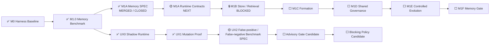

# AI Test Harness / Test Agent OS 实现状态

> 文档角色：项目状态单一事实源  
> 最近更新：2026-08-05  
> 当前状态：`FOUNDATION_BASELINE`  
> 阶段产品交付：`NOT_READY`  
> 当前里程碑：`M1 MEMORY_AND_CONTROLLED_EVOLUTION`  
> 已关闭主模块：`M1A MEMORY_CONTRACTS_AND_NAMESPACES_SPEC`  
> 当前主模块：`M1A RUNTIME_CONTRACTS`  
> 当前主模块阶段：`IMPLEMENTATION_NEXT`  
> 并行跨切面：`UX Assurance Plane`  
> 下一 UX 模块：`UX2 FALSE_POSITIVE_FALSE_NEGATIVE_BENCHMARK_SPEC`  
> UX Gate：`SHADOW_NONBLOCKING`  
> Human UAT：`REQUIRED`  
> 当前自治授权：`MANDATE-AUTONOMY-M1-M3@1.0.0 ACTIVE`

---

## 1. 状态结论

```text
M0 Harness Baseline：MERGED
M1.0 Memory Benchmark Harness：MERGED / CLOSED
M1A Memory Contracts & Namespaces SPEC：MERGED / CLOSED
M1A Runtime Contracts：NEXT / DEV3
M1B Store & Progressive Retrieval：BLOCKED
TodoMVC UX Mutation Proof SPEC：MERGED / CLOSED
UX Mutation Proof Runner：MERGED / CLOSED
Five-mutation Campaign：5 / 5 KILLED
UX False-positive / False-negative Benchmark：NEXT / SPEC
UX Gate Mode：SHADOW / NONBLOCKING
Human UAT：REQUIRED
M1 Memory Gate：0 / 1
Stage Delivery：NOT_READY
```

历史阶段记录（非当前状态，保留用于审计）：

```text
M1A Memory Contracts & Namespaces：SPEC_DRAFT_NEXT
TodoMVC UX Mutation Proof：SPEC_DRAFT
UX Mutation Proof Runner：NOT_IMPLEMENTED
UX Mutation Proof Runner：VERIFIED / MERGE_PENDING
```

当前项目已经具备需求到测试执行、证据、诊断、回归、重放和发布的基础闭环，也具备真实 Playwright 用户体验 Shadow 验证与 UX Mutation 证明。项目仍未达到阶段产品交付标准，因为 Memory 运行时、跨模型泛化和跨项目架构能力尚未完成。

---

## 2. 当前推进链



Memory 仍是主执行路径。UX Assurance 是跨 M1—M3 的并行质量面，不改变 M1A Runtime Contracts 的当前执行优先级。

---

## 3. 已交付基础能力

### M0 Harness Baseline

已具备：Capability Contract、Registry、不可变 Artifact Store、Policy、Permission、Budget、Workflow Compiler、Orchestrator、Requirement Revision、Impact、Campaign、Generation、Diagnosis、Regression、Verdict、Replay、功能 Mutation Proof、Browser、Pinned Target、Python Package 与 GHCR 发布。

### M1.0 Memory Benchmark Harness

已完成 16 个 Memory 场景、60 次运行、独立 Replay 和安全优先判定；Critical False Green 为 0。该模块证明了 Memory 价值和威胁评估基线，但不实现生产 Memory Store，也不关闭 M1 Memory Gate。

### M1A Memory Contracts & Namespaces SPEC

业务上已经明确：

- 会话历史不能自动变成长记忆；
- Working、Semantic、Episodic、Procedural、Skill 五类记忆拥有不同安全约束；
- 项目、Agent 与共享记忆默认隔离，相关性和向量相似度不能绕过权限；
- 所有长期记忆必须保留来源、证据、Revision、Hash 和转换链路；
- Candidate Memory 不能直接成为 Fact、Oracle、Policy、Permission 或无限制执行能力；
- 并发更新使用 CAS，陈旧写入产生显式冲突，禁止静默覆盖；
- 过期、撤销和遗忘后的内容不能继续有效检索；
- 文件、SQLite、PostgreSQL、Redis、文档、图或向量后端必须遵守同一业务契约。

最终交付事实：

```text
Goal：Issue #28 — CLOSED
SPEC PR：#41 — MERGED
Merge Commit：4cc4beb99fa9e45509ea1be240b0c2edebbe6137
PR M1A SPEC Gate：31006481889 — SUCCESS
PR Full Quality：31006482580 — SUCCESS
Main M1A SPEC Gate：31006798787 — SUCCESS
Main Full Quality：31006798834 — SUCCESS
Release：31006798767 — SUCCESS
Cleanup：31006798731 — SUCCESS
Review Threads：0
SPEC Branch：DELETED
Critical False Green：0
```

该 SPEC 已关闭，但 M1A Runtime Contracts 尚未实现，因此 M1B Store & Retrieval 继续保持阻塞，M1 Memory Gate 仍为 0 / 1。

---

## 4. UX Assurance 当前事实

UX0 Synthetic User Runtime：MERGED / CLOSED。它能够通过真实 Playwright Journey 生成体验证据，但 Release Effect 固定为 `NONBLOCKING_SHADOW`，不能替代 Human UAT。

UX1 已完成五类真实体验退化证明：

```text
MISSING_FEEDBACK
VISIBLE_SUCCESS_STATE_LOSS
KEYBOARD_FOCUS_SEMANTIC_BARRIER
INTERRUPTED_RESUME_FAILURE
FILTER_ROUTE_STATE_DRIFT
```

当前结果为 5 / 5 Mutation Killed、正常基线零误报、精确恢复 100%、独立 Replay 100%、Critical False Green 0。Advisory 和 Blocking 仍未启用。

---

## 5. 当前主模块：M1A Runtime Contracts

下一步把已批准的 Memory 规范变成可执行的领域契约，但仍不选择数据库或向量检索方案。

目标能力：

- 稳定生成并校验 Memory ID、Revision ID 和内容 Hash；
- 执行 Namespace 与 ACL 的默认拒绝、DENY 优先和共享范围规则；
- 执行 Lifecycle、Promotion、Revoke、Expire、Forget 状态转换；
- 执行 CAS、Idempotency 和 Conflict 规则；
- 提供可测试、可重放、厂商无关的 Store / Query Port 接口。

完成标准：上述规则全部具备可执行实现、负向与对抗测试、独立证据和可回滚交付；完成前不得进入 M1B Store & Retrieval。

---

## 6. 当前自治与安全边界

`MANDATE-AUTONOMY-M1-M3@1.0.0` 覆盖 M1—M3 范围内的 Goal、SPEC、实现、测试、Benchmark、Review、Merge、Release、Ledger 和 Cleanup。

仍不覆盖：真实生产数据、个人数据和 Secret；破坏性生产迁移；不可逆外部写或费用；危险设备动作；更高权威、Oracle、Experience Oracle、Policy 或 Permission 冲突；DEV-E；绕过失败的 CI、Evidence、Review 或 Release Gate。

Synthetic User / UX Mutation 额外禁止：真实客户账号、敏感属性和生物识别推断、无限制网页探索、AI-only Blocker 或 Kill、修改生产目标、替代 Human UAT。

---

## 7. 近期执行顺序

```text
1. M1A Runtime Contracts implementation / verification / closure
2. M1B Store & Progressive Retrieval SPEC
3. UX False-positive / False-negative Benchmark SPEC
4. M1C Memory Formation
```

UX 与 Memory 可以交错推进，但不能通过并行降低各自 Evidence Gate。

---

## 8. 阶段交付条件

项目只有在以下全部通过后，才从 `FOUNDATION_BASELINE` 晋升为 `TEST_AGENT_RUNTIME_BETA`：

```text
M1 Memory Gate：PASS
M2 Model Generalization Gate：PASS
M3 Project / Architecture Gate：PASS
Global Safety Gate：PASS
```

全局要求继续是：Critical False Green 0、未授权 Oracle / Experience Oracle / Policy / Permission 修改 0、Out-of-Mandate 动作 0、关键 Evidence 可重放率 100%、Memory / Model / Device / UX Asset 可追溯、自动晋升资产可回滚。
