# AI 测试 Agent 实现状态

> 文档角色：项目状态的单一事实源（Single Source of Truth）  
> 最近更新：2026-08-05  
> 总体计划：`docs/ai-test-agent-closed-loop-plan.md` v2.0  
> Module 03 计划：`docs/module-03-risk-adaptive-change-aware-plan.md`  
> Phase 1 PR：[#7](https://github.com/lsq1030757028/Pytest-playwright-e2e/pull/7)  
> Module 01 PR：[#8](https://github.com/lsq1030757028/Pytest-playwright-e2e/pull/8)  
> 当前模块 PR：[#9](https://github.com/lsq1030757028/Pytest-playwright-e2e/pull/9)

---

## 1. 状态规则

| 状态 | 含义 |
|---|---|
| `PLANNED` | 已进入计划，尚未编码 |
| `IN_PROGRESS` | 正在开发，接口或行为仍可能变化 |
| `PARTIAL` | 已有部分实现，但无法独立完成目标场景 |
| `IMPLEMENTED` | 功能代码完成，并具备对应单元测试 |
| `VERIFIED` | 单元测试、拒绝路径、阶段集成、文档和远端 CI 全部通过 |
| `MERGED` | 已验证并合并进入 `main` |
| `BLOCKED` | 因依赖、环境、权限或需求冲突无法继续 |

`IMPLEMENTED` 不等于 `VERIFIED`，`VERIFIED` 不等于 `MERGED`。

---

## 2. 计划调整说明

原下一阶段为“AI 需求理解与风险识别”。经过设计复核，发现直接进入重型业务理解会带来：

- 普通敏捷需求测试成本过高；
- 风险列表容易产生大量误报；
- 需求变化时缺少局部调整和证据失效能力；
- 单一进度百分比无法表达当前仍然可信的工作。

因此总体计划升级为 v2.0，先建立：

1. **Risk Triage & Assurance Router**：按业务损失和变更范围决定测试做多重；
2. **Change-Aware Test Campaign**：管理需求版本、状态转换、局部失效、有效进度、Freeze 和保障等级升降；
3. **Incremental Business Understanding**：后续只对 Router 选中的局部范围做业务理解和损失场景分析。

已有实现没有回退，但因为计划节点从 14 个细化为 16 个，架构节点完成比例会重新计算。

---

## 3. 总体状态机 v2

```mermaid
flowchart LR
    A[确定性执行底座\nMERGED]
    --> B[TestSpec 与 Oracle\nVERIFIED · PR #7]
    --> C[环境 / Mock / 造数\nVERIFIED · PR #7]
    --> D[Replay Bundle\nVERIFIED · PR #7]
    --> E[固定开源目标运行时\nVERIFIED · PR #8]
    --> F[Product Adapter\nVERIFIED · PR #8]
    --> G[业务 Baseline\nVERIFIED · PR #9]
    --> H[Mutation 证伪\nVERIFIED · PR #9]
    --> I[GREEN → RED → GREEN\nVERIFIED · PR #9]
    --> J[Assurance Router\nNEXT]
    --> K[Change-aware Campaign\nNEXT]
    --> L[增量业务理解与损失场景\nPLANNED]
    --> M[AI TestSpec 编译\nPLANNED]
    --> N[测试代码生成\nPLANNED]
    --> O[诊断与安全修复\nPLANNED]
    --> P[智能回归与 Benchmark\nPLANNED]
```



按 16 个主要能力节点统计：

- `MERGED / VERIFIED`：9 个；
- `NEXT`：2 个；
- `PLANNED`：5 个；
- 节点完成度：`9 / 16 ≈ 56%`。

原显示为 `9 / 14 ≈ 64%`。比例下降来自计划拆分和新增专业能力，不代表已有工作回退。

---

## 4. 当前已验证链路

```text
人工整理的粗糙需求与 TestSpec
→ EnvironmentSpec / MockPlan / DataSeedSpec
→ Truth Boundary 与契约校验
→ 确定性环境编译
→ 哈希锁定 Replay Bundle
→ 固定上游 TodoMVC Commit
→ Product Adapter 造数与状态探针
→ 确定性业务回归
→ Baseline GREEN × 3
→ Critical Mutation RED × 5
→ Restored GREEN × 3
→ Mutation Score 100%
→ Critical False Green 0
```

尚未验证：

```text
需求 / Diff / 环境变化
→ Assurance Router
→ Versioned Test Campaign
→ 需求变化后的局部失效与有效进度
→ 增量业务理解和生产不变量
→ AI TestSpec 与候选代码
→ 诊断修复和智能回归
```

---

## 5. 分支与发布状态

| 范围 | 状态 | 分支 / PR | 验证 |
|---|---|---|---|
| Pytest + Playwright 基础框架 | `MERGED` | `main` | CI 已通过 |
| 总体计划 v1 | `MERGED` | `main` | 已被当前分支 v2.0 更新 |
| 总体计划 v2 | `IMPLEMENTED` | PR #9 当前分支 | 文档已更新，待本次 CI |
| TestSpec / Mock / Env / Replay | `VERIFIED` | PR #7 | CI Run #14 |
| 固定 TodoMVC Target Runtime | `VERIFIED` | PR #8 | CI Run #20 |
| TodoMVC Product Adapter | `VERIFIED` | PR #8 | 真实目标集成通过 |
| Baseline / Mutation / Restored | `VERIFIED` | PR #9 | Run #23 / #25 |
| Assurance Router | `PLANNED` | Module 03A/03B | 详细计划已建立 |
| Change-aware Campaign | `PLANNED` | Module 03C/03D/03E | 详细计划已建立 |
| 增量业务理解 | `PLANNED` | Module 04 | 依赖 Module 03 |

PR #7、#8、#9 尚未进入 `main`，对应能力不能标记 `MERGED`。

---

## 6. 能力状态矩阵

### 6.1 已验证底座

| 能力 | 状态 | 代码 / 资产 | 验证 |
|---|---|---|---|
| Pytest / Playwright 执行与证据 | `MERGED` | `tests/`、`conftest.py` | Unit/API、Smoke、Live E2E |
| TestSpec / Oracle / Truth Boundary | `VERIFIED` | `specs.py`、`mocking.py` | Schema、越界负测 |
| Environment / Seed / Virtual Service | `VERIFIED` | `control_plane.py`、`virtual_service.py` | Env Build、Contract Drift |
| Replay / Hash / Tamper Detection | `VERIFIED` | `bundle.py`、`integrity.py` | 独立 Replay |
| Target Runtime | `VERIFIED` | `targets.py` | 固定 Revision、真实 Clone/Start |
| TodoMVC Adapter | `VERIFIED` | `adapters/todomvc.py` | Seed / Probe / Cleanup |
| Mutation Proof | `VERIFIED` | `proof.py`、`proofs/todomvc/` | 5/5 Killed、False Green 0 |

### 6.2 Module 03：风险自适应与变更感知

| 子模块 | 状态 | 计划交付 | 核心验证 |
|---|---|---|---|
| 03A Source & Revision Registry | `PLANNED` | SourceRecord、RequirementRevision、ChangeEvent、Authority | 版本不可覆盖、未授权变更拒绝 |
| 03B Assurance Router | `PLANNED` | L0/L1/L2/L3/LE、Policy Floor、Budget | 高风险不可降级、低风险不误升级 |
| 03C Campaign State Machine | `PLANNED` | Campaign、状态机、Freeze、Block/Resume | 非法跳转、任意阶段 Change Assessment |
| 03D Change Impact & Invalidation | `PLANNED` | 依赖图、Artifact Validity、局部失效 | Oracle 变化不误伤无关 Evidence |
| 03E Progress & Decision Report | `PLANNED` | Raw/Valid Progress、变更报告 | 当前有效进度计算正确 |

### 6.3 后续 AI 能力

| 能力 | 状态 | 下一步 |
|---|---|---|
| Incremental Business Model | `PLANNED` | 只加载受影响角色、资产、状态和依赖 |
| Production Invariants | `PLANNED` | 金额、权限、数据、幂等、审计、恢复 |
| Loss Scenario / Risk Promotion | `PLANNED` | Candidate → Supported → Reproduced → Proven |
| AI TestSpec Compiler | `PLANNED` | 绑定 Requirement/Oracle/Assurance Revision |
| Test Planner / Generator | `PLANNED` | 输出 Candidate Bundle |
| Evidence Diagnoser / Repairer | `PLANNED` | 规则优先、有限修复 |
| Impact Regression / Benchmark | `PLANNED` | PR Diff、漏选审计、成本和质量指标 |

---

## 7. 阶段集成 Gate v2

| 阶段 | 集成场景 | 状态 |
|---|---|---|
| Stage 0 | Pytest + Playwright Smoke + Live E2E | `VERIFIED` |
| Stage 1 | TestSpec + MockPlan + Env Build + Replay | `VERIFIED` · PR #7 |
| Stage 1.5 | 固定真实 TodoMVC + Adapter | `VERIFIED` · PR #8 |
| Stage 2 | Baseline + Mutation + Restored | `VERIFIED` · PR #9 |
| Stage 3A | Requirement Revision + Assurance Router | `NEXT` |
| Stage 3B | Change-aware Campaign + Local Invalidation | `NEXT` |
| Stage 4 | 增量业务理解 + 生产不变量 + Loss Scenario | `PLANNED` |
| Stage 5 | AI TestSpec + Candidate Test Generation + Proof Gate | `PLANNED` |
| Stage 6 | Evidence Diagnosis + Safe Repair | `PLANNED` |
| Stage 7 | Intelligent Regression + Benchmark | `PLANNED` |

---

## 8. Module 03 Golden Scenarios

固定 TodoMVC 用于验证六种变化决策：

1. **无行为影响澄清**：保留全部资产，不启动浏览器重跑；
2. **新增验收条件**：局部补充 TestSpec，只重跑 Clear completed 相关测试；
3. **风险升级**：新增跨标签同步，从 L1 升级 L2；
4. **Oracle 改变**：相关 Evidence `SUPERSEDED`，无关测试保持 `VALID`；
5. **未授权建议**：开发建议不能改变已确认 Oracle；
6. **需求与生产不变量冲突**：Campaign 进入 `BLOCKED`。

Module 03 详细验收见：`docs/module-03-risk-adaptive-change-aware-plan.md`。

---

## 9. 并行开发策略

```text
03A Source / Revision Schema
        ↓
03B Assurance Router   ||   03C Campaign State Machine
        ↓                         ↓
        └──────→ 03D Invalidation ←┘
                        ↓
                 03E Progress / Report
                        ↓
              TodoMVC Golden Campaign Gate
```

强制规则：

1. Schema / Protocol 先于实现；
2. 模块之间只通过版本化 Artifact 交互；
3. 每个子模块有独立单元测试和状态汇报；
4. 高风险 Policy Floor 由确定性代码执行；
5. 模型只产生候选，不直接决定发布阻断；
6. 历史 Requirement、Test 和 Evidence 不覆盖、不删除；
7. 功能、测试、阶段集成、实施文档和状态更新必须同步。

---

## 10. 模块完成记录

### Module 01：固定 TodoMVC Target Runtime 与 Product Adapter

- 状态：`VERIFIED`，尚未合并；
- PR：#8；
- 本地：`31 passed, 2 skipped`；
- 远端：Run #20 全部通过。

### Module 02：TodoMVC Baseline 与 Mutation 测试证明

- 状态：`VERIFIED`，尚未合并；
- PR：#9；
- 本地：`37 passed, 6 skipped`；
- Baseline：`3 / 3 PASS`；
- Mutation：`5 / 5 KILLED`；
- Restored：`3 / 3 PASS`；
- Mutation Score：`100%`；
- Critical False Green：`0`；
- 报告：`docs/module-02-todomvc-mutation-proof-report.md`。

---

## 11. 当前下一步

```text
03A SourceRecord / RequirementRevision / ChangeEvent
→ 03B Assurance Router / Policy Floor / Budget
→ 03C Campaign State Machine / Freeze
→ 03D Local Invalidation / Evidence Validity
→ 03E Raw + Valid Progress / Decision Report
→ TodoMVC 六个 Change Scenario
→ Stage 3 Gate
```

Module 03 暂不生成浏览器代码，也不接入真实模型 API。第一版使用 `MockModelProvider` 验证接口，最终路由和状态决策由确定性 Policy Engine 与 State Machine 裁决。