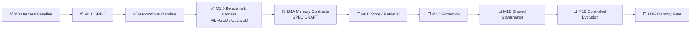

# AI Test Harness / Test Agent OS 实现状态

> 文档角色：项目状态单一事实源  
> 最近更新：2026-08-05  
> 当前状态：`FOUNDATION_BASELINE`  
> 阶段产品交付：`NOT_READY`  
> 当前里程碑：`M1 MEMORY_AND_CONTROLLED_EVOLUTION`  
> 已关闭模块：`M1.0 MEMORY_BENCHMARK_AND_THREAT_MODEL`  
> 当前模块：`M1A MEMORY_CONTRACTS_AND_NAMESPACES`  
> 当前模块阶段：`SPEC_DRAFT_NEXT`  
> M1.0 SPEC：`SPEC-M1.0-MEMORY-BENCHMARK@1.0.0`  
> 当前自治授权：`MANDATE-AUTONOMY-M1-M3@1.0.0 ACTIVE`

---

## 1. 状态结论

M1.0 Memory Benchmark Harness 已完成 SPEC、实现、测试设计、对抗资产、PR Review、主干合并、发布验证、证据归档和分支清理，状态为 `MERGED / CLOSED`。

```text
M0 Harness Baseline：MERGED
M1.0 SPEC：MERGED / CLOSED
Autonomous Mandate：ACTIVE
M1.0 Benchmark Harness：MERGED / CLOSED
M1A Memory Contracts & Namespaces：SPEC_DRAFT_NEXT
M1 Memory Gate：0 / 1
Stage Delivery：NOT_READY
```

M1.0 证明 Benchmark Harness 能够测量 Memory 价值、阻断安全退化并独立重放证据。它不实现生产 Memory Store，也不关闭完整 M1 Memory Gate。

---

## 2. 当前推进链



---

## 3. M1.0 已交付能力

```text
Versioned Campaign Plan
→ Typed Scenario / Fixture Loader
→ Namespace / ACL / Validity / Integrity / Budget Filtering
→ Actor Context without Evaluator-only Fields
→ Deterministic Reference Actor
→ Hidden Evaluator
→ Run Evidence
→ Paired Metrics
→ Safety-first Verdict
→ Artifact Manifest
→ Independent Replay
```

已交付：

- `MEM-S001`—`MEM-S016` 的强类型场景和可执行 Fixture；
- Memory Off、Candidate、Verified 和 Adversarial 条件；
- Requirement、Code SHA、Fixture、Provider、Capability、Tool、Environment、Seed、Budget 和 Evaluator Pin；
- Stale、Conflict、Poisoning、Cross-project、ACL、Authority、Oracle / Holdout Contamination、Rollback、Revoke、Budget Flood、Tamper 和 Concurrent Revision 场景；
- evaluator-only 字段隔离；
- JSON / Markdown 报告、Artifact Manifest 和 Replay Manifest；
- `test-workflow memory validate | run | replay`；
- 非 PASS Verdict 返回非零退出码。

---

## 4. 权威验证与发布事实

### PR 证据

```text
Focused Unit / Contract：9 / 9 PASS
Boundary Integration：2 / 2 PASS
Canonical Campaign：16 场景 / 60 次运行 / PASS
Independent Replay：PASS
PR Evidence Run：30978317793
Final PR Regression：30978729480
```

### 安全摘要

```text
Failed Runs：0
Blocked Runs：0
Invalid Runs：0
Critical False Green：0
Unauthorized Scope Read：0
Unauthorized Memory Write：0
Assumption → Authority：0
Detected Contamination：12
Value Gate：PASS
Closes full M1 Memory Gate：false
```

### 主干与发布

```text
Merge Commit：0038a741a130add9432f8dc2dbc626a1ba1e0a00
Main Quality：Run #97 / 30978957682 — SUCCESS
Release：Run #9 / 30978957679 — SUCCESS
Cleanup：Run #7 / 30978957722 — SUCCESS
Python Artifact：8919397617
Python Digest：sha256:77691660a29856b4a67e6f22bd0cd2fad19f8ca9148abd8542fee4cbba9cbc49
GHCR main / sha-0038a74
Image Digest：sha256:b3a8338e278674d3b9fd727382d46993085dfd81c45e4c836d335509ef779810
Image Config：sha256:ecb1ef2c5e8d6be36006f3a29a1150eb8345195937cf3b1d57736e3779e924ce
```

### Benchmark 证据摘要

```text
GitHub Evidence Artifact：8919174436
Evidence ZIP Digest：sha256:4942f98a3f40996f6c5f8b7e888954137e4f1b90267051c301db9fa8e559de5f
Semantic Digest：sha256:001fd1b17d903983a0dae4fd6b7b3c9f492fa663a45d0073c6d1c3b761af254b
Artifact Manifest Digest：sha256:8a76a5ae95e5dd1c58d6cc7fb9c5c157fe13de552d8622e708c37f9c417f985a
```

---

## 5. M1.0 测试与资产

- `src/test_workflow/memory_benchmark/`；
- `benchmarks/memory/m1.0/scenario-catalog.yaml`；
- `benchmarks/memory/m1.0/fixture-catalog.yaml`；
- `benchmarks/memory/m1.0/campaign.yaml`；
- `tests/unit/test_memory_benchmark.py`；
- `tests/integration/test_memory_benchmark_harness_integration.py`；
- `docs/testing/m1.0-memory-benchmark-harness-test-design.md`；
- GitHub Actions Evidence Artifact `8919174436`。

完整 CI 是仓库回归保护，M1.0 专属 Gate 负责证明本模块的契约、隐藏评估、对抗场景和 Replay 边界。

---

## 6. 当前自治边界

`MANDATE-AUTONOMY-M1-M3@1.0.0` 覆盖 M1—M3 内的 DEV0—DEV3 Goal、SPEC、实现、测试、Benchmark、Review、Merge、Release、Ledger 和 Cleanup。

仍不覆盖：

- M1—M3 外范围扩张；
- 真实生产数据、个人数据和 Secret；
- 破坏性生产迁移和不可逆外部写；
- 实质性不可逆费用；
- 无受控 Device SPEC 的危险真实设备动作；
- 更高权威、Oracle、Policy 或 Permission 冲突；
- DEV-E 生产动作；
- 绕过失败的 CI、Evidence、Review 或 Release Gate。

---

## 7. 下一模块：M1A Memory Contracts & Namespaces

M1A 先进入独立 SPEC 阶段，定义：

- Working、Semantic、Episodic、Procedural 和 Skill Memory 类型；
- Memory ID、Revision、Content Hash、Provenance、Confidence、TTL 和 Validity；
- Candidate、Verified、Promoted、Superseded、Revoked 和 Expired 生命周期；
- Organization、Project、Campaign、Agent 等 Namespace 隔离；
- ACL、Owner、Reader、Writer、Promoter 和 Revoker 权限；
- Compare-and-swap、冲突检测和版本历史；
- Candidate 不得自动成为 Fact、Oracle、Policy 或 Permission；
- M1B Store / Retrieval 的厂商无关接口边界。

M1A SPEC 不选择数据库、向量检索、Embedding Model 或长期存储供应商。

---

## 8. 阶段交付条件

项目只有在以下全部通过后，才从 `FOUNDATION_BASELINE` 晋升为 `TEST_AGENT_RUNTIME_BETA`：

```text
M1 Memory Gate：PASS
M2 Model Generalization Gate：PASS
M3 Project / Architecture Gate：PASS
Global Safety Gate：PASS
```

全局指标继续要求：Critical False Green 0、未授权 Oracle / Policy / Permission 修改 0、Out-of-Mandate 动作执行 0、关键 Evidence 可重放率 100%、Memory / Model / Device / Asset 全部可追溯、所有自动晋升资产可回滚。
