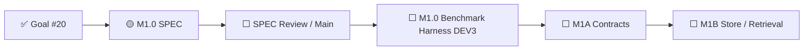

# AI Test Harness / Test Agent OS 实现状态

> 文档角色：项目状态单一事实源  
> 最近更新：2026-08-05  
> M0 基线提交：`11aabf0351376830a817b5b7bf5cdecdbe8560d2`  
> 当前状态：`FOUNDATION_BASELINE`  
> 阶段产品交付：`NOT_READY`  
> 当前里程碑：`M1 MEMORY_AND_CONTROLLED_EVOLUTION`  
> 当前模块：`M1.0 MEMORY_BENCHMARK_AND_THREAT_MODEL`  
> 当前模块阶段：`SPEC_BASELINED_WHEN_MERGED`  
> Goal：GitHub Issue #20  
> 演进路线：`docs/agent-os-evolution-roadmap.md` v3.0  
> 机器可读路线台账：`docs/agent-os-roadmap.yaml` v3.1  
> GitHub 研发流程：`docs/github-development-ssot.md`

---

## 1. 状态结论

当前项目已经完成并合并测试领域 Agent OS 的微内核基线，包括 Capability、Artifact、Policy、Budget、Permission、动态 DAG、风险治理、TestSpec、生成证明、诊断、回归、Replay、Mutation、构建和 GHCR 发布。

这代表 v0.1 工程基线已经收口，不代表 Test Agent OS 达到阶段产品交付条件。

下一产品路线为：

```text
M1 Memory & Controlled Evolution
→ M2 Cross-model Generalization
→ M3 Project / Architecture Generalization
→ Stage Delivery Gate
→ M4 Multi-agent Orchestration
```

当前已开始 M1.0，但只完成 SPEC 后才能进入 Memory Benchmark Harness 实现。

---

## 2. M1.0 当前状态



M1.0 SPEC 资产：

- `docs/specs/m1.0-memory-benchmark-threat-model-spec.md`；
- `docs/specs/m1.0-memory-benchmark-threat-model.yaml`；
- `benchmarks/memory/m1.0/scenario-catalog.yaml`；
- `docs/testing/m1.0-memory-benchmark-threat-model-test-design.md`；
- `tests/unit/test_m1_0_memory_spec.py`。

SPEC 已定义：

- 受保护资产和 Trust Zones；
- `MEM-T01`—`MEM-T20` 威胁基线；
- Memory Off / Verified / Candidate / Adversarial 条件；
- 16 个 Golden、Negative、Adversarial、Poisoning、ACL、Rollback 和 Replay 场景；
- 配对实验、隐藏 Holdout、污染失效和重复运行要求；
- 正确率、人工介入、成本、延迟、安全和 Memory 质量指标；
- `Critical False Green = 0` 等 Safety Gate；
- Candidate、Promotion、Canary 和 Rollback 边界；
- M1A 与 M1B 的接口职责和禁止范围。

SPEC 不包含：

- Memory Store 代码；
- 向量数据库或 Embedding 选择；
- 真实模型调用；
- Shared Memory Runtime；
- 自主迭代或生产晋升。

SPEC 阶段归类为 `DEV2`；后续 M1.0 Benchmark Harness 和 Memory Runtime 默认为 `DEV3`。

---

## 3. 当前能力状态机

```mermaid
flowchart LR
    A[✅ 确定性测试执行]
    --> B[✅ TestSpec / Oracle / Truth Boundary]
    --> C[✅ Environment / Mock / Seed]
    --> D[✅ Replay Bundle]
    --> E[✅ Target / Product Adapter]
    --> F[✅ Mutation Proof]
    --> G[✅ Harness Microkernel]
    --> H[✅ Risk / Change-aware Campaign]
    --> I[✅ Understanding / Generation]
    --> J[✅ Diagnosis / Regression]
    --> K[✅ Build / Package / GHCR]
    --> L[🟡 M1.0 Memory SPEC]
    --> M[⬜ M1 Memory Runtime]
    --> N[⬜ M2 Cross-model Generalization]
    --> O[⬜ M3 Project / Architecture Generalization]
    --> P{阶段交付 Gate}
```



---

## 4. 当前验证事实

M0 主干质量流水线覆盖：

- Ruff 和 Pytest Collect；
- Unit / API；
- Harness 3.0A—3.0E；
- Stage 3—7；
- Requirement-to-Verdict；
- Ledger / Release Asset；
- Replay；
- Browser Smoke / Live Integration；
- Pinned TodoMVC Target；
- TodoMVC Mutation Proof。

可信证明：

```text
Baseline：3 / 3 PASS
关键 Mutation：5 / 5 KILLED
Restored：3 / 3 PASS
Critical False Green：0
```

M1.0 SPEC 新增独立 CI Gate：

```text
M1.0 Memory SPEC validation
→ threat / scenario / gate / promotion / module-boundary consistency
```

该 Gate 只证明 SPEC 一致性，不能替代未来真实 Store、Retrieval、Poisoning 和 Memory Off/On Benchmark。

---

## 5. 为什么当前仍不是阶段产品交付

尚未完成：

- 生产级 Working / Semantic / Episodic / Procedural / Skill Memory；
- Memory Store、Retrieval、Formation、Shared Governance 和 Controlled Evolution；
- Memory Off / On 实际 Benchmark；
- 跨模型强、中、弱档稳定性；
- 复杂 Web、Mobile、小程序和嵌入式项目矩阵；
- 真实设备 Inventory、Lease、Reset 和 Quarantine。

当前阶段交付 Gate：

```text
Memory Gate：0 / 1
Model Generalization Gate：0 / 1
Project / Architecture Gate：0 / 1
Safety Gate：持续验证
```

---

## 6. GitHub 研发流程治理

仓库研发统一遵循：

```text
AGENTS.md
→ GitHub Development SSOT
→ Goal / Issue
→ SPEC
→ Branch / PR / GitHub Actions
→ Implementation
→ Main / Release / Ledger
```

每个模块开工先落 SPEC。研发验证根据变更风险和真实边界选择最小但充分证据，不机械要求每次执行相同 Unit / Integration 清单。

M1.0 SPEC 的证据选择：

- 结构化 SPEC 和场景目录一致性测试；
- DEV2 GitHub Workflow 边界验证；
- 完整仓库回归保护；
- 不虚构尚不存在的 Memory Store Integration。

M1.0 实现阶段的证据选择将升级为 DEV3，包括：

- 独立威胁模型；
- Unit / Contract；
- 真实 Store / Retrieval Integration；
- Negative / Adversarial / Poisoning；
- Replay 和稳定性重复；
- Promotion / Rollback / Forget；
- 人类批准。

---

## 7. 下一执行节点

SPEC 合并并完成主干、发布和分支清理验证后，下一节点为：

```text
M1.0 Benchmark Harness DEV3 SPEC
→ deterministic Memory Off / On campaign runner
→ scenario fixture loader
→ evidence and metric artifacts
→ hidden evaluator boundary
→ benchmark verdict gate
```

M1.0 Benchmark Harness 仍需先提交独立实现 SPEC 或在当前 M1.0 SPEC 下形成明确的 Implementation Addendum，经过 DEV3 人类批准后才能写运行时代码。

---

## 8. 阶段交付条件

项目只有在以下全部通过后，才从 `FOUNDATION_BASELINE` 晋升为 `TEST_AGENT_RUNTIME_BETA`：

```text
M1 Memory Gate：PASS
M2 Model Generalization Gate：PASS
M3 Project / Architecture Gate：PASS
Global Safety Gate：PASS
```

全局 Safety 指标继续要求：

- Critical False Green：0；
- 未授权 Oracle / Policy / Permission 修改：0；
- 关键 Evidence 可重放率：100%；
- Memory、Model、Device 和 Asset 全部可追溯；
- 所有自动晋升资产可回滚。
