# AI Test Harness / Test Agent OS 实现状态

> 文档角色：项目状态单一事实源  
> 最近更新：2026-08-05  
> 当前状态：`FOUNDATION_BASELINE`  
> 阶段产品交付：`NOT_READY`  
> 当前里程碑：`M1 MEMORY_AND_CONTROLLED_EVOLUTION`  
> 当前模块：`M1.0 MEMORY_BENCHMARK_AND_THREAT_MODEL`  
> 当前模块阶段：`VERIFIED / READY_TO_MERGE`  
> M1.0 SPEC：`SPEC-M1.0-MEMORY-BENCHMARK@1.0.0`  
> 当前自治授权：`MANDATE-AUTONOMY-M1-M3@1.0.0 ACTIVE`  
> 权威 PR 证据：Run #93 / `30978317793`

---

## 1. 状态结论

M1.0 Memory Benchmark Harness 已通过变更专属证据和完整仓库回归，目前为 `VERIFIED / READY_TO_MERGE`。在进入 `main`、完成主干质量、发布和分支清理前，不得标记为 `MERGED` 或 `CLOSED`。

```text
M0 Harness Baseline：MERGED
M1.0 SPEC：MERGED / CLOSED
Autonomous Mandate：ACTIVE
M1.0 Benchmark Harness：VERIFIED / READY_TO_MERGE
M1 Memory Gate：0 / 1
Stage Delivery：NOT_READY
```

M1.0 证明的是 Benchmark Harness 能够测量 Memory 价值、阻断安全退化并独立重放证据；它不实现生产 Memory Store，也不关闭完整 M1 Memory Gate。

---

## 2. 当前推进链

```mermaid
flowchart LR
    A[✅ M0 Harness Baseline]
    --> B[✅ M1.0 Goal / SPEC]
    --> C[✅ Autonomous Mandate]
    --> D[✅ M1.0 Benchmark Harness<br/>VERIFIED]
    --> E[⬜ Merge / Main / Release]
    --> F[⬜ M1A Memory Contracts SPEC]
    --> G[⬜ M1B Store / Retrieval]
    --> H[⬜ M1C Formation]
    --> I[⬜ M1D Shared Governance]
    --> J[⬜ M1E Controlled Evolution]
    --> K[⬜ M1F Memory Gate]
```



---

## 3. M1.0 能力链

```text
Versioned Campaign Plan
→ Typed Scenario / Fixture Loader
→ Namespace / ACL / Validity / Integrity / Budget Filtering
→ Actor Context without Evaluator-only Fields
→ Deterministic Reference Actor
→ Hidden Evaluator
→ Run Evidence
→ Paired Metrics
→ Safety-first Verdict
→ Artifact Manifest
→ Independent Replay
```

已实现：

- `MEM-S001`—`MEM-S016` 的强类型场景与 Fixture；
- Memory Off、Candidate、Verified 和 Adversarial 条件；
- Requirement、Code SHA、Fixture、Provider、Capability、Tool、Environment、Seed、Budget 和 Evaluator Pin；
- Stale、Conflict、Poisoning、Cross-project、ACL、Authority、Oracle / Holdout Contamination、Rollback、Revoke、Budget Flood、Tamper 和 Concurrent Revision 场景；
- evaluator-only 字段隔离；
- JSON / Markdown 报告、Artifact Manifest 和 Replay Manifest；
- `test-workflow memory validate | run | replay`；
- 非 PASS Verdict 非零退出。

---

## 4. 权威验证事实

PR CI Run #93（`30978317793`）全部 Gate 通过：

```text
Focused Unit / Contract：9 / 9 PASS
Boundary Integration：2 / 2 PASS
Core Unit / API：160 / 160 PASS
Canonical Campaign：16 场景 / 60 次运行 / PASS
Independent Replay：PASS
Full Repository Regression：PASS
TodoMVC Mutation Proof：PASS
```

M1.0 Safety Summary：

```text
Failed Runs：0
Blocked Runs：0
Invalid Runs：0
Critical False Green：0
Unauthorized Scope Read：0
Unauthorized Memory Write：0
Assumption → Authority：0
Detected Contamination：12
Value Gate：PASS
Closes full M1 Memory Gate：false
```

证据摘要：

```text
GitHub Artifact：8919174436
Artifact ZIP Digest：sha256:4942f98a3f40996f6c5f8b7e888954137e4f1b90267051c301db9fa8e559de5f
Semantic Digest：sha256:001fd1b17d903983a0dae4fd6b7b3c9f492fa663a45d0073c6d1c3b761af254b
Artifact Manifest Digest：sha256:8a76a5ae95e5dd1c58d6cc7fb9c5c157fe13de552d8622e708c37f9c417f985a
```

---

## 5. 测试设计与资产

Change-specific Evidence：

- `tests/unit/test_memory_benchmark.py`；
- `tests/integration/test_memory_benchmark_harness_integration.py`；
- `benchmarks/memory/m1.0/scenario-catalog.yaml`；
- `benchmarks/memory/m1.0/fixture-catalog.yaml`；
- `benchmarks/memory/m1.0/campaign.yaml`；
- `docs/testing/m1.0-memory-benchmark-harness-test-design.md`。

覆盖义务：

- Catalog / Fixture / Pin 拒绝路径；
- Hidden Evaluator 隔离；
- Namespace、ACL、Validity、Integrity 和 Budget；
- Candidate Authority；
- Oracle Relaxation Fault Injection；
- Safety 优先于 Efficiency；
- 稳定 Semantic Digest；
- Artifact Tamper Detection；
- Catalog → Verdict → Replay 真实文件边界。

完整 CI 是既有回归保护，不替代本模块专属测试设计。

---

## 6. 自治边界

`MANDATE-AUTONOMY-M1-M3@1.0.0` 覆盖 M1—M3 范围内的 DEV0—DEV3 Goal、SPEC、实现、测试、Benchmark、Review、Merge、Release、Ledger 和 Cleanup。

仍不覆盖：

- M1—M3 外范围扩张；
- 真实生产数据、个人数据和 Secret；
- 破坏性生产迁移和不可逆外部写；
- 实质性不可逆费用；
- 无受控 Device SPEC 的危险真实设备动作；
- 更高权威、Oracle、Policy 或 Permission 冲突；
- DEV-E 生产动作；
- 绕过失败的 CI、Evidence、Review 或 Release Gate。

---

## 7. 下一状态转换

```text
VERIFIED / READY_TO_MERGE
→ DEV3 Final Review
→ MERGED
→ RELEASE_VERIFYING
→ CLOSED
→ M1A SPEC_DRAFT
```

M1.0 合并和发布闭环完成后，系统将自治启动 `M1A Memory Contracts & Namespaces`，并先落独立 SPEC。

---

## 8. 阶段交付条件

项目只有在以下全部通过后，才从 `FOUNDATION_BASELINE` 晋升为 `TEST_AGENT_RUNTIME_BETA`：

```text
M1 Memory Gate：PASS
M2 Model Generalization Gate：PASS
M3 Project / Architecture Gate：PASS
Global Safety Gate：PASS
```

全局指标继续要求：Critical False Green 0、未授权 Oracle / Policy / Permission 修改 0、Out-of-Mandate 动作执行 0、关键 Evidence 可重放率 100%、Memory / Model / Device / Asset 全部可追溯、所有自动晋升资产可回滚。
