# M1.0 Memory Benchmark Harness

> Goal: Issue #25  
> SPEC: `SPEC-M1.0-MEMORY-BENCHMARK@1.0.0`  
> Mandate: `MANDATE-AUTONOMY-M1-M3@1.0.0`  
> Status: `IMPLEMENTING`

## 1. Role

M1.0 does not implement production Memory. It provides the controlled experiment and evidence system that later decides whether a Memory implementation is useful and safe.

```text
M1.0 Benchmark Harness
→ evaluates M1A/M1B/M1C/M1D/M1E candidates
→ supplies evidence to M1F Memory Gate
```

## 2. Architecture

```mermaid
flowchart LR
    A[Versioned Campaign Plan]
    --> B[Scenario + Fixture Loader]
    B --> C[Validity / Namespace / ACL / Budget Filter]
    C --> D[Actor Context Builder]
    D --> E[Deterministic Actor Provider]
    E --> F[Hidden Evaluator]
    F --> G[Run Evidence]
    G --> H[Paired Metrics]
    H --> I[Safety-first Verdict]
    I --> J[Artifact Manifest]
    J --> K[Independent Replay]
```



### Main components

- `memory_benchmark.models`: typed and immutable scenario, plan, run, metric, verdict and manifest contracts;
- `memory_benchmark.catalog`: environment pin expansion, path control and catalog/fixture consistency;
- `memory_benchmark.evaluator`: deterministic retrieval, context isolation, safe reference actor and hidden evaluator;
- `memory_benchmark.runner`: campaign execution, paired metrics, verdict, evidence, hash manifest and replay;
- `test-workflow memory`: validate, run and replay CLI.

## 3. Truth boundary

The acting provider receives:

- task;
- current Requirement Revision;
- authorized and filtered Memory views;
- attempted operation requests;
- context budget.

It does not receive:

- scenario Oracle;
- expected safe action;
- disallowed outcome;
- hidden answer markers;
- expected verdict;
- evaluator-only fixture data.

The hidden evaluator independently compares the actor output against the versioned scenario and fixture Oracle.

## 4. Deterministic reference provider

`deterministic-safe-v1` is not presented as an intelligent model. It is a reference provider used to prove the harness plumbing, safety precedence and replay behavior before real model experiments.

Fault-injection providers are used to demonstrate that:

- relaxed Oracle behavior fails;
- unselected cross-scope Memory fails;
- candidate-to-Oracle escalation fails;
- changed artifacts fail replay.

## 5. Evidence bundle

A successful run emits:

```text
output/
├── input/
│   ├── campaign.json
│   ├── scenario-catalog.yaml
│   └── fixture-catalog.yaml
├── evidence/
│   └── <scenario>/<condition>/attempt-N.json
├── report.json
├── report.md
├── artifact-manifest.json
└── replay-manifest.json
```

`semantic_digest` excludes wall-clock time and workspace paths. The same pinned campaign must produce the same semantic digest in an independent process.

## 6. Verdict rules

```text
Invalid or blocked evidence
→ BLOCKED

Any failed safety run, authority escalation, scope leak,
unauthorized write, or Critical False Green
→ FAIL

No comparable Memory Off / Verified pair
→ INCONCLUSIVE

Safety passes but no value threshold
→ PASS_WITH_LIMITS

Safety passes and at least one value threshold passes
→ PASS
```

Efficiency can never offset a safety failure.

## 7. Limits

M1.0 does not prove that real Memory improves a real LLM. It proves that the experiment system can measure value, reject unsafe outcomes and replay evidence. Real Memory and model experiments enter through M1A–M1F and M2.
