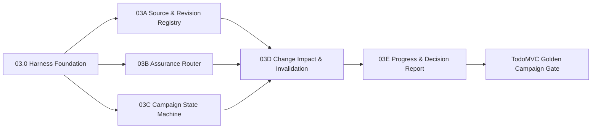

# Module 03 实施计划：Harness、风险自适应保障与需求变更感知

> 文档状态：实施计划 v1.1  
> 架构依赖：`docs/harness-architecture.md`  
> 前置能力：TestSpec、环境控制、Replay、固定目标、Product Adapter、Mutation Proof  
> 模块目标：先建立轻量 Harness 控制面，再实现风险分流、版本化测试活动、局部失效和有效进度。

---

## 1. 调整原因

Module 03 原计划直接开发 Source Registry、Assurance Router 和 Campaign。进一步复核后确认，如果缺少统一 Harness：

- 每个模块会自行持有状态、预算、权限和上下文；
- Workflow 会逐渐硬编码成庞大串行流程；
- AI 能力容易直接修改状态或突破 Gate；
- 所有模块可能重复加载完整仓库和历史；
- 需求变化后的局部重编译、暂停恢复和成本统计难以统一。

因此在 03A 前新增 **Module 03.0 Harness Foundation**。后续 03A—03E 都作为 Capability 接入 Harness，而不是各自构建编排入口。

---

## 2. 模块结构



---

## 3. Module 03.0：Harness Foundation

### 03.0A Capability Contracts

交付模型：

- `CapabilityDescriptor`
- `CapabilityRequest`
- `CapabilityResult`
- `ArtifactRef`
- `ContextRequest`
- `ExecutionBudget`
- `PermissionScope`
- `DomainEvent`
- `ExecutionMetrics`

核心约束：

- Capability 不能接收或直接修改全局 Campaign；
- 输入输出必须使用 ArtifactRef；
- 副作用、权限、成本、上下文、幂等性、超时和重试必须声明；
- AI Capability 必须使用 advisory / propose 类别。

单元测试：

- Schema round-trip；
- 非法版本、空输入输出、未知副作用拒绝；
- 路径和权限范围校验；
- 预算不能为负；
- deterministic Capability 不允许声明模型副作用；
- Artifact 哈希和版本格式；
- Result 不能同时建议成功转换和输出 Blocker。

### 03.0B Capability Registry & Artifact Store

交付：

- 名称和语义版本注册；
- 重复注册拒绝；
- 兼容版本解析；
- 不可变 Artifact Store；
- 内存实现与文件实现；
- Artifact 哈希、来源和 Validity。

### 03.0C Policy / Budget / Permission

交付：

- `PolicyDecision`；
- Policy Floor 接口；
- Budget Reservation / Consumption；
- Permission Guard；
- 拒绝原因和审计事件；
- 超预算后的 stop / downgrade / approval-required。

### 03.0D Workflow Compiler & Minimal Orchestrator

交付：

- `ExecutionPlan` 和 DAG Node；
- 拓扑排序；
- 条件跳过；
- 可并行组；
- Gate；
- 节点失败、暂停、恢复和取消；
- 根据 Artifact Validity 局部重编译；
- Checkpoint。

### 03.0E Existing Capability Adapters

第一批包装：

- `spec.validate`
- `target.validate`
- `test.run`
- `proof.run`

现有 CLI 暂时保留，适配器直接调用现有业务函数，避免一次性重构。

### Harness Stage Gate

L1 TodoMVC 场景：

```text
source fixture
→ assurance fixture
→ target.validate
→ selected test.run
→ artifact / event / metrics persisted
```

必须证明：

- 未加载 Deep Context；
- 未启动不需要的 Mock 和 Mutation；
- 顺序稳定；
- 权限越界和预算超限被拒绝；
- 中断后可从 Checkpoint 恢复；
- 单节点失败不污染其他 Artifact。

---

## 4. 03A：Source & Revision Registry

交付：

- `SourceRecord`
- `RequirementRevision`
- `ChangeEvent`
- `SourceAuthority`
- `ChangeApproval`

规则：

- 历史内容不可覆盖；
- 每次变更产生新 Revision 和哈希；
- 区分 Suggestion / Clarification / Proposed / Approved / Emergency Override；
- 未授权来源不能改变 Acceptance Criteria、Oracle 或 Production Invariant；
- 所有操作通过 `source.register` 和 `source.authorize-change` Capability。

Golden：开发人员建议忽略失败测试，系统必须保存为 Proposed Change，不能修改当前 Oracle。

---

## 5. 03B：Assurance Router

### Profile

| Profile | 默认路径 |
|---|---|
| `L0` | Lint、Collect、受影响静态/单元检查 |
| `L1` | Unit/API + 一条关键 E2E |
| `L2` | 局部模型、关键 E2E、定向 Replay、1—3 Mutation |
| `L3` | 生产不变量、Loss Scenario、多层测试、Mutation、Replay、发布保护 |
| `LE` | 最小安全验证、Canary、强监控、快速回滚、发布后补齐 |

### Policy Floor

- 钱、余额、计费、支付、退款、权限、隐私、迁移、审计、不可逆操作：最低 `L3`；
- 持久化、幂等、状态机、跨服务一致性：最低 `L2`；
- 纯文案和样式：允许 `L0`；
- 模型建议只能提高候选等级，不能突破确定性 Floor 降级。

### Budget

输出：

- 必做和跳过检查；
- Context Level；
- Unit/API/E2E 数量；
- Mutation / Replay 数量；
- 模型调用和 Token；
- 最大时长与重试；
- 路由理由。

Golden：Todo 样式调整保持 L0；跨标签持久化同步最低 L2；不可逆删除最低 L3。

---

## 6. 03C：Campaign State Machine

状态：

```text
RECEIVED
→ TRIAGED
→ CAMPAIGN_CREATED
→ MODEL_SCOPE_READY
→ PLANNED
→ ASSETS_READY
→ EXECUTING
→ EVALUATING
→ GATED
→ VERIFIED
```

任意阶段允许进入：

```text
CHANGE_ASSESSMENT
BLOCKED
SUPERSEDED
```

交付：

- `TestCampaign`
- `CampaignTransition`
- Requirement Freeze；
- Pause / Resume / Cancel；
- 当前 Requirement / Code / Environment Revision；
- Assurance Decision 和 Execution Plan 引用；
- Artifact Validity 汇总。

状态只能通过 `campaign.transition` Capability 和 Policy Decision 修改。

---

## 7. 03D：Change Impact & Invalidation

依赖图：

```text
Requirement Revision
→ Fact / Invariant / Assumption
→ Oracle
→ TestSpec Case
→ Test Asset
→ Evidence
→ Gate Decision
```

Validity：

- `VALID`
- `CONDITIONALLY_VALID`
- `REQUIRES_REVIEW`
- `REQUIRES_RERUN`
- `SUPERSEDED`
- `HISTORICAL`
- `INVALID`

规则示例：

- 纯澄清：补充来源，保持 Evidence Valid；
- 新增验收条件：旧 Evidence 条件有效，新增局部 Test Obligation；
- Oracle 改变：相关 Evidence Superseded，无关 Evidence Valid；
- 环境版本变化：只将环境相关结果标为 Requires Rerun；
- 风险升级：重新编译剩余 Execution Plan；
- 完全替换：旧 Campaign Superseded。

---

## 8. 03E：Progress & Decision Report

必须同时计算：

- `Raw Progress`：已经执行的工作；
- `Valid Progress`：对当前 Revision 仍可信的工作；
- 复用、需要修改、新增、重跑、替代和阻塞数量；
- Assurance 变化；
- 本次重编译新增和删除的 DAG 节点；
- 成本预算与实际消耗。

变更报告示例：

```text
Requirement v3 → v4
Assurance L1 → L2
Raw 78% → 78%
Valid 78% → 61%
Valid 18 / Rerun 5 / Review 2 / New 1 / Superseded 1
Next: PARTIAL_REPLAN
```

---

## 9. 渐进式上下文策略

| Capability | 默认 Context |
|---|---|
| `source.register` | 原始输入，不读取代码 |
| `assurance.route` | Metadata + Summary |
| `campaign.transition` | Campaign + Event Metadata |
| `impact.compute` | Focused 映射图 |
| `artifact.invalidate` | Artifact 依赖和版本 |
| `progress.calculate` | 状态与权重，不读取业务源码 |

Deep Context 只允许后续增量业务理解和复杂诊断使用。

---

## 10. TodoMVC Golden Campaign

1. 无行为影响澄清：保持全部 Valid，不启动浏览器；
2. 新增 Clear Completed 验收：局部新增义务，只选择相关测试；
3. 新增跨标签同步：L1 → L2，增加局部模型和定向 Proof；
4. Oracle 改变：相关 Evidence Superseded，无关测试保持 Valid；
5. 未授权开发建议：不能改变确认 Oracle；
6. 与数据完整性不变量冲突：Campaign Blocked；
7. Budget 超限：重节点不执行，产生明确 Decision；
8. 中断恢复：从 Harness Checkpoint 继续，不重复已完成副作用。

---

## 11. 开发和汇报顺序

```text
03.0A Contracts
→ 汇报
03.0B Registry / Artifact Store  ||  03.0C Policy / Budget / Permission
→ 分别汇报
03.0D Workflow Compiler / Orchestrator
→ 汇报
03.0E Existing Capability Adapters + Harness Gate
→ 汇报
03A / 03B / 03C 可并行
→ 分别汇报
03D
→ 汇报
03E + Golden Campaign
→ Stage 3 总结
```

每个节点要求：功能代码、拒绝路径、单元测试、阶段集成、实施文档、状态事实源和远端 CI。

---

## 12. 非目标

本阶段不实现：

- 真实模型业务理解；
- AI TestSpec 和代码生成；
- 通用分布式调度；
- 多 Agent 自由协作；
- 全量仓库语义索引；
- 复杂 Dashboard。

Module 03 完成后，Module 04 才在 Harness 约束下实现增量业务理解、Production Invariant 和 Loss Scenario。
