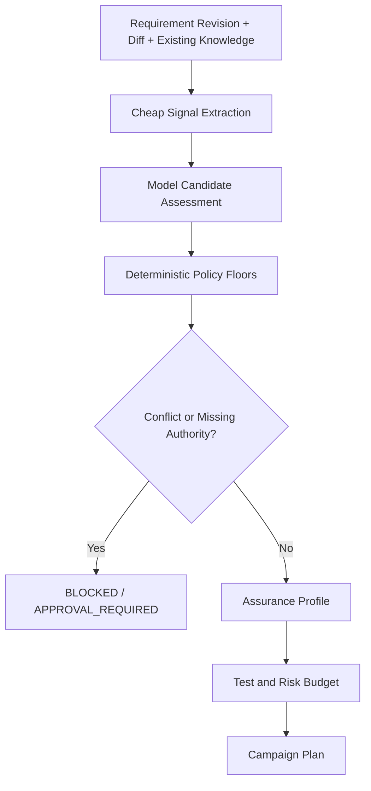
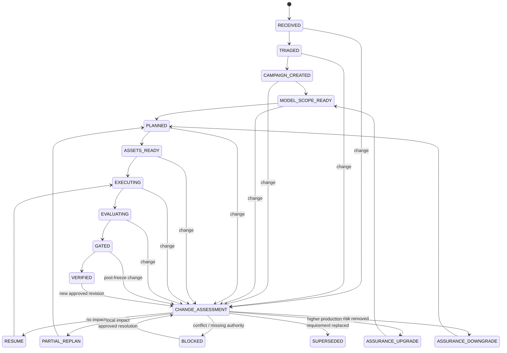

# Module 03 实施计划：风险自适应保障路由与需求变更感知测试活动

> 文档状态：实施计划 v1.0  
> 计划分支：`agent/todomvc-mutation-proof`  
> 前置能力：TestSpec、环境控制、Replay、固定目标、Product Adapter、Mutation Proof  
> 本模块目标：让测试系统根据业务风险、变更范围和已有证据动态决定测试投入，并在测试过程中发生需求变化时局部调整计划、进度和证据有效性。

---

## 1. 为什么调整原计划

原计划准备直接进入“AI 业务理解与风险识别”，但存在两个工程问题：

1. **默认流程过重**：普通敏捷需求不应该每次都执行完整业务建模、Mutation、全量 Replay 和完整风险论证。
2. **测试活动并非静态**：测试过程中可能持续出现需求澄清、范围增减、Oracle 改变、环境补充和紧急覆盖。若只能全部重来或忽略变化，既浪费成本，也会让历史绿色结果被错误沿用。

因此 Module 03 不直接生成测试代码，也不先实现一个“大模型读需求后输出风险”的能力，而是先建立两个控制层：

```text
Risk Triage & Assurance Router
决定本次测试需要做多重

Change-Aware Test Campaign
决定发生变化后哪些工作继续有效、哪些局部失效、哪些必须升级或阻塞
```

这两个控制层将成为后续业务理解、TestSpec 编译、测试生成、诊断和回归选择的统一入口。

---

## 2. 核心设计原则

### 2.1 能力完整，执行路径按需裁剪

系统可以具备完整生产保障能力，但单次需求只执行与风险相匹配的最小充分路径。

```text
所有变化：轻量分流
普通变化：快速验证
重要规则：局部业务保障
生产关键变化：完整证明与发布保护
```

### 2.2 Production-first，Requirement-grounded

保障优先级：

```text
生产安全与业务完整性
> 生产可靠性与恢复能力
> 已确认需求实现
> 健壮性与异常体验
> 低影响优化
```

需求不能被忽略，但需求若与金额、权限、数据完整性、审计、幂等或不可逆操作等生产不变量冲突，系统必须进入冲突状态，而不是机械生成符合新需求的测试。

### 2.3 高召回发现，严格证据晋升

模型可以产生候选影响和候选风险，但最终保障等级、发布阻断和证据失效由确定性规则裁决。

```text
Candidate
→ Supported
→ Reproduced
→ Proven
```

低证据候选不能直接成为缺陷或发布阻断项。

### 2.4 Versioned、Incremental、Evidence-preserving

需求、Oracle、TestSpec、测试代码和证据都必须版本化。需求变化不能覆盖历史，也不能默认使全部资产失效。

```text
只沿依赖边传播失效
保留历史证据
重新计算当前有效进度
```

### 2.5 成本受预算约束

每个 Assurance Profile 必须声明：

- 必做检查；
- 可跳过检查；
- 测试层级预算；
- 风险分析预算；
- Mutation 与 Replay 预算；
- 最大重试和最大运行时长。

Agent 不得通过无限扩展风险列表或测试数量来表现“认真”。

---

## 3. 模块拆分

Module 03 拆为五个可独立开发、独立测试和独立汇报的子模块。

| 子模块 | 名称 | 主要职责 |
|---|---|---|
| 03A | Source & Revision Registry | 需求来源、权威、版本、哈希和变更事件 |
| 03B | Assurance Router | 风险分流、保障等级和测试预算 |
| 03C | Test Campaign State Machine | 测试活动状态、Freeze、暂停、恢复和阻塞 |
| 03D | Change Impact & Invalidation | 局部失效传播、证据有效性和重规划 |
| 03E | Progress & Decision Report | Raw/Valid Progress、决策解释和用户视图 |

后续 Module 04 才实现增量业务理解、生产不变量和损失场景；Module 05 再实现 AI TestSpec 与测试代码生成。

---

## 4. Assurance Profile

### 4.1 分级

| Profile | 典型变化 | 默认验证路径 |
|---|---|---|
| `L0` | 文案、样式、注释、非运行配置 | Lint、Collect、受影响静态/单元检查 |
| `L1` | 常规 CRUD、普通 UI、小范围可逆规则 | 需求事实、受影响单元/API、1 条关键 E2E |
| `L2` | 状态流转、持久化、跨模块一致性、重要业务规则 | 局部业务模型、单元/API、关键 E2E、定向 Replay、1—3 个 Mutation |
| `L3` | 钱、余额、计费、权限、隐私、迁移、幂等、不可逆操作、审计 | 生产不变量、损失场景、多层测试、Mutation、Replay、对账、Canary/Probe 计划 |
| `LE` | 紧急修复 | 最小安全验证、小流量、强监控、快速回滚、发布后补齐证明 |

### 4.2 确定性最低等级规则

以下信号不能被模型降级：

- 修改金额、余额、计费、支付或退款：最低 `L3`；
- 修改权限、身份、隐私或审计：最低 `L3`；
- 数据迁移、批量删除、不可逆副作用：最低 `L3`；
- 幂等、重复事件、并发状态迁移：最低 `L2`，涉及钱或数据损失时升级 `L3`；
- 持久化、状态机、跨服务一致性：最低 `L2`；
- 仅文案或样式且无行为 Diff：最高默认 `L0`；
- 紧急修复必须显式选择 `LE`，不能由模型自行声明。

### 4.3 测试预算

```yaml
assurance_profile: L1
budget:
  risk_candidates: 3
  detailed_loss_scenarios: 0
  unit_tests: 6
  api_tests: 3
  e2e_tests: 1
  mutations: 0
  stability_replays: 1
  max_retries: 1
```

```yaml
assurance_profile: L2
budget:
  risk_candidates: 6
  detailed_loss_scenarios: 2
  unit_tests: 12
  api_tests: 6
  e2e_tests: 3
  mutations: 3
  stability_replays: 2
  max_retries: 2
```

预算是默认上限，不是必须用满。超过预算必须记录原因并重新通过 Router。

---

## 5. 核心数据模型

### 5.1 RequirementRevision

```yaml
id: REQ-TODO-001@v3
requirement_id: REQ-TODO-001
revision: 3
source_records:
  - SRC-001
content_hash: sha256:...
status: approved
supersedes: REQ-TODO-001@v2
created_at: 2026-08-05T00:30:00+08:00
```

### 5.2 SourceRecord 与权威

```yaml
id: SRC-001
source_type: product_document
source_role: product_owner
authority:
  clarify: true
  change_acceptance_criteria: true
  change_production_invariant: false
content_hash: sha256:...
```

来源状态：

```text
SUGGESTION
PROPOSED
APPROVED
REJECTED
EMERGENCY_OVERRIDE
```

未经授权的开发说明不能自动修改 Oracle。

### 5.3 ChangeEvent

```yaml
id: CHANGE-003
from_revision: REQ-TODO-001@v2
to_revision: REQ-TODO-001@v3
change_type: acceptance_criteria_addition
summary: Clear completed must preserve active items
authority_status: approved
content_hash: sha256:...
```

`change_type` 第一版支持：

- `clarification_no_behavior_change`
- `acceptance_criteria_addition`
- `oracle_change`
- `scope_expand`
- `scope_reduce`
- `environment_change`
- `implementation_change`
- `production_invariant_change`
- `requirement_invariant_conflict`
- `requirement_replacement`
- `emergency_override`

### 5.4 AssuranceDecision

```yaml
profile: L2
confidence: high
hard_floors:
  - persistence_changed
reasons:
  - refresh behavior is part of the requirement
required_checks:
  - affected_unit
  - affected_api
  - persistence_e2e
  - targeted_mutation
skipped_checks:
  - full_browser_regression
  - production_probe
budget_ref: L2-default-v1
policy_version: assurance-policy-v1
```

### 5.5 TestCampaign

```yaml
id: CAMPAIGN-TODO-042
active_requirement_revision: REQ-TODO-001@v3
code_revision: feature/todo-sync@abc123
assurance_profile: L2
state: EXECUTING
freeze_state: OPEN
raw_progress: 78
valid_progress: 62
change_events:
  - CHANGE-003
blockers: []
```

### 5.6 ArtifactValidity

```text
VALID
CONDITIONALLY_VALID
REQUIRES_REVIEW
REQUIRES_RERUN
SUPERSEDED
INVALID
HISTORICAL
```

所有执行证据必须绑定：

- Requirement Revision；
- Oracle Revision；
- TestSpec Revision；
- Test Asset Revision；
- Code Revision；
- Environment Revision。

---

## 6. Router 决策流程



第一版 Router 采用“规则优先、模型候选”的架构：

1. 规则识别明确高风险关键词、文件、表、API 和变更类型；
2. Mock Model Provider 提供结构化候选原因；
3. Policy Engine 应用最低等级、禁止降级和冲突规则；
4. 输出可解释的 Profile 与预算；
5. 未知或低置信度高影响变化进入人工确认，而不是自动放行。

---

## 7. Test Campaign 状态机



关键规则：

- 需求变化是正式事件，不是异常；
- 任意阶段都可进入 `CHANGE_ASSESSMENT`；
- 不允许直接修改当前 Campaign 的 Requirement Revision；
- `VERIFIED` 之后出现新批准版本时，旧结论保留为历史，但不能继续代表最新需求；
- Campaign 只有在最新 Requirement Revision 的 Critical Evidence 全部有效时才能进入 `GATED`。

---

## 8. 局部失效传播

第一版影响图：

```text
RequirementRevision
→ BusinessFact / ProductionInvariant / Assumption
→ Oracle
→ TestSpecCase
→ TestAsset
→ ExecutionEvidence
→ GateDecision
```

变更只沿依赖边传播：

```text
Oracle changed
→ related TestSpecCase: REQUIRES_REVIEW
→ related TestAsset: REQUIRES_REVIEW
→ related Evidence: SUPERSEDED
→ unrelated tests and evidence remain VALID
```

### 8.1 典型决策

| 变化 | 资产处理 | 执行处理 |
|---|---|---|
| 纯文本澄清，无语义变化 | 更新来源证据 | 不重跑 |
| 新增低风险验收条件 | 保留原资产，新增局部 TestSpec | 只跑新增与关联测试 |
| Oracle 改变 | 相关测试与证据失效 | 修改并重跑相关范围 |
| 范围扩大 | 新增节点和风险标签 | 局部重规划，可能升级 Profile |
| 范围缩小 | 相关资产标记 Deprecated/Historical | 停止无效执行 |
| 环境补充 | 更新 Environment Revision | 判断受影响测试是否必须 Replay |
| 生产不变量冲突 | 不生成新 Oracle | Campaign `BLOCKED` |
| 完全替换需求 | 旧 Campaign `SUPERSEDED` | 创建新 Campaign |

---

## 9. 进度模型

单一百分比不足以表达需求变化后的真实状态。

### 9.1 Raw Progress

表示已经投入并完成过的工作，不因需求变化删除。

### 9.2 Valid Progress

表示对当前 Requirement Revision 仍然有效的工作。

建议按阶段权重计算：

```yaml
weights:
  triage: 10
  business_scope: 15
  test_plan: 15
  assets: 25
  execution: 25
  proof_and_gate: 10
```

只有状态为 `VALID` 或按折扣计入的 `CONDITIONALLY_VALID` 资产进入 Valid Progress。

变化汇报示例：

```text
Requirement v3 → v4
Raw Progress: 78% → 78%
Valid Progress: 78% → 61%

仍有效测试：18
需要重跑：5
需要修改：2
需要新增：1
已被替代：1
保障等级：L1 → L2
下一状态：PARTIAL_REPLAN
```

---

## 10. Requirement Freeze

敏捷过程允许持续变化，但进入最终证明前需要短期冻结点。

```text
OPEN
→ CANDIDATE_FREEZE
→ FROZEN
→ RELEASED
```

规则：

- `OPEN`：可以持续接受批准变更；
- `CANDIDATE_FREEZE`：准备最终回归，检查未决 Proposed Change；
- `FROZEN`：执行最终 Replay、Mutation 和 Gate；
- Freeze 后出现批准变更必须撤销受影响 Gate，重新进入 Change Assessment；
- `LE` 紧急流程允许 Emergency Override，但必须记录批准人、回滚条件和发布后补齐任务。

---

## 11. CLI 规划

```bash
test-workflow assurance route <requirement> --diff <diff>
test-workflow assurance explain <decision-id>

test-workflow campaign create <requirement-revision>
test-workflow campaign status <campaign-id>
test-workflow campaign apply-change <campaign-id> <change-event>
test-workflow campaign assess-change <campaign-id>
test-workflow campaign replan <campaign-id>
test-workflow campaign freeze <campaign-id>
test-workflow campaign resume <campaign-id>
test-workflow campaign report <campaign-id>
```

第一版不要求真实 LLM API。`MockModelProvider` 用固定结构化输出验证接口；Router 的最终结果由 Policy Engine 决定。

---

## 12. 目标代码结构

```text
src/test_workflow/
├── intake/
│   ├── models.py
│   ├── registry.py
│   └── changes.py
├── assurance/
│   ├── models.py
│   ├── signals.py
│   ├── policy.py
│   ├── router.py
│   └── budgets.py
├── campaigns/
│   ├── models.py
│   ├── state_machine.py
│   ├── invalidation.py
│   ├── progress.py
│   ├── freeze.py
│   └── reporting.py
└── providers/
    ├── protocol.py
    └── mock.py

schemas/
├── requirement-revision.schema.json
├── change-event.schema.json
├── assurance-decision.schema.json
├── test-campaign.schema.json
└── artifact-validity.schema.json

benchmarks/
└── campaign-routing/
```

---

## 13. 单元测试要求

### 13.1 Source & Revision

- 相同内容生成稳定哈希；
- Revision 只能递增；
- 不允许覆盖历史 Revision；
- 未授权来源不能批准 Oracle 变化；
- Proposed Change 不影响当前基线；
- Requirement Replacement 正确封存旧版本。

### 13.2 Assurance Router

- 金额、权限、迁移和不可逆操作不能低于 `L3`；
- 持久化和状态机不能低于 `L2`；
- 纯文案 Diff 不应被无意义升级；
- 风险消失后可以降级；
- 模型建议不能突破 Policy Floor；
- 同样输入和 Policy Version 输出稳定；
- 每个决策必须包含理由和跳过项。

### 13.3 Campaign State Machine

- 合法状态转换；
- 非法跳转拒绝；
- 任意活动状态可进入 Change Assessment；
- Blocked 只能在批准解决后恢复；
- Freeze 后变化会撤销受影响 Gate；
- Requirement Replacement 进入 Superseeded；
- Emergency Override 必须有批准和回滚信息。

### 13.4 Invalidation 与 Progress

- Oracle 变化只使相关证据失效；
- 无关测试保持有效；
- 环境变化正确产生 `REQUIRES_RERUN`；
- Raw Progress 不回退；
- Valid Progress 按当前计划重算；
- 历史 Evidence 永不被删除；
- 最新 Critical Evidence 无效时禁止 Gated。

---

## 14. 阶段性集成场景

使用固定 TodoMVC 作为第一个 Golden Campaign。

### Scenario A：无行为影响澄清

```text
“清理完成事项”补充为“删除已完成事项”
→ No Impact
→ Profile 保持 L1
→ 原测试与证据继续 VALID
→ 无浏览器重跑
```

### Scenario B：新增验收条件

```text
新增“Clear completed 必须保留 Active”
→ Local Impact
→ 只关联 clear-completed TestSpec/TestAsset
→ Valid Progress 局部下降
→ 只重跑相关回归
```

### Scenario C：风险升级

```text
新增“数据需跨标签页同步”
→ 新增并发/持久化风险
→ L1 升级 L2
→ 新增 Storage Event 环境能力与定向 Mutation
```

### Scenario D：Oracle 改变

```text
Active/Completed 语义发生正式变更
→ 相关 Oracle/Test/Evidence SUPERSEDED
→ 其他输入和持久化测试保持 VALID
→ 局部重规划
```

### Scenario E：未授权建议

```text
开发人员建议删除失败断言
→ Source Authority 不足
→ Change 保持 PROPOSED
→ 当前 Oracle 不改变
```

### Scenario F：需求与生产不变量冲突

```text
需求允许 Clear completed 同时删除 Active
→ 违反数据完整性不变量
→ REQUIREMENT_INVARIANT_CONFLICT
→ Campaign BLOCKED
```

---

## 15. 验收标准

Module 03 只有满足以下条件才能标记 `VERIFIED`：

- 03A—03E 全部具有 Pydantic Model、序列化和 JSON Schema；
- Router 的 Critical Policy Floor Golden Case 召回率为 100%；
- 普通低风险 Golden Case 不被无意义升级；
- 未授权变更进入 Oracle 的数量为 0；
- 六个 TodoMVC Change Scenario 全部通过；
- 局部失效不会误伤无关测试和证据；
- Raw/Valid Progress 在 Golden Fixtures 中计算正确；
- Freeze 后变更会撤销受影响 Gate；
- 历史 Requirement、Test 和 Evidence 不被覆盖或删除；
- L0/L1 路由不启动浏览器、Mutation 或完整业务建模；
- 所有核心状态转换和拒绝路径有单元测试；
- GitHub Actions 增加独立 `Risk-adaptive campaign integration` Gate；
- 实施报告和状态事实源同步更新。

---

## 16. 实施顺序

```text
03A Source & Revision Registry
→ 03B Assurance Router
→ 03C Campaign State Machine
→ 03D Change Impact & Invalidation
→ 03E Progress & Decision Report
→ TodoMVC Golden Campaign Integration
```

允许 03B 与 03C 在 03A Schema 稳定后并行开发；03D 依赖 Campaign 和资产引用协议；03E 最后汇总。

每完成一个子模块，按统一状态机图汇报：

```text
PLANNED
→ IN_PROGRESS
→ IMPLEMENTED
→ VERIFIED
→ MERGED
```

---

## 17. 模块完成后的下一步

Module 04 将在 Router 和 Campaign 限定的范围内实现：

```text
Incremental Business Understanding
→ Production Invariants
→ Facts / Assumptions / Unknowns
→ Loss Scenarios
→ Evidence Promotion
→ Test Obligations
```

也就是说，业务理解不再是所有需求的重型前置步骤，而是根据 Assurance Profile 和 Change Impact 对局部业务范围进行增量编译。