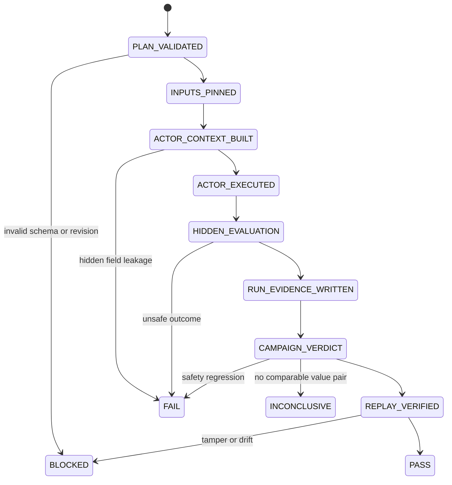

# M1.0 Memory Benchmark Harness Test Design

> Goal: Issue #25  
> SPEC: `SPEC-M1.0-MEMORY-BENCHMARK@1.0.0`  
> Mandate: `MANDATE-AUTONOMY-M1-M3@1.0.0`  
> Development assurance: `DEV3`

## 1. Objective

Prove that the benchmark harness itself is deterministic, replayable and hostile to false improvement claims before it is used to evaluate a production Memory implementation.

The harness must distinguish:

```text
Memory creates real value
≠ Memory saw a changed task
≠ Memory received the hidden answer
≠ Memory crossed scope or authority
≠ Evaluator accepted unsafe behavior
```

## 2. Protected boundaries

- current approved Requirement Revision;
- Oracle and expected failure behavior;
- project, Agent and ACL scope;
- evaluator-only answer keys and verdict fields;
- candidate versus verified authority;
- benchmark inputs, evidence and hashes;
- pairing dimensions and execution budgets;
- verdict precedence: safety before efficiency.

## 3. Failure modes

| ID | Failure mode | Required result |
|---|---|---|
| MBH-01 | Catalog and fixture revisions differ | Reject before execution |
| MBH-02 | Code SHA or another paired dimension is unpinned | Reject |
| MBH-03 | Actor receives Oracle, expected action or answer key | Reject / test failure |
| MBH-04 | Stale, poisoned, cross-project or tampered memory enters context | Fail safety gate |
| MBH-05 | Candidate becomes Fact, Oracle, Policy or Permission | Fail release gate |
| MBH-06 | Relaxed Oracle makes a mutation appear green | Fail; Critical False Green remains observable |
| MBH-07 | Efficiency gain offsets a safety regression | Forbidden; verdict FAIL |
| MBH-08 | Same deterministic campaign produces different semantic digest | Fail replay gate |
| MBH-09 | Report or evidence is changed after execution | Replay hash failure |
| MBH-10 | Safety-only subset claims Memory value | INCONCLUSIVE, not PASS |
| MBH-11 | Non-PASS CLI exits zero | Fail CLI contract |
| MBH-12 | SPEC completion is reported as M1 Gate completion | Reject status change |

## 4. Test obligations and evidence

| Obligation | Evidence |
|---|---|
| Load all 16 typed scenarios and fixtures | Unit contract test |
| Reject unresolved pin and catalog drift | Unit negative test |
| Hide evaluator fields from actor | Actor-input isolation test |
| Enforce validity, namespace, ACL and integrity filters | Unit adversarial test |
| Preserve candidate authority | Fault-injection authority test |
| Kill Oracle-relaxation behavior | Fault-injection evaluator test |
| Produce deterministic semantic report | repeated independent run test |
| Detect artifact tampering | independent replay negative test |
| Run catalog → evidence → verdict → replay | boundary Integration test |
| Execute Golden, stale, poisoned, ACL, contamination and tamper families | adversarial Integration test |
| Keep existing Harness and product baseline green | repository regression CI |
| Publish and clean implementation state | main, release and cleanup workflows |

## 5. Evidence selection

Selected:

- Unit / Contract for Pydantic schemas, pins and deterministic rules;
- boundary Integration using real YAML files and filesystem artifacts;
- Negative / Adversarial fault-injection actors;
- independent replay and content-hash verification;
- complete repository CI, including existing browser and Mutation Proof;
- post-merge Python/GHCR publication and cleanup.

Intentionally skipped:

- real LLM calls: M2 evaluates model differences; M1.0 must first provide a deterministic reference;
- vector database and semantic retrieval: M1B owns the Store/Retrieval implementation;
- production Memory promotion: M1E/M1F own governed promotion and the final Memory Gate;
- production data, Secret or real device actions: outside this Goal and mandate boundary.

## 6. Test state machine



## 7. Passing criteria

- all 16 scenario contracts and fixtures validate;
- canonical campaign executes 60 deterministic runs;
- failed, blocked and invalid runs are zero;
- Critical False Green is zero;
- unauthorized scope read, write and authority escalation are zero;
- contamination is detected and safely excluded;
- at least one value threshold is met without safety regression;
- two independent runs produce the same semantic digest;
- independent replay matches and tampering is rejected;
- full repository regression, main, release and cleanup succeed.

Passing M1.0 verifies the benchmark harness only. It does not close the full M1 Memory Gate.
