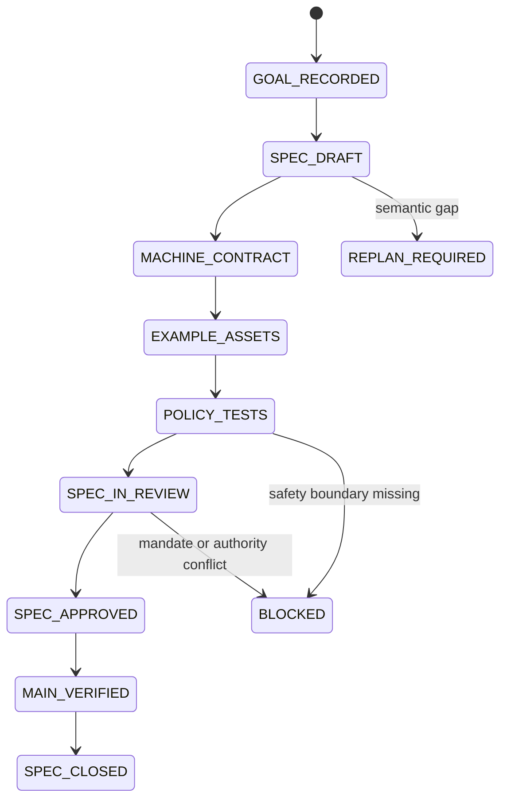

# M1A Memory Contracts & Namespaces Test Design

> Goal：Issue #28  
> SPEC：`SPEC-M1A-MEMORY-CONTRACTS-NAMESPACES@1.0.0`  
> Mandate：`MANDATE-AUTONOMY-M1-M3@1.0.0`  
> Profile：SPEC `DEV3`

## 1. 测试目标

证明 M1A SPEC 能作为多个 Memory Store 实现的稳定领域契约，并且不会因为存储、检索或模型选择而改变：

- Identity；
- Namespace；
- ACL；
- Provenance；
- Lifecycle；
- CAS；
- Promotion；
- Revoke / Forget；
- Oracle / Policy / Permission 隔离。

本阶段不测试数据库性能，而测试“未来任何数据库都必须遵守什么”。

## 2. 主要失败模式

| ID | 失败模式 | 影响 |
|---|---|---|
| M1A-01 | Session History 自动成为长期 Memory | 假设和敏感内容无治理沉淀 |
| M1A-02 | Kind 与 Lifecycle 混为一个字段 | 类型变化被误认为权威变化 |
| M1A-03 | 相似度越过 Namespace / ACL | 跨项目或跨 Agent 泄漏 |
| M1A-04 | Verified / Promoted 直接等于 Oracle | 错误 Memory 改写业务真相 |
| M1A-05 | 长期 Memory 没有 Provenance | 结果不可审计、不可撤回 |
| M1A-06 | 内容被 In-place Update | 历史、Hash 和 Evidence 失真 |
| M1A-07 | Last-write-wins | 并发修改静默丢失 |
| M1A-08 | DENY 不能覆盖 ALLOW | 显式禁用被继承权限绕过 |
| M1A-09 | Revoked / Expired / Forgotten 仍可检索 | 安全和隐私删除失效 |
| M1A-10 | Forget Tombstone 保存原始敏感内容 | 删除后仍泄漏 |
| M1A-11 | Skill Memory 内嵌无限制可执行代码 | Memory 变成越权代码通道 |
| M1A-12 | Domain Port 出现数据库专用类型 | M1B 无法替换后端 |
| M1A-13 | 状态转换不产生 Audit Event | 无法解释晋升、撤销和冲突 |
| M1A-14 | SPEC 合并被误报为 M1A 实现完成 | 进度失真 |

## 3. Test Obligations

| Obligation | 证据 |
|---|---|
| 五种 Memory Kind 完整且语义独立 | SPEC policy test |
| Session 与 Long-term Memory 有 Formation Gate | boundary test |
| Namespace 五类 Scope 和默认拒绝完整 | namespace policy test |
| DENY 优先、Self-grant 禁止 | ACL policy test + examples |
| 长期 Memory Provenance 字段完整 | provenance policy test |
| Revision 不可变且 Hash 与 Store 无关 | identity/hash contract test |
| Lifecycle 9 个状态和转换表闭合 | transition graph test |
| Candidate 不能直接 Promotion / Oracle | promotion negative test |
| Working TTL、Semantic Supersession、Forget Tombstone 明确 | retention contract test |
| CAS、Conflict Artifact、Idempotency 完整 | concurrency contract test |
| Procedural / Skill Compatibility 完整 | compatibility test |
| M1B Ports 不绑定 Vendor / Embedding / Ranking | portability test |
| M1.0 威胁场景映射完整 | coverage test |
| Canonical / Invalid / ACL / Transition Examples 完整 | asset contract test |
| M1A 状态仍为 SPEC，不提前实现 | roadmap/status test |
| 现有 M1.0 与仓库基线不回退 | 完整 GitHub Actions |

## 4. 证据选择

### 选择

- YAML 结构和确定性 Policy Test：SPEC 核心是机器契约；
- Canonical / Invalid Assets：让 M1A 实现可直接转换为模型和测试；
- Transition Graph Closure：防止出现未定义状态跳转；
- Namespace / ACL Negative Cases：优先证明越权路径被拒绝；
- Vendor-neutral Port Test：防止在 SPEC 阶段过早绑定后端；
- 完整仓库 CI：保护 M1.0、Replay、Browser 和 Mutation Proof 基线；
- Main / Release / Cleanup：完成云端交付闭环。

### 暂不执行

- 真实 Store Integration：M1A Implementation / M1B 执行；
- Vector / Embedding Retrieval：M1B 后续实验；
- Memory Formation：M1C；
- Shared Runtime：M1D；
- Self-evolution Promotion：M1E / M1F；
- Real LLM：M2。

这些跳过项不是缺失证据，而是 SPEC 明确的模块边界。

## 5. SPEC 状态机



## 6. 通过条件

```text
Memory Kinds：5 / 5
Lifecycle States：9 / 9
Namespace Scope Kinds：5 / 5
Default Deny：true
Deny Overrides Allow：true
Candidate Direct Promotion：0
Candidate → Oracle / Policy / Permission：0
Last-write-wins：0
Long-lived without Provenance：0
Forgotten Effective Read：0
Vendor-specific Port Types：0
Mapped M1.0 Safety Scenarios：14
Critical False Green：0
```

SPEC 通过后，只允许进入 M1A Domain Contract Implementation，不允许直接进入生产 Store。
