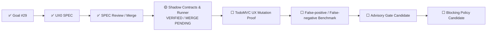

# UX Assurance Plane 状态

> 状态源：Synthetic User / UAT Readiness 跨切面状态  
> 最近更新：2026-08-05  
> SPEC Goal：Issue #29  
> Runtime Goal：Issue #31  
> SPEC：`SPEC-UX0-SYNTHETIC-USER@1.0.0`  
> Approval：`APPROVAL-UX0-SYNTHETIC-USER-SPEC@1.0.0`  
> 当前阶段：`RUNTIME_VERIFIED_MERGE_PENDING`  
> Runtime：`VERIFIED_MERGE_PENDING`  
> Gate Mode：`SHADOW_NONBLOCKING`  
> Human UAT：`REQUIRED`

## 当前状态

```text
UX0 SPEC：MERGED / CLOSED
ExperienceEnvironment Contract：IMPLEMENTED / VERIFIED
SyntheticUserAgent Contract：IMPLEMENTED / VERIFIED
Experience Oracle Contract：IMPLEMENTED / VERIFIED
Canonical Persona / Journey Assets：IMPLEMENTED / VERIFIED
Playwright Shadow Runner：VERIFIED / MERGE_PENDING
AI Candidate Finding Adapter：RULE_FIRST / VERIFIED / NONBLOCKING
Independent Replay：PASS
TodoMVC UX Mutation Proof：NOT IMPLEMENTED
False-positive / False-negative Benchmark：NOT IMPLEMENTED
Advisory PR Gate：DISABLED
Blocking Release Gate：DISABLED
Human UAT：REQUIRED
```

## 当前执行链



## Runtime 已验证能力

```text
Versioned Profile / Journey / ExperienceEnvironment
→ Pinned TodoMVC Target
→ Real Playwright Interaction
→ Semantic State Hash
→ Screenshot / Trace / Semantic Snapshot
→ Deterministic UX Evaluation
→ Nonblocking AI Candidate Finding
→ Artifact Manifest
→ Independent Replay
```

已执行四条真实 Journey：

- `novice-add-task`：3 / 3 Checkpoint PASS；
- `returning-filter-persistence`：4 / 4 Checkpoint PASS；
- `keyboard-primary`：4 / 4 Checkpoint PASS；
- `interrupted-resume`：3 / 3 Checkpoint PASS。

## 权威证据

```text
Focused Runtime Gate：Run #16 / 30991412463 — SUCCESS
Unit / Contract：9 / 9 PASS
CLI Validate：PASS
Real Playwright Journeys：4 / 4 PASS
Independent Replay：PASS
Campaign Verdict：PASS
Full Repository CI：Run #125 / 30991412405 — SUCCESS
```

```text
Artifact ID：8924285005
Artifact ZIP Digest：sha256:349f51fa11cca5c5f83bee863c69b289b19eebc63bfabe6c5623399b8254a3fc
Semantic Digest：sha256:1dda03adfcc3a264240b20a883daf2a230e3ce6dcd00c43dccfb84da40b885c5
Artifact Manifest Digest：sha256:702fdce96eedbb8b81566dda08768d33434346a7edf88653594587f676c92fa4
Manifest Files：19
```

## 当前边界

当前能力仍是 SHADOW：

- 体验 FAIL 会进入报告，但不会直接修改 Release Verdict；
- AI Finding 只能是非阻断 Candidate；
- Experience Oracle 对 Actor 隐藏；
- 仅使用 Synthetic Fixture；
- Human UAT 保持 REQUIRED；
- Advisory / Blocking 必须继续关闭。

Blocking 模式只有在 Mutation Proof、False-positive / False-negative Benchmark、Independent Replay、Rollback 和版本化 Policy Promotion 全部通过后才允许评估。

## 下一节点

```text
合并 Shadow Runtime
→ Main / Release / Cleanup
→ TodoMVC UX Mutation Proof SPEC
→ 缺失反馈 / 状态丢失 / 键盘障碍 / 恢复失败 Mutations
→ False-positive / False-negative Benchmark
→ 评估是否晋升 ADVISORY
```
