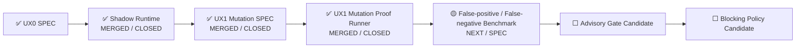

# UX Assurance Plane 状态

> 状态源：Synthetic User / UAT Readiness 跨切面状态  
> 最近更新：2026-08-05  
> UX0 SPEC Goal：Issue #29  
> UX0 Runtime Goal：Issue #31  
> UX1 Mutation SPEC Goal：Issue #34  
> UX1 Mutation Runtime Goal：Issue #36  
> UX0 SPEC：`SPEC-UX0-SYNTHETIC-USER@1.0.0`  
> UX0 Runtime：`UX0-SYNTHETIC-USER-SHADOW@1.0.0`  
> UX1 SPEC：`SPEC-UX1-TODOMVC-MUTATION-PROOF@1.0.0 MERGED`  
> 当前阶段：`UX1_MUTATION_PROOF_MERGED_CLOSED`  
> 下一阶段：`UX2_FALSE_POSITIVE_FALSE_NEGATIVE_BENCHMARK_SPEC`  
> Gate Mode：`SHADOW_NONBLOCKING`  
> Human UAT：`REQUIRED`

## 当前状态

```text
UX0 Synthetic User SPEC：MERGED / CLOSED
UX0 Playwright Shadow Runtime：MERGED / CLOSED
UX0 Independent Replay：PASS
UX1 TodoMVC UX Mutation Proof SPEC：MERGED / CLOSED
UX1 Mutation Proof Runner：MERGED / CLOSED
Five-mutation Campaign：5 / 5 KILLED
Independent Replay：PASS / 100%
Exact Restore：100%
Critical False Green：0
UX False-positive / False-negative Benchmark：NEXT / SPEC
Advisory PR Gate：DISABLED
Blocking Release Gate：DISABLED
Human UAT：REQUIRED
```

历史阶段记录（非当前状态）：

```text
TodoMVC UX Mutation Proof：SPEC_DRAFT
UX Mutation Proof Runner：NOT_IMPLEMENTED
UX Mutation Proof Runner：VERIFIED / MERGE_PENDING
```

## 当前执行链



## UX0 已交付能力

```text
Versioned Profile / Journey / ExperienceEnvironment
→ Pinned TodoMVC Target
→ Real Playwright Interaction
→ Semantic State Hash
→ Screenshot / Trace / Semantic Snapshot
→ Deterministic UX Evaluation
→ Nonblocking AI Candidate Finding
→ Artifact Manifest
→ Independent Replay
```

最终交付事实：

```text
Runtime Merge：f687fd9c30873c4a81d9ffb57b20459fdcebe4ee
Final Ledger Merge：8760cf785ecb4d75415b8a155739fc7d69e7546d
Main Quality：Run #142 / 30994343760 — SUCCESS
UX Shadow Gate：Run #33 / 30994343819 — SUCCESS
Release：Run #13 / 30994343839 — SUCCESS
Cleanup：Run #11 / 30994343939 — SUCCESS
Real Playwright Journeys：4 / 4 PASS
Journey Checkpoints：14 / 14 PASS
Independent Replay：PASS
Critical False Green：0
```

## UX1 最终交付事实

UX1 证明 Synthetic User 不只会让健康页面通过，还能可靠识别体验退化。

```text
Pinned Baseline PASS
→ Apply one bounded UX Mutation
→ Mutation KILLED with E3/E4 Oracle evidence
→ Restore exact source bytes
→ Restored PASS
→ Independent Replay PASS
```

五类 Mutation：

1. `MISSING_FEEDBACK`；
2. `VISIBLE_SUCCESS_STATE_LOSS`；
3. `KEYBOARD_FOCUS_SEMANTIC_BARRIER`；
4. `INTERRUPTED_RESUME_FAILURE`；
5. `FILTER_ROUTE_STATE_DRIFT`。

固定目标：

```text
Repository：percy/example-todomvc
Revision：4a2344b2207a72c680e5c559c72617498fb5b75b
Mutable File：index.html
Preimage SHA-256：8abcb565e24e7fdbe75feb21f986e9b7550173c04122727e4e07e7ec9c4d5f70
Mutation Application：EXACT_TEXT_REPLACE
Replacement Count：1
```

权威交付证据：

```text
Goal：Issue #36 — CLOSED
Implementation PR：#37 — MERGED
Implementation Merge：2b5bc958e5c302cef8649e28ff13d8ebafa3afcc
Final PR UX1 Gate：Run #16 / 31002474167 — SUCCESS
Final PR Full Quality：Run #173 / 31002474184 — SUCCESS
Main UX1 Gate：Run #17 / 31002717005 — SUCCESS
Main Full Quality：Run #174 / 31002716954 — SUCCESS
Release：Run #14 / 31002716980 — SUCCESS
Cleanup：Run #12 / 31002717017 — SUCCESS
Implementation Branch：DELETED
Focused Unit / Contract / Delivery：10 / 10 PASS
Real Mutation Campaign：5 / 5 KILLED
Baseline False Positive：0
Critical False Green：0
Exact Restore：100%
Independent Replay：100%
Oracle / Journey Coverage：100% / 100%
Hidden Metadata Leakage：0
Undeclared Changed Files：0
AI-only Kills：0
Main UX Artifact：8929019254
Main UX Artifact Digest：sha256:c7e5f7e9ce4e2190c7e043765b3176fcc459782439f58c472954de417396c1fa
Main Semantic Digest：sha256:0ec56a6ca9f0b5f2c9b4564b5bc173df7f0621e32a15d1d84fa8711dad1c6322
Main Manifest Digest：sha256:34c8915bccb010a814b7783f43db25bcaf320c8a4634497e3eb70a4417622fed
Python Distribution：8928961328
Python Digest：sha256:bd18044e8fa442c54afb0e1d4e90d25e0caec81fc07b7b1be6b7152a2880d086
Docker Build Record：8928992374
Docker Digest：sha256:5e857db4bfe699961cb3d6934926e8587728763d5422c3f5c93ccb3dfb0f4761
Image Digest：sha256:e119014c9810d745ff989bf5b46f5aa19f71acf094e854130c968a26d2aa10ac
Image Config：sha256:7f6d6488d9562074a53ac0acd0de8768d93764b2c2bf1757a400ea0d2023287e
```

## 当前边界

- Runtime 仍为 `SHADOW`；
- Release Effect 固定为 `NONBLOCKING_SHADOW`；
- AI Finding 只能是非阻断 Candidate，不能成为 Mutation Kill Authority；
- Experience Oracle、Mutation ID 和预期失败对 Actor 隐藏；
- 只允许一次性本地目标 Checkout；
- 禁止修改当前仓库、远程系统、生产数据和真实用户账号；
- Human UAT 保持 `REQUIRED`；
- Advisory / Blocking 保持 `DISABLED`。

## 下一节点

```text
UX1 Closure Ledger Merge
→ False-positive / False-negative Benchmark SPEC
→ Benchmark Runtime / Replay
→ 评估是否具备 ADVISORY 候选条件
```
