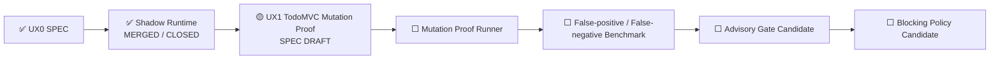

# UX Assurance Plane 状态

> 状态源：Synthetic User / UAT Readiness 跨切面状态  
> 最近更新：2026-08-05  
> UX0 SPEC Goal：Issue #29  
> UX0 Runtime Goal：Issue #31  
> UX1 Mutation SPEC Goal：Issue #34  
> UX0 SPEC：`SPEC-UX0-SYNTHETIC-USER@1.0.0`  
> UX0 Runtime：`UX0-SYNTHETIC-USER-SHADOW@1.0.0`  
> UX1 SPEC：`SPEC-UX1-TODOMVC-MUTATION-PROOF@1.0.0 CANDIDATE`  
> 当前阶段：`UX1_MUTATION_PROOF_SPEC_DRAFT`  
> Gate Mode：`SHADOW_NONBLOCKING`  
> Human UAT：`REQUIRED`

## 当前状态

```text
UX0 Synthetic User SPEC：MERGED / CLOSED
UX0 Playwright Shadow Runtime：MERGED / CLOSED
UX0 Independent Replay：PASS
UX1 TodoMVC UX Mutation Proof：SPEC_DRAFT
UX Mutation Proof Runner：NOT_IMPLEMENTED
UX False-positive / False-negative Benchmark：PLANNED
Advisory PR Gate：DISABLED
Blocking Release Gate：DISABLED
Human UAT：REQUIRED
```

## 当前执行链



## UX0 已交付能力

```text
Versioned Profile / Journey / ExperienceEnvironment
→ Pinned TodoMVC Target
→ Real Playwright Interaction
→ Semantic State Hash
→ Screenshot / Trace / Semantic Snapshot
→ Deterministic UX Evaluation
→ Nonblocking AI Candidate Finding
→ Artifact Manifest
→ Independent Replay
```

已完成四条真实 Journey：

- `novice-add-task`：3 / 3 Checkpoint PASS；
- `returning-filter-persistence`：4 / 4 Checkpoint PASS；
- `keyboard-primary`：4 / 4 Checkpoint PASS；
- `interrupted-resume`：3 / 3 Checkpoint PASS。

最终交付事实：

```text
Runtime Merge：f687fd9c30873c4a81d9ffb57b20459fdcebe4ee
Final Ledger Merge：8760cf785ecb4d75415b8a155739fc7d69e7546d
Main Quality：Run #142 / 30994343760 — SUCCESS
UX Shadow Gate：Run #33 / 30994343819 — SUCCESS
Release：Run #13 / 30994343839 — SUCCESS
Cleanup：Run #11 / 30994343939 — SUCCESS
Real Playwright Journeys：4 / 4 PASS
Journey Checkpoints：14 / 14 PASS
Independent Replay：PASS
Critical False Green：0
```

## UX1 当前 SPEC

UX1 证明 Synthetic User 不只会让健康页面通过，还能可靠识别体验退化。

```text
Pinned Baseline PASS
→ Apply one bounded UX Mutation
→ Mutation KILLED with E3/E4 Oracle evidence
→ Restore exact source bytes
→ Restored PASS
→ Independent Replay PASS
```

当前已定义五类 Mutation：

1. `MISSING_FEEDBACK`；
2. `VISIBLE_SUCCESS_STATE_LOSS`；
3. `KEYBOARD_FOCUS_SEMANTIC_BARRIER`；
4. `INTERRUPTED_RESUME_FAILURE`；
5. `FILTER_ROUTE_STATE_DRIFT`。

固定目标：

```text
Repository：percy/example-todomvc
Revision：4a2344b2207a72c680e5c559c72617498fb5b75b
Mutable File：index.html
Preimage SHA-256：8abcb565e24e7fdbe75feb21f986e9b7550173c04122727e4e07e7ec9c4d5f70
Mutation Application：EXACT_TEXT_REPLACE
Replacement Count：1
```

当前 SPEC 资产：

- `docs/specs/ux1-todomvc-mutation-proof-spec.md`；
- `docs/specs/ux1-todomvc-mutation-proof.yaml`；
- `tests/assets/ux/ux1/mutation-catalog.yaml`；
- `tests/assets/ux/ux1/negative-cases.yaml`；
- `tests/assets/ux/ux1/target-index-preimage.html`；
- `docs/testing/ux1-todomvc-mutation-proof-test-design.md`；
- `tests/unit/test_ux1_todomvc_mutation_spec.py`。

本阶段不修改目标、不执行 Mutation，也不实现 Runner。

## 当前边界

- Runtime 仍为 `SHADOW`；
- Release Effect 仍为 `NONBLOCKING_SHADOW`；
- AI Finding 只能是非阻断 Candidate，不能成为 Mutation Kill Authority；
- Experience Oracle、Mutation ID 和预期失败对 Actor 隐藏；
- 只允许一次性本地目标 Checkout；
- 禁止修改当前仓库、远程系统、生产数据和真实用户账号；
- Human UAT 保持 `REQUIRED`；
- Advisory / Blocking 保持 `DISABLED`。

## 下一节点

```text
UX1 SPEC Review / Merge
→ UX1 Mutation Proof Runner Goal
→ Domain Models / Catalog
→ Disposable Target Sandbox
→ Exact Mutation Application
→ Three-phase Runner
→ Five-mutation Campaign
→ False-positive / False-negative Benchmark
→ 评估是否具备 ADVISORY 候选条件
```
