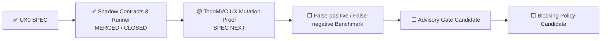

# UX Assurance Plane 状态

> 状态源：Synthetic User / UAT Readiness 跨切面状态  
> 最近更新：2026-08-05  
> SPEC Goal：Issue #29  
> Runtime Goal：Issue #31  
> SPEC：`SPEC-UX0-SYNTHETIC-USER@1.0.0`  
> Approval：`APPROVAL-UX0-SYNTHETIC-USER-SPEC@1.0.0`  
> 当前阶段：`SHADOW_RUNTIME_MERGED_CLOSED`  
> Runtime：`MERGED_CLOSED`  
> Gate Mode：`SHADOW_NONBLOCKING`  
> Human UAT：`REQUIRED`  
> 下一模块：`TODO_MVC_UX_MUTATION_PROOF_SPEC`

## 当前状态

```text
UX0 SPEC：MERGED / CLOSED
ExperienceEnvironment Contract：MERGED / VERIFIED
SyntheticUserAgent Contract：MERGED / VERIFIED
Experience Oracle Contract：MERGED / VERIFIED
Canonical Persona / Journey Assets：MERGED / VERIFIED
Playwright Shadow Runner：MERGED / CLOSED
AI Candidate Finding Adapter：RULE_FIRST / VERIFIED / NONBLOCKING
Independent Replay：PASS
TodoMVC UX Mutation Proof：SPEC_NEXT
False-positive / False-negative Benchmark：PLANNED
Advisory PR Gate：DISABLED
Blocking Release Gate：DISABLED
Human UAT：REQUIRED
```

## 当前执行链



## Runtime 已交付能力

```text
Versioned Profile / Journey / ExperienceEnvironment
→ Pinned TodoMVC Target
→ Real Playwright Interaction
→ Semantic State Hash
→ Screenshot / Trace / Semantic Snapshot
→ Deterministic UX Evaluation
→ Nonblocking AI Candidate Finding
→ Artifact Manifest
→ Independent Replay
```

已执行四条真实 Journey：

- `novice-add-task`：3 / 3 Checkpoint PASS；
- `returning-filter-persistence`：4 / 4 Checkpoint PASS；
- `keyboard-primary`：4 / 4 Checkpoint PASS；
- `interrupted-resume`：3 / 3 Checkpoint PASS。

## 权威证据

### PR 与实现证据

```text
Baseline Focused Runtime：Run #16 / 30991412463 — SUCCESS
Final PR Focused Runtime：Run #25 / 30992515643 — SUCCESS
UX0 SPEC Gate：Run #17 / 30992515724 — SUCCESS
Final PR Full Repository CI：Run #134 / 30992515715 — SUCCESS
Unit / Contract / Delivery / Approval：17 / 17 PASS
Real Playwright Journeys：4 / 4 PASS
Journey Checkpoints：14 / 14 PASS
Independent Replay：PASS
Campaign Verdict：PASS
```

### 主干与发布

```text
Merge Commit：f687fd9c30873c4a81d9ffb57b20459fdcebe4ee
Main UX Shadow Gate：Run #26 / 30993021836 — SUCCESS
Main Quality：Run #135 / 30993021825 — SUCCESS
Release：Run #12 / 30993022051 — SUCCESS
Cleanup：Run #10 / 30993021598 — SUCCESS
Implementation Branch：DELETED
```

### 产物摘要

```text
Main UX Artifact：8924951167
Main UX Artifact Digest：sha256:afd95dfea4ba738494bc24e2c9b2c2247eb64cbaff1b5d07901ea20c4b758134
Python Distribution：8924921509
Python Distribution Digest：sha256:6ff953f33d5699d64dc832bb7bf73d63425eb5e5ae2a2f24bec9558c0996e16d
Docker Build Record：8924949424
Docker Build Record Digest：sha256:89e9c4b4c971f4e9a0524abdb75a2514434a3b53e72b81add762f31fe74eafc9
Image Tags：main / sha-f687fd9
Image Digest：sha256:a0d20ae869f323a0622e71dad8c4257fac3f32963552ea3ac9781086c3e2797d
Image Config：sha256:69fad9daed03cfdb4a7373e57a5dc6439a5d285c1ce0eae9d80385993c2f72b7
Semantic Digest：sha256:1dda03adfcc3a264240b20a883daf2a230e3ce6dcd00c43dccfb84da40b885c5
Artifact Manifest Digest：sha256:702fdce96eedbb8b81566dda08768d33434346a7edf88653594587f676c92fa4
```

## 当前边界

当前能力仍是 SHADOW：

- 体验 FAIL 会进入报告，但不会直接修改 Release Verdict；
- AI Finding 只能是非阻断 Candidate；
- Experience Oracle 对 Actor 隐藏；
- 仅使用 Synthetic Fixture；
- Human UAT 保持 REQUIRED；
- Advisory / Blocking 必须继续关闭。

Blocking 模式只有在 Mutation Proof、False-positive / False-negative Benchmark、Independent Replay、Rollback 和版本化 Policy Promotion 全部通过后才允许评估。

## 下一节点

```text
TodoMVC UX Mutation Proof SPEC
→ 缺失反馈 Mutation
→ 可见成功但状态丢失 Mutation
→ 键盘 / 焦点 / 语义障碍 Mutation
→ 刷新恢复失败 Mutation
→ Baseline / Mutation / Restored 三阶段证据
→ False-positive / False-negative Benchmark
→ 评估是否具备 ADVISORY 候选条件
```
