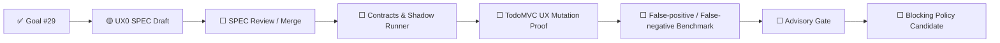

# UX Assurance Plane 状态

> 状态源：Synthetic User / UAT Readiness 跨切面状态  
> 最近更新：2026-08-05  
> Goal：Issue #29  
> SPEC：`SPEC-UX0-SYNTHETIC-USER@1.0.0`  
> 当前阶段：`SPEC_DRAFT`  
> Runtime：`NOT_IMPLEMENTED`  
> Gate Mode：`SHADOW_ONLY_WHEN_IMPLEMENTED`  
> Human UAT：`REQUIRED`

## 当前状态

```text
ExperienceEnvironment Contract：SPEC DRAFT
SyntheticUserAgent Contract：SPEC DRAFT
Experience Oracle Contract：SPEC DRAFT
Canonical Persona / Journey Assets：SPEC ASSETS
Playwright Shadow Runner：NOT IMPLEMENTED
AI Candidate Finding Adapter：NOT IMPLEMENTED
TodoMVC UX Mutation Proof：NOT IMPLEMENTED
Advisory PR Gate：NOT ENABLED
Blocking Release Gate：NOT ENABLED
Human UAT：REQUIRED
```

## 状态机



## 当前边界

本分支只定义规范、机器契约、测试设计、Canonical/Negative 资产和 CI Policy Test。它不声称 Agent 已能执行体验测试，也不改变现有 Release Verdict。

Blocking 模式必须继续保持关闭，直至 Mutation、Benchmark、Replay、Rollback 和版本化 Policy Promotion 全部通过。
